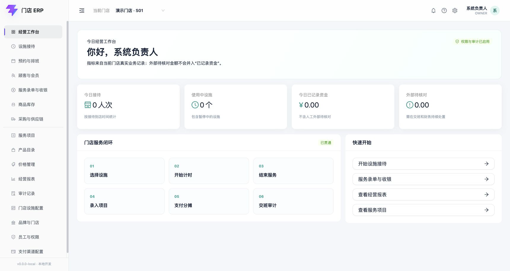
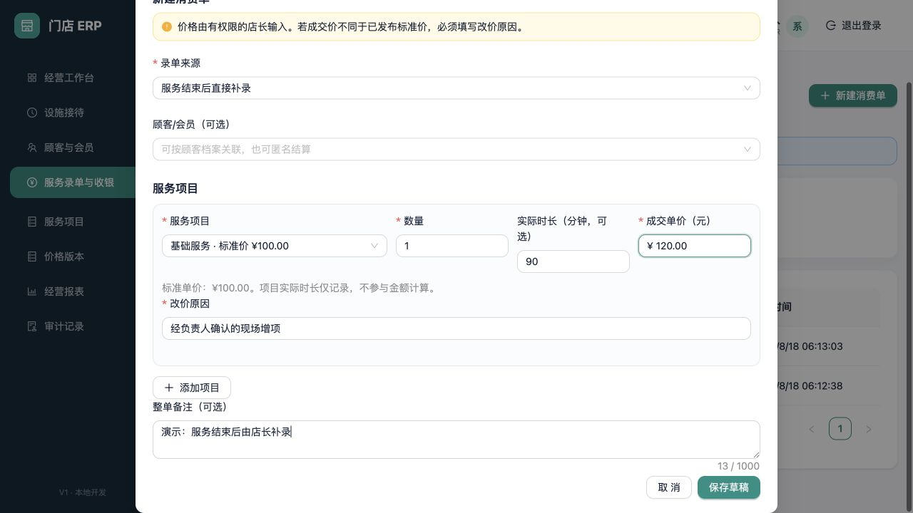
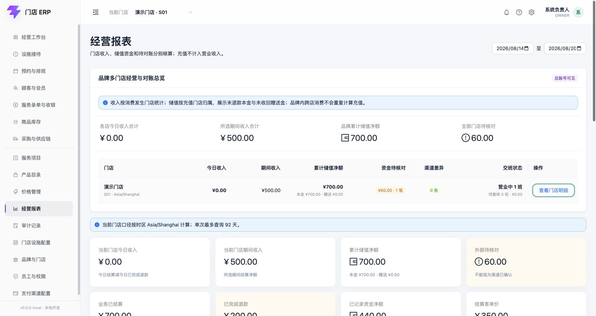
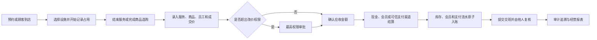
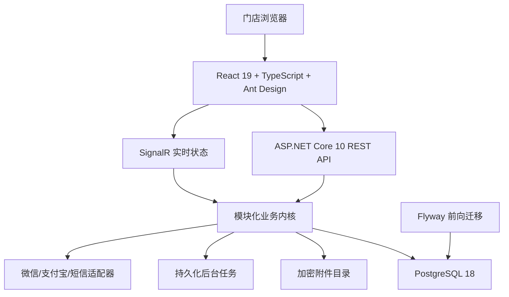

# 门店 ERP

> 面向品牌连锁门店的经营管理系统：把接待、预约、顾客会员、服务与商品、收银、库存、供应链、员工权限、审计和经营分析放进同一套可追溯的业务闭环。


门店 ERP 不是一个只展示静态表格的后台模板。它以真实门店工作流为中心：顾客预约或到店、设施开始占用、员工完成服务、负责人录入实际服务和商品、系统确认价格与库存、收款结算、会员权益变动、交班复核，最后进入审计和经营报表。

系统采用“一个品牌多家门店、品牌内共享、品牌间隔离”的数据模型。顾客在同一品牌 A 店办理会员后，可在 B 店识别并消费；不同品牌之间的顾客、会员、订单、库存、员工和资金数据完全隔离。

## 阅读导航

- [产品界面](#产品界面)
- [核心设计原则](#核心设计原则)
- [业务闭环](#业务闭环)
- [左侧菜单完整指南](#左侧菜单完整指南)
- [常用名词解释](#常用名词解释)
- [角色与权限](#角色与权限)
- [初次使用顺序](#初次使用顺序)
- [本地开发](#本地开发)
- [技术架构](#技术架构)
- [测试、部署与版本更新](#测试部署与版本更新)
- [旧系统数据迁移](#旧系统数据迁移)
- [项目边界](#项目边界)
- [完整文档索引](#完整文档索引)

## 产品界面

所有截图均来自本地虚构数据，不包含参考系统或真实门店的顾客、员工、手机号、资金和支付密钥。

### 经营工作台



工作台聚合当前门店的今日接待、使用中设施、已记录资金和外部待核对金额。它用于发现“今天发生了什么”，不代替经营报表、财务对账或审计中心。

### 设施接待


设施可以是房间、床位、服务位、护理位、仪器或门店自定义的其他资源。开始、暂停、继续、换设施和结束只记录资源占用，不自动形成收费。

### 服务录单与收银



服务结束后，由有权限的人员根据实际情况录入服务项目、商品、员工、时长和成交金额。服务和商品彼此独立：一张消费单可以只有服务、只有商品，或同时包含二者。

### 顾客与会员


顾客档案、会员卡、储值本金、赠送奖励、积分和次卡分别管理。会员消费固定先扣本金，只有同卡本金已经用完时才允许使用赠送奖励。

### 经营报表



报表区分业务结算额、已完成退款、结算净额、已记录资金和外部待核对，不把人工登记的微信或支付宝误报为渠道已经到账。

<details>
<summary><strong>查看更多代表性界面</strong></summary>

| 页面 | 截图 |
|---|---|
| 产品目录与图片 | [产品目录](docs/user-manual/assets/34-product-catalog.png) · [产品图片](docs/user-manual/assets/47-product-images.png) |
| 价格管理 | [价格版本](docs/user-manual/assets/36-product-versioned-price.png) |
| 商品库存 | [库存余额与流水](docs/user-manual/assets/45-product-inventory.png) |
| 门店设施配置 | [跨店设施配置](docs/user-manual/assets/49-facility-configuration-management.png) |
| 员工与权限 | [员工账号](docs/user-manual/assets/28-employee-accounts.png) |
| 支付渠道 | [微信/支付宝配置](docs/user-manual/assets/44-payment-channel-configuration.png) |
| 审计记录 | [审计列表](docs/user-manual/assets/23-audit-events.png) · [审计详情](docs/user-manual/assets/24-audit-detail.png) |
| 收银交班 | [提交交班](docs/user-manual/assets/21-shift-handover.png) · [独立复核](docs/user-manual/assets/32-shift-independent-review.png) |

</details>

## 核心设计原则

1. **设施计时和最终收费分离。** 设施时长只记录占用；店长或负责人根据实际服务内容决定消费单金额。
2. **服务和商品彼此独立。** 顾客可以只做服务、只买商品，也可以两者一起结算。
3. **标准价由最高权限统一发布。** 历史订单保存当时的价格快照，后续改价不会重算旧订单。
4. **品牌内共享、品牌间隔离。** 同品牌多店共享顾客和会员权益，不同品牌的数据不能互查互用。
5. **资金、会员和库存使用不可变流水。** 已过账事实不直接覆盖；纠错通过退款、冲正或反向单据保留完整历史。
6. **前端隐藏不等于授权。** 菜单、路由、按钮和 API 都校验角色、门店范围、业务状态与并发版本。
7. **敏感信息按需展示。** 顾客姓名正常显示；列表手机号只隐藏中间四位，输入完整手机号仍可精确定位；查看完整号码必须说明目的并留痕。
8. **所有金额使用整数分。** 避免浮点数造成收银、退款和提成误差。

## 业务闭环



需要特别理解的三个“不自动”：

- 设施结束计时，**不会自动收费**；
- 商品退回库存，**不会自动退款**；
- 人工登记微信或支付宝，**不会自动变成渠道已确认到账**。

## 左侧菜单完整指南

菜单会按账号权限自动收敛。最高权限负责人通常能看到全部页面；店长、前台、收银员和服务员工只看到工作职责所需的页面。页面入口被隐藏后，服务端仍会再次鉴权。

### 菜单速查表

| 菜单 | 路径 | 主要解决的问题 | 典型使用人 |
|---|---|---|---|
| 经营工作台 | `/` | 今天接待、设施和资金概况 | 全部授权岗位 |
| 设施接待 | `/facilities` | 现场资源占用、计时和清洁状态 | 前台、店长、负责人 |
| 预约与排班 | `/scheduling` | 顾客预约与员工出勤计划 | 前台、店长、负责人 |
| 顾客与会员 | `/customers` | 顾客档案、会员权益和服务档案 | 授权服务与结算岗位 |
| 服务录单与收银 | `/cashier` | 消费单、改价、收款、退款和交班 | 收银员、店长、负责人 |
| 商品库存 | `/inventory` | 门店库存余额、预占、流水和调整 | 店长、负责人 |
| 采购与供应链 | `/supply-chain` | 供应商、采购、批次、盘点和调拨 | 店长、负责人 |
| 服务项目 | `/catalog/items` | 维护门店能提供哪些服务 | 目录查看岗位、负责人 |
| 产品目录 | `/catalog/products` | 维护能销售哪些商品及可选图片 | 目录查看岗位、负责人 |
| 价格管理 | `/catalog/prices` | 统一发布服务和商品标准价 | 负责人 |
| 经营报表 | `/reports` | 收入、退款、支付、项目和员工绩效 | 店长、负责人 |
| 审计记录 | `/audit` | 追溯谁在何时执行了什么动作 | 授权管理岗位 |
| 门店设施配置 | `/settings/facilities` | 配置服务区、服务位和设施信息 | 店长、负责人 |
| 品牌与门店 | `/settings/organization` | 新增门店、维护品牌和门店生命周期 | 负责人 |
| 员工与权限 | `/settings/employees` | 员工档案、账号、角色和门店范围 | 负责人 |
| 支付渠道配置 | `/settings/payment-channels` | 微信/支付宝凭据映射和渠道对账 | 负责人 |

### 1. 经营工作台

这是登录后的经营总览，不是业务数据的编辑页面。

- **今日接待**按门店到店时间统计接待人次，不等于已结算订单数。
- **使用中设施**包含正在使用和暂停中的设施，设施占用不等于产生收入。
- **今日已记录资金**是系统已经记录且不处于外部待核对状态的资金净额。
- **外部待核对**是人工登记或仍需渠道确认的金额，不能当作到账证明。
- 快捷入口会根据权限跳转设施接待、收银、报表和服务项目。

详细口径：[经营工作台与经营报表](docs/user-manual/08-dashboard-and-operations-reports.md)

### 2. 设施接待

用于现场判断哪些服务位可用、谁正在使用以及已经占用了多久。

- 状态包括可用、使用中、已暂停、待清洁、维护中和已停用。
- 顾客、预计服务、预计时长和备注都可以不填，只用于帮助识别接待。
- 暂停期间不累计有效占用时长；换设施要求目标设施可用。
- 结束服务后再到“服务录单与收银”录入真实内容和金额。
- 页面展示秒级实时计时；报表汇总时按业务口径换算为分钟或小时。

详细操作：[设施接待与独立计时](docs/user-manual/03-facility-reception-and-timing.md)

### 3. 预约与排班

一个页面包含两类不同的计划：

- **顾客预约**：计划顾客在什么时间接受什么服务，可选员工和设施；到店后才生成接待。
- **员工排班**：计划员工的上班和下班时间；它不是收银员的收银班次。

同一员工或设施不能出现重叠预约，同一员工的排班不能重叠。取消和爽约只改变状态，历史记录保留。预约到店后仍不会自动收费。

详细操作：[预约与员工排班](docs/user-manual/18-appointments-and-employee-scheduling.md)

### 4. 顾客与会员

这是顾客主档和会员权益中心，主要包括：

- 顾客新增、编辑、自动包含词搜索和重复档案归并；
- 手机号中间四位视觉脱敏，完整手机号精确搜索；
- 按业务目的查看完整手机号并记录审计；
- 会员卡类、会员开卡、储值本金、赠送奖励和积分；
- 会员储值、退款、次卡、积分增减与核销；
- 服务档案的文字记录、可选图片、追加更正和历史保留。

“开卡”和“储值”是两个动作。开卡只建立卡和零余额账户，不会自动充值。储值本金是顾客实际支付的钱，赠送奖励是门店额外赠送的权益，两者分账。

详细操作：[顾客与会员](docs/user-manual/04-customers-and-membership.md) · [会员储值](docs/user-manual/11-member-topups.md) · [服务档案](docs/user-manual/16-product-images-and-service-records.md)

### 5. 服务录单与收银

这是业务最密集的页面，分为今日收银、待处理、交班复核等区域。

1. 从已结束接待中选择顾客、设施、预计服务和到店时间，或直接补录。
2. 添加服务行、商品行或两者混合；服务不强制绑定商品，商品也不强制绑定服务。
3. 选择实际服务员工，用于后续按比例或固定金额计算提成。
4. 输入成交价。偏离标准价时填写原因，系统按策略决定直接授权或提交审批。
5. 确认金额后订单进入“待支付”；商品库存此时被预占。
6. 使用现金、会员本金/奖励、微信、支付宝或允许的组合方式结算。
7. 结算成功后形成支付、会员、库存、提成和审计快照。

页面还承担退款审批、真实渠道付款码/查单、改价审批、开班、提交交班和独立复核。因为这些操作影响资金，系统保留请求号、状态和审计记录。

详细操作：[服务录单与金额确认](docs/user-manual/05-service-order-and-price-confirmation.md) · [支付与交班](docs/user-manual/06-payments-and-cashier-shifts.md) · [退款与冲正](docs/user-manual/13-payment-refunds-and-topup-reversals.md)

### 6. 商品库存

用于查看当前门店的商品数量和不可变库存流水。

- **账面库存**：已经正式入库减去正式出库后的数量。
- **销售预占**：已确认但尚未结算的消费单占用数量。
- **可用库存**：账面库存减销售预占，是还能继续销售的数量。
- **过账单据**：期初、收货、盘盈和盘亏等已经正式影响库存的业务单据。
- **库存流水**：每次数量变化的事实记录，过账后不能编辑或删除。

商品退货只表示实物回库，资金退款必须另走原支付退款流程。

详细操作：[商品销售与门店库存](docs/user-manual/15-product-sales-and-inventory.md)

### 7. 采购与供应链

页面包含五个页签：

- **批次效期**：查看批次号、有效期和剩余数量；出库优先使用较早到期批次。
- **库存盘点**：提交时冻结当时账面数，审批时只过账实盘差异；申请人不能审批自己的盘点。
- **跨店调拨**：经历待出库、在途、已收货或已取消；出库和收货分别影响两家店库存。
- **供应商**：维护供应商编码、名称、联系人和结算条款。
- **采购入库**：记录供应商、产品、数量、单位成本、批次和可选有效期。

采购成本只向最高权限展示。本模块当前是采购入库与高级库存闭环，不等于完整的采购订单、应付账款和财务凭证系统。

详细说明：[供应链与高级库存](docs/modules/supply-chain-and-advanced-inventory.md)

### 8. 服务项目

用于定义“门店可以提供什么服务”。

- 项目编码、名称和标准时长构成基础目录。
- 标准时长只是参考，不参与自动收费。
- 新建服务项目时不要求同时绑定商品。
- 项目目录本身不保存当前标准价；价格由“价格管理”发布。
- 已被业务引用的项目不应物理删除，停用只阻止新业务使用。

详细操作：[服务项目与价格版本](docs/user-manual/02-service-items-and-pricing.md)

### 9. 产品目录

用于定义“门店可以销售什么商品”。

- 产品编码、名称和计量单位构成基础资料。
- “跟踪库存”决定商品是否形成库存余额和流水。
- 产品图片可选，只帮助识别商品，不参与定价与库存计算。
- 产品可以独立销售，不要求关联服务项目。
- 目录建档不等于已经可销售；未发布价格的产品暂不可按标准价销售。

详细操作：[产品目录与版本化标准价](docs/user-manual/10-product-catalog-and-pricing.md)

### 10. 价格管理

“价格版本”是某个时间点对服务和商品标准价的完整快照。它解决的是历史可追溯问题：今天改价不能把上个月的订单一起改掉。

- **草稿**可以继续编辑，尚未对业务生效。
- **发布**会锁定内容并按生效规则供新订单使用。
- 新版本只需勾选本次新增或变化的条目；其余有效价格自动继承。
- 已发布版本只读，历史订单仍使用当时快照。
- 服务和产品独立定价，可以只调整其中一种。

详细操作：[服务项目与价格版本](docs/user-manual/02-service-items-and-pricing.md) · [产品目录与标准价](docs/user-manual/10-product-catalog-and-pricing.md)

### 11. 经营报表

用于分析日期范围内的真实业务结果：

- 业务已结算、已完成退款和结算净额；
- 已记录资金净额与外部待核对；
- 结算客单价、每日走势和支付方式构成；
- 服务项目成交排行；
- 设施记录占用时长；
- 员工服务收益与提成。

“设施记录占用占比”不是正式营业时间利用率，因为当前还没有把每家店的营业日历、维护时间和可售容量全部纳入口径。“员工提成”是核算结果，也不等于工资已经发放。

详细口径：[经营工作台与经营报表](docs/user-manual/08-dashboard-and-operations-reports.md)

### 12. 审计记录

审计中心回答“谁、在什么时候、对什么对象、执行了什么动作、结果如何”。

- 可按门店、动作、对象和日期查询；
- 展示操作前后状态、原因、请求号和追踪号；
- 审计事件只读，不提供编辑或删除；
- 请求号用于幂等业务追踪，追踪号用于定位服务日志；
- 审计记录不等于财务审批完成，也不能作为支付渠道到账凭证。

详细操作：[审计记录](docs/user-manual/07-audit-events.md)

### 13. 门店设施配置

这是设施基础资料维护页，不是日常计时看板。

- 最高权限可以查看全部门店的店长、服务区数和服务位数。
- 店长只能配置自己的授权门店。
- 服务区名称和服务位名称必填。
- 服务名称、内部设施名称、参考单价、设施类型和编号可以选填。
- 参考单价只作提示，不进入消费单，也不会自动收费。
- 使用中的服务位不能直接维护或停用；停用保留历史记录。

详细操作：[设施接待与独立计时](docs/user-manual/03-facility-reception-and-timing.md)

### 14. 品牌与门店

只有最高权限账号可以维护品牌资料和门店生命周期。

- 编辑品牌编码和名称；
- 新增门店，填写门店编码、名称和业务时区；
- 查看每家店的店长、员工、服务区和服务位概况；
- 停用或恢复门店，并填写原因；
- 门店有使用中设施、未完成业务或未关闭收银班次时不能停用；
- 新门店不会自动复制其他门店的员工、设施、库存或支付配置。

详细操作：[品牌与门店主数据](docs/user-manual/17-brand-and-store-management.md)

### 15. 员工与权限

员工档案、登录账号、角色和门店范围是四个相关但不同的概念。

- 员工可以有档案但没有登录账号。
- 一个员工可以拥有多个角色，最终权限取角色并集。
- 门店范围决定账号能看哪些门店的数据。
- 新账号首次登录必须修改初始密码。
- 离职会停用账号但保留历史业务。
- 当前用户不能自行扩大权限、停用自己或重置自己的密码。
- 系统始终保留至少一个有效最高权限账号。

详细操作：[员工、账号与权限](docs/user-manual/09-employees-accounts-and-permissions.md)

### 16. 支付渠道配置

用于把门店映射到服务器上的微信支付或支付宝商户凭据，并执行渠道账单对账。

- 页面只保存“凭据配置名”，不会读取或回显私钥正文。
- 可区分沙箱/联调环境和生产环境。
- 凭据缺失、回调地址不安全或密钥格式错误时拒绝启用。
- 渠道支付只有在验签回调或主动查单确认成功后才完成结算。
- 对账用于发现本地与渠道差异，不会自动改账、补记收款或修改会员余额。
- “登记已处置”只保存人工核对说明，需要补账或冲正时仍走独立审批流程。

真实商户扣款和退款必须在商户资料、证书、回调域名和渠道验收全部完成后，才能对外宣称可用。

详细操作：[支付渠道配置与对账](docs/user-manual/14-payment-channel-configuration.md)

### 顶部区域

顶部也承载关键业务上下文：

- **当前门店**：切换本次操作的数据范围。
- **待办通知**：展示改价审批、退款审批和交班复核等任务。
- **使用帮助**：提供日常操作顺序提示。
- **系统设置**：按权限进入设施、品牌门店、员工和支付配置。
- **个人账号菜单**：查看当前角色、修改密码和退出登录。

## 常用名词解释

这一节专门解释界面里的业务词。第一次使用系统时，建议先阅读本节。

### 门店、接待与排班

| 名词 | 通俗解释 | 不代表什么 |
|---|---|---|
| 品牌/商户/租户 | 一组共享顾客和会员数据的经营主体，也是跨品牌隔离边界 | 不等于一家具体门店 |
| 门店上下文 | 顶部“当前门店”选择的本次操作范围 | 不会改变账号本身的门店权限 |
| 服务区 | 门店内用于组织服务位的逻辑分组 | 不要求写死成某个行业名称 |
| 服务位/设施 | 可以被占用和计时的资源，如房间、床位、仪器 | 不等于服务项目，也不自动定价 |
| 预计服务 | 接待开始时用于提醒后续录单的计划项目 | 不会自动变成消费单明细 |
| 设施占用时长 | 服务位实际被记录占用的时间 | 不等于服务收费时长或收费金额 |
| 顾客预约 | 顾客未来到店的资源计划 | 不等于已经到店、占用或收费 |
| 员工排班 | 员工计划上班和下班的时间段 | 不等于收银班次 |

### 目录、价格与订单

| 名词 | 通俗解释 | 关键规则 |
|---|---|---|
| 服务项目 | 门店向顾客提供的服务目录 | 可以独立于商品存在 |
| 产品/商品 | 门店销售的实物或非服务型产品目录 | 可以独立于服务存在 |
| 标准价 | 最高权限发布的基准销售价格 | 不是设施参考单价 |
| 成交价 | 本次订单实际向顾客收取的单价 | 偏离标准价时可能需要审批 |
| 价格版本 | 某次发布时全部有效价格的完整快照 | 已发布版本不覆盖修改 |
| 价格草稿 | 尚未发布、可以继续编辑的版本 | 不会被订单当作标准价 |
| 价格快照 | 订单保存的当时名称、编码和价格 | 后续改目录或改价不重算历史 |
| 待录单接待 | 已结束现场接待但尚未形成消费单 | 机器编号只用于追溯 |
| 待确认金额 | 草稿已保存，应收尚未锁定 | 不能当成已收款 |
| 待支付 | 应收已经确认，等待支付 | 商品可能已预占但未正式出库 |
| 改价策略 | 规定不同岗位可以改价的范围 | 收银员改价仍可能必须审批 |
| 作废 | 终止未完成订单并保留历史 | 不是物理删除 |

### 收银、交班和支付

| 名词 | 通俗解释 | 关键规则 |
|---|---|---|
| 开班 | 收银人员开始本次收银工作并登记备用金 | 不是员工排班，也不是收入 |
| 收银班次 | 从开班到提交交班的一段收银责任区间 | 汇总本人现金和待核对金额 |
| 提交交班 | 收银员填写实点现金并把班次提交给他人复核 | 有时口语会听成“提交开班/K班”，实际含义是**提交交班** |
| 交班复核 | 另一名人员核对理论现金、实点现金和差额 | 原收银员不能自我复核 |
| 理论现金 | 开班备用金加本班现金收款并考虑现金退款 | 不是抽屉实点金额 |
| 实点现金 | 交班时实际清点到的现金 | 与理论现金之差形成差额 |
| 外部待核对 | 人工登记或尚未被可信渠道确认的金额 | 不能视为渠道到账 |
| 支付分摊 | 把应收拆到现金、会员或渠道等多个来源 | 合计必须精确等于应收 |
| 对账 | 比较系统账务与渠道账单 | 发现差异，不自动改账 |
| 原路退款 | 沿原可信支付渠道或原会员账户退回 | 必须从原支付分摊发起 |
| 冲正 | 用新的反向记录抵消原事实 | 不删除、不覆盖原流水 |

### 会员权益

| 名词 | 通俗解释 | 关键规则 |
|---|---|---|
| 储值本金 | 顾客真实支付后进入会员账户的钱 | 消费时优先扣除 |
| 赠送奖励 | 门店随储值额外赠送的权益 | 不属于实付，不能直接退现金 |
| 先本金后奖励 | 同卡本金还有余额时不能先花奖励 | 防止先用赠送再退完整本金套利 |
| 次卡 | 指定服务可以使用若干次的权益 | 购买次数先于赠送次数核销 |
| 核销 | 把一次或多次权益标记为已使用 | 撤销会新增反向流水 |
| 积分批次 | 一次积分增加形成的独立有效期批次 | 最早到期批次优先使用 |

### 库存、供应链与审计

| 名词 | 通俗解释 | 关键规则 |
|---|---|---|
| 过账 | 让业务单据正式影响库存或账务 | 过账后用反向单据纠错 |
| 账面库存 | 正式入库减正式出库后的数量 | 不扣除销售预占 |
| 销售预占 | 待支付订单暂时锁住的商品数量 | 作废释放，结算转为出库 |
| 可用库存 | 账面库存减销售预占 | 用于判断还能否销售 |
| 批次 | 同一产品某次入库形成的追踪单元 | 可携带效期和成本 |
| 冻结账面数 | 发起盘点时保存的当时库存 | 审批按实盘与冻结数计算差异 |
| 跨店调拨 | 商品从一家店转移到另一家店 | 出库扣调出店，收货增调入店 |
| 审计记录 | 关键操作的不可变追溯事件 | 不等于渠道回单或会计凭证 |
| 请求号 | 标识一次业务命令，防止重复入账 | 重试应返回第一次结果 |
| 追踪号 | 串联 HTTP 请求及服务日志的编号 | 不能证明资金到账 |
| 乐观并发/版本号 | 保存时确认数据未被别人抢先修改 | 冲突时要求刷新 |
| 停用 | 阻止对象继续参与新业务 | 不删除历史记录 |

## 角色与权限

| 角色 | 主要职责 | 通常可见范围 |
|---|---|---|
| `OWNER` / 负责人 | 品牌级最高权限、目录价格、组织员工、审批、审计与渠道配置 | 全部业务和设置页面 |
| `STORE_MANAGER` / 店长 | 授权门店经营、设施、预约、顾客、收银、库存和报表 | 不维护全局账号权限和支付密钥 |
| `FRONT_DESK` / 前台 | 顾客预约、到店和设施现场操作 | 工作台、设施、预约、顾客和只读目录 |
| `CASHIER` / 收银员 | 消费单、收款和本人收银班次 | 工作台、顾客、收银和只读目录 |
| `TECHNICIAN` / 服务员工 | 本人服务任务与记录的受限能力 | 仅显示明确授予的入口 |

角色可以兼职，最终权限取角色并集，但仍受门店范围、业务状态和职责分离规则约束。完整矩阵见：[角色权限与审批矩阵](docs/v1-role-permission-and-approval-matrix.md)和[角色权限闭环](docs/modules/role-permission-enforcement.md)。

## 初次使用顺序

新商户从空库开始时，建议由负责人按以下顺序初始化：

1. 在“品牌与门店”确认品牌资料并建立门店。
2. 在“员工与权限”创建店长、前台、收银员和服务员工，分配门店范围。
3. 在“服务项目”和“产品目录”建立目录，按需上传产品图片。
4. 在“价格管理”建立价格草稿，核对后发布。
5. 在“门店设施配置”建立服务区和服务位。
6. 在“顾客与会员”建立会员卡类和必要的会员规则。
7. 如需商品库存，建立期初、收货或采购入库。
8. 如需真实微信/支付宝，先在服务器安全配置凭据，再完成商户验收。
9. 门店人员开始预约、接待、录单、收银、交班和复核。

## 本地开发

### 环境要求

- .NET SDK `10.0.301`
- Node.js `24`
- Docker 与 Docker Compose
- PostgreSQL `18`（本地默认通过 Compose 启动）

### 启动步骤

```bash
cp .env.example .env
# 编辑 .env，将所有 CHANGE_ME 替换为本地专用安全值

docker compose up -d postgres
npm --prefix apps/web ci

set -a
source .env
set +a

dotnet run --project apps/api/Erp.Api
# 在另一个终端运行：
npm --prefix apps/web run dev
```

浏览器访问 `http://127.0.0.1:5173`。

仓库不提供可用于正式环境的默认密码。开发种子负责人仅在明确设置 `ERP_SEED_OWNER_PASSWORD` 后创建；独立平台管理员按一次性环境变量初始化，首次登录必须修改密码：

```bash
dotnet run --project apps/api/Erp.Api -- --bootstrap-platform-admin
```

## 技术架构



当前选择**模块化单体 + 单 PostgreSQL 数据库 + 独立 React 前端**，适合当前 2 核 4 GB 服务器，也便于收银、会员、库存和退款在单库事务中保持一致。项目不因“看起来大型”而提前引入 Kubernetes；当多实例、高可用、独立扩缩容或团队边界真实出现时再评估。

| 层次 | 技术 |
|---|---|
| 前端 | React 19、TypeScript、Vite 8、Ant Design 6、TanStack Query |
| 后端 | .NET 10、ASP.NET Core、Entity Framework Core、Npgsql |
| 数据库 | PostgreSQL 18、Flyway 版本化 SQL |
| 测试 | xUnit、真实 PostgreSQL 集成测试、Vitest、Testing Library、Playwright |
| 生产 | Ubuntu Server 24.04、Nginx、systemd、Blue/Green A/B 发布 |
| 安全 | Argon2id、同源 Cookie、CSRF、CSP、HSTS、限流和不可变审计 |

完整说明：[技术架构](docs/technical-architecture-and-stack.md) · [数据库治理](docs/database-design-and-change-governance.md)

## 仓库结构

```text
erp/
├── apps/
│   ├── api/                  # ASP.NET Core API 与领域模块
│   └── web/                  # React 管理端
├── db/
│   ├── migrations/           # 只向前追加的 Flyway 迁移
│   └── test-seed/            # 仅测试环境数据
├── tests/
│   ├── architecture/         # 架构与仓库规则
│   ├── integration/          # PostgreSQL/API 集成测试
│   └── e2e/                  # 浏览器端到端测试
├── deploy/linux/             # A/B 发布、备份和恢复
├── docs/                     # PRD、架构、模块与用户手册
├── compose.yaml
└── ERP.slnx
```

## 测试、部署与版本更新

常用验证命令：

```bash
dotnet build ERP.slnx --no-restore
dotnet test ERP.slnx --no-build

npm --prefix apps/web run lint
npm --prefix apps/web test -- --run
npm --prefix apps/web run build
npm --prefix apps/web audit --omit=dev
```

生产方向为 Ubuntu Server 24.04 LTS：

1. CI 运行后端、前端、迁移和安全门禁。
2. 生成带版本、Git 提交、SHA-256 清单和 schema 兼容范围的不可变发布包。
3. 发布前创建数据库、附件和 Data Protection 密钥联合备份。
4. Flyway 只执行新的前向迁移。
5. 将新版本部署到非活动 Blue/Green 槽位。
6. 通过存活、就绪和入口检查后由 Nginx 原子切流。
7. 应用异常时切回上一兼容版本，禁止用数据库降级脚本伪装回滚。

详细操作：[Linux 部署基线](docs/linux-server-deployment-baseline.md) · [Linux 脚本说明](deploy/linux/README.md) · [发布、备份与恢复](docs/v2-release-and-recovery.md)

## 旧系统数据迁移

旧系统迁移采用“只读导出 → Git 外加密保存 → 离线校验 → 事务干跑 → 备份 → 指定测试品牌导入 → 数量与关联对账”的独立通道，不通过日常业务页面，也不提供公网迁移 API。

- 旧系统除登录外只允许逐项登记的 GET；新增、修改、删除、保存、退款和任意地址请求在客户端发送前即被拒绝。
- 顾客列表、门店、员工、服务、产品、卡类、顾客备注和档案照片分别保留来源主键及 SHA-256；重复运行不会重复建档，来源内容变化时拒绝静默覆盖。
- 当前导入切片在代码中固定只允许测试品牌 `B01`。旧门店使用新系统不可变自动编号；不会修改另一品牌及其门店。
- 顾客手机号在导入时使用服务器既有 Data Protection 密钥环和查询 HMAC；姓名正常显示，列表仍只视觉隐藏手机号中间四位，完整号码检索能力不受影响。
- 顾客备注与照片形成带“旧系统迁移”标记的服务档案；旧员工仅导入档案，不自动获得登录账号或权限。
- 旧余额、赠送、积分和欠款因缺少可审计流水，只保存在数据库的非消费快照中，`is_spendable=false` 由约束固定，不会增加会员可用余额。

操作与安全边界见[旧系统只读迁移工具](tools/Erp.LegacyMigration/README.md)、[迁移 PRD](docs/legacy-system-data-migration-prd.md)和[字段映射矩阵](docs/legacy-system-field-profile-and-mapping.md)。

## 项目边界

当前仓库已形成可运行闭环的主要模块包括品牌门店、身份权限、目录价格、设施接待、预约排班、顾客会员、服务和商品收银、储值与权益、退款、门店库存、供应链、审计和经营报表。

仍需真实外部条件验收的范围：

- 微信支付与支付宝具备本地交易、验签、查单、退款和日账单对账代码，但没有真实商户凭据时不能证明真实资金链路可用。
- 供应链已经具备供应商、采购入库、批次、盘点和调拨，但不等于完整采购订单、采购退货、应付账款和会计凭证。
- 员工提成是收益核算数据，不等于工资发放系统。
- 复杂退卡作价、多次充值跨单追溯和异常非原路退款仍需单独设计。
- 生产前仍需完成真实门店业务验收、支付商户验收和备份恢复演练。

准确状态以[开发进度](docs/development-progress.md)、[变更记录](CHANGELOG.md)和各模块手册中的“当前边界”为准。

## 完整文档索引

### 用户手册

| # | 文档 | 内容 |
|---:|---|---|
| 1 | [登录与权限](docs/user-manual/01-local-login-and-permissions.md) | 登录、首次改密、角色和菜单 |
| 2 | [服务项目与价格](docs/user-manual/02-service-items-and-pricing.md) | 服务目录和价格发布 |
| 3 | [设施接待与计时](docs/user-manual/03-facility-reception-and-timing.md) | 配置、占用、换位和清洁 |
| 4 | [顾客与会员](docs/user-manual/04-customers-and-membership.md) | 顾客、隐私、会员卡和账户 |
| 5 | [服务录单](docs/user-manual/05-service-order-and-price-confirmation.md) | 消费单、成交价和改价 |
| 6 | [支付与交班](docs/user-manual/06-payments-and-cashier-shifts.md) | 收款、开班、交班和复核 |
| 7 | [审计记录](docs/user-manual/07-audit-events.md) | 审计查询和字段解释 |
| 8 | [经营报表](docs/user-manual/08-dashboard-and-operations-reports.md) | 指标与统计口径 |
| 9 | [员工与权限](docs/user-manual/09-employees-accounts-and-permissions.md) | 员工生命周期和授权 |
| 10 | [产品与标准价](docs/user-manual/10-product-catalog-and-pricing.md) | 产品、图片、库存属性和定价 |
| 11 | [会员储值](docs/user-manual/11-member-topups.md) | 本金、奖励和储值流水 |
| 12 | [会员余额支付](docs/user-manual/12-member-balance-payments.md) | 先本金后奖励和验证 |
| 13 | [退款与冲正](docs/user-manual/13-payment-refunds-and-topup-reversals.md) | 消费退款和储值退款 |
| 14 | [支付渠道](docs/user-manual/14-payment-channel-configuration.md) | 微信、支付宝与对账 |
| 15 | [商品与库存](docs/user-manual/15-product-sales-and-inventory.md) | 库存预占、出入库和退货 |
| 16 | [图片与服务档案](docs/user-manual/16-product-images-and-service-records.md) | 附件和服务记录 |
| 17 | [品牌与门店](docs/user-manual/17-brand-and-store-management.md) | 多门店生命周期 |
| 18 | [预约与排班](docs/user-manual/18-appointments-and-employee-scheduling.md) | 预约冲突、到店和班次 |
| 19 | [次卡、积分与部分退款](docs/user-manual/19-service-passes-points-and-partial-topup-refunds.md) | 权益核销和积分批次 |
| 20 | [平台管理与登录安全](docs/user-manual/20-platform-registration-security-and-administration.md) | 商户申请、平台和安全日志 |

手册总入口：[ERP 用户使用手册](docs/user-manual/README.md)

### 产品、架构与交付

- [产品需求文档 PRD](docs/PRD.md)
- [产品架构](docs/product-architecture.md)
- [核心业务逻辑](docs/core-business-logic.md)
- [页面与字段矩阵](docs/v1-page-and-field-matrix.md)
- [状态机与验收用例](docs/v1-state-machines-and-acceptance-cases.md)
- [CRUD 与生命周期规则](docs/crud-and-lifecycle-rules.md)
- [数据库设计与变更治理](docs/database-design-and-change-governance.md)
- [支付接入开发指南](docs/payment-integration-development-guide.md)
- [电商自动选品调研与设计](docs/ecommerce-auto-selection-research.md)
- [技术架构与开发基线](docs/technical-architecture-and-stack.md)
- [开发进度与验证证据](docs/development-progress.md)
- [变更记录](CHANGELOG.md)

## 开发约定

- 不提交 `.env`、密码、支付密钥、私钥、Cookie 或真实顾客数据。
- 不修改已经部署的 Flyway 迁移；结构变化新增前向迁移。
- 不直接修改会员、支付、库存和积分流水；纠错使用明确的反向业务流程。
- 新增页面或菜单时，同步更新权限、路由、API 鉴权、README 和用户手册。
- 新业务名词进入界面前，必须在本 README 或对应模块手册给出通俗解释。
- 截图只能使用本地虚构数据，并在提交前检查敏感信息。

---

如果你是第一次使用系统：先阅读[初次使用顺序](#初次使用顺序)和[常用名词解释](#常用名词解释)，再按左侧菜单逐页配置。若状态与预期不一致，不要直接改数据库；先保留业务单号、请求号和追踪号，再到审计记录中定位。
