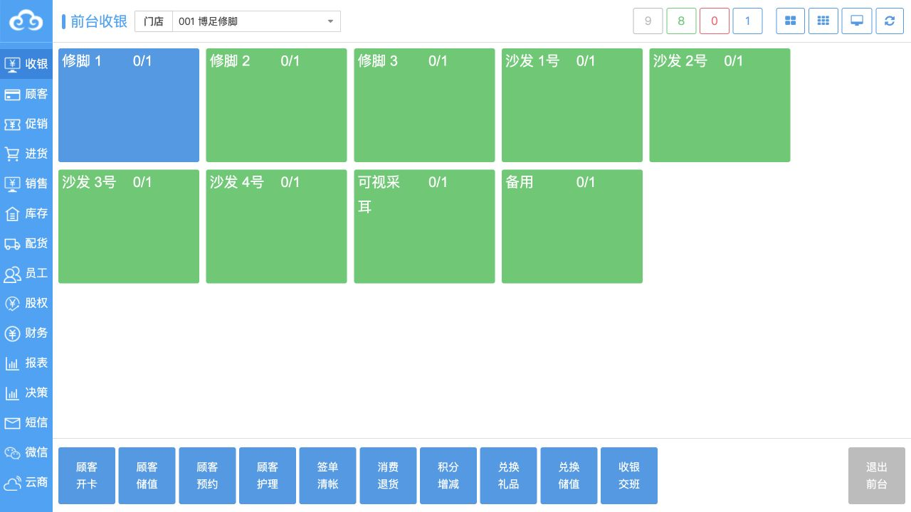
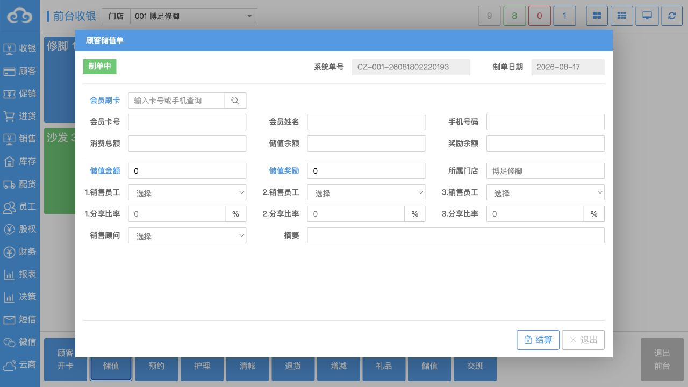
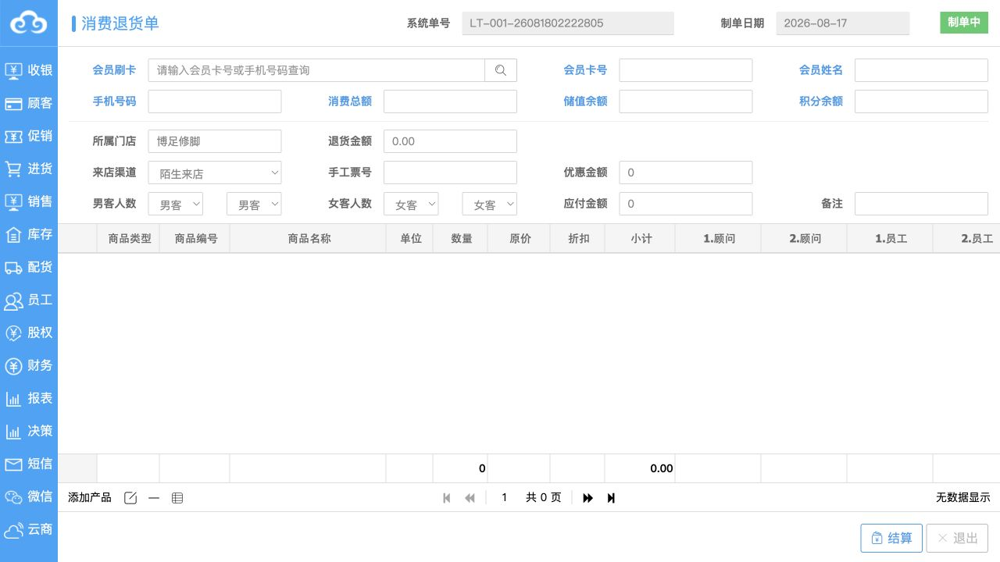
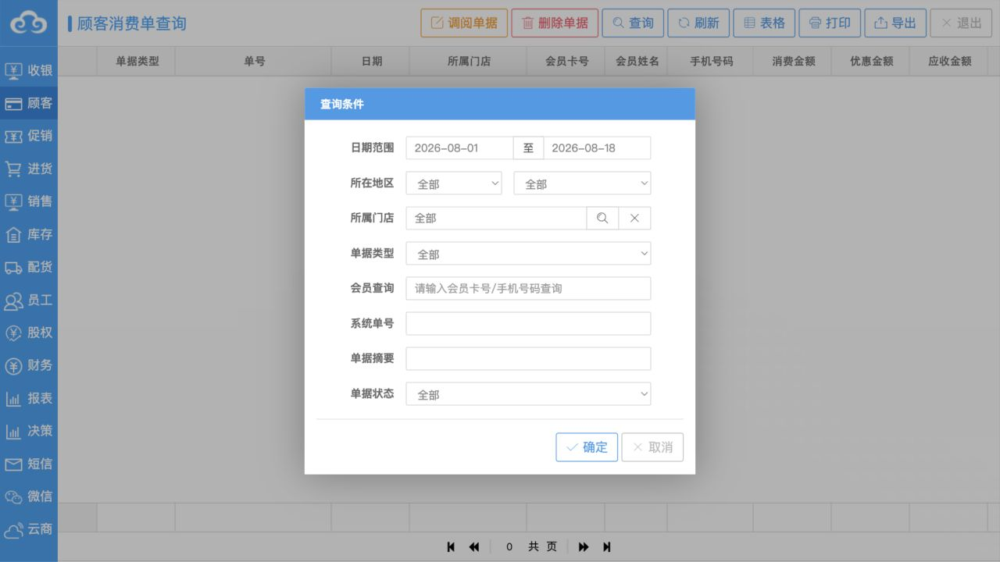
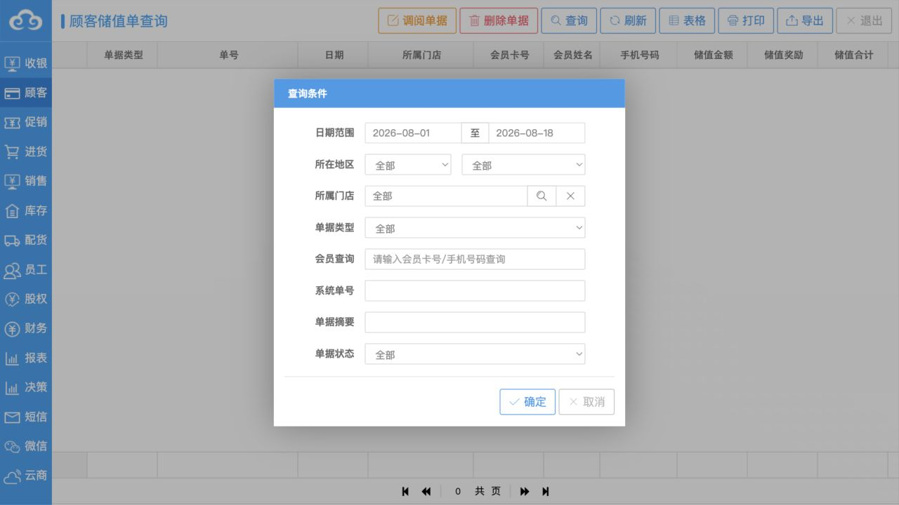
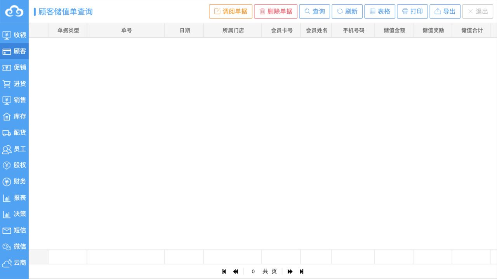
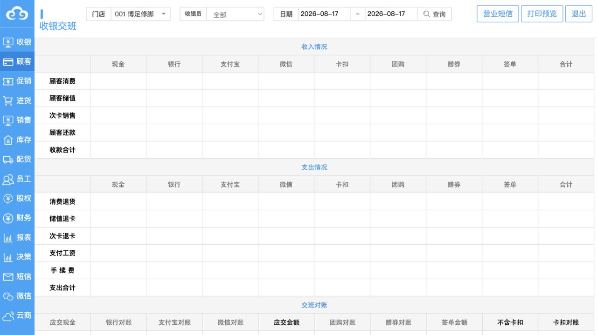
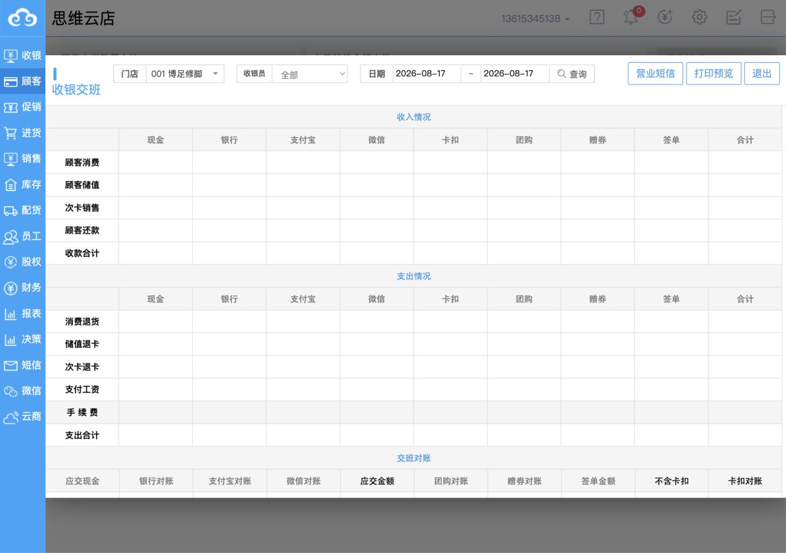

# 老板系统：收银与会员资金业务逻辑审阅

审阅日期：2026-08-18  
审阅范围：前台设施看板、顾客储值、消费退货、消费单查询、储值单查询、收银交班。  
操作边界：只查看页面与空白表单；未保存、结算、删除、审核、打印、导出或提交查询条件。

## 结论

老板系统的收银主线不是“设施计时后自动计费”，而是以下四层业务相互关联但彼此独立：

1. **设施状态层**：记录设施可用、等待、服务中等现场状态和占用情况。
2. **业务单据层**：由店长录入顾客、项目/产品、数量、折扣、员工归属和应收金额。
3. **资金结算层**：将一张业务单的实收拆分到现金、银行卡、储值、奖励、支付宝、微信、团购、赠券、签单等渠道。
4. **班次对账层**：按门店、收银员和日期汇总收入、支出及各渠道应对金额，用于交班核对。

因此，新 ERP 应继承这套业务分层，但不应照搬参考系统把每种支付方式做成消费单上的固定列，也不应把“打开设施”直接变成占用或创建账单。

## 审阅步骤

### 1. 前台设施看板 — 状态：业务入口集中，查看与写状态未分离

页面按设施展示可用、等待和服务状态，底部集中放置开卡、储值、预约、护理、签单清账、退货、积分、兑换和交班入口。设施看板承担现场调度职责，但设施计时本身没有显示为价格计算依据。

已确认的风险是：此前只打开空设施就让设施进入等待状态并持续保留。目标系统必须把“查看详情”和“开始接待”拆成两个动作。

### 2. 顾客储值单 — 状态：会员账户与销售归属逻辑完整

储值单先通过会员卡号或手机号识别会员，再展示储值余额与奖励余额。录入项包含储值金额、储值奖励、门店、销售员工、分享比率、销售顾问和摘要。

这说明老板系统把“本金储值”和“奖励金额”作为两类权益记录，并把储值销售纳入员工业绩归属。页面以“结算”结束，而不是简单保存。

### 3. 消费退货单 — 状态：信息全面，原单约束证据不足

退货单包含会员身份、消费总额、储值余额、积分余额、退货金额、优惠、应付金额、来店渠道及商品/项目明细；明细还记录顾问和员工归属。

当前空白页面没有证明退货必须引用原消费单。目标系统应强制从原单和原明细发起可追溯退货，防止自由录入金额造成资金与库存不一致。

### 4. 消费单查询 — 状态：支付拆分充分，扩展方式僵硬

查询条件支持日期、地区、门店、单据类型、会员、系统单号、摘要和单据状态；状态包含已审核、待审核和已作废。

页面字段结构显示，消费单保存消费金额、优惠金额、应收金额、积分，以及现金、银联、储值、奖励、支付宝、微信、团购、赠券、签单和还款等金额；支付宝、微信和团购另有外部交易号或订单号，并记录各渠道手续费、收银员和交易时间。

这证明支付是消费单的“渠道分摊”，审核状态与支付记录是两个维度。页面存在外部交易号字段，但仅凭页面不能证明已经接入微信或支付宝的实时支付回调。

### 5. 储值单查询 — 状态：储值收入同样进入多渠道资金核算

储值业务有独立单据和查询入口，单据类型区分顾客储值单与储值退款单，状态同样包含已审核、待审核和已作废。

储值单字段包括储值金额、储值奖励、储值合计、作价金额、积分，以及现金、银联、支付宝、微信、赠券、签单和还款等渠道金额与手续费。这说明储值不是直接修改会员余额，而是先形成资金单据，再影响会员账户。

### 6. 收银交班 — 状态：已形成按业务类型和支付渠道的对账矩阵

交班页面按门店、收银员和日期汇总：

- 收入：顾客消费、顾客储值、次卡销售、顾客还款。
- 支出：消费退货、储值退卡、次卡退卡、支付工资、手续费。
- 渠道：现金、银行、支付宝、微信、卡扣、团购、赠券、签单。
- 对账：应交现金、银行/支付宝/微信/团购/赠券对账、签单金额、卡扣对账等。

这意味着老板系统把“业务发生额”“支付渠道发生额”和“班次实交/对账”分开统计，是升级版必须保留的核心业务逻辑。

## 老板系统现状业务链

## 升级后的业务规则

1. **设施与收费解耦**：设施开始、暂停、结束只产生设施使用记录，不生成收费金额。
2. **老板控制标准价**：服务项目、产品、卡类、会员价和促销规则由最高权限账号维护并版本化。
3. **店长确认实际金额**：结算时店长录入或确认实际成交价；系统同时保存标准价、折扣、改价原因和操作者。超出授权范围需老板审批。
4. **支付真假不能靠口头确认**：没有支付接口时，微信/支付宝等只可标记为“人工登记待核对”，必须录入参考号或上传凭证，并在交班/对账后变为“已核对”。
5. **会员卡扣由系统内部确认**：储值、奖励、次卡和积分通过内部余额与不可变流水实时校验，余额不足时禁止结算。
6. **支付方式配置化**：新增支付渠道只增加配置和分摊记录，不给消费单表增加新列。
7. **财务单据不可物理删除**：未结算草稿可作废；已结算单据只能退款、冲正或红字处理，并保留原单关系。
8. **交班是独立流程**：系统计算“理论应交”，收银员录入“实际交接”，差额必须说明并形成待处理事项。

## 需要业务负责人确认

- 微信/支付宝第一期是否接支付接口、只录交易号，还是上传凭证后人工核对。
- 老板允许店长改价的范围：完全禁止、固定比例以内，或超过阈值审批。
- 交班差额由谁复核，是否必须当天关班。
- 退款是否必须原路退回，以及线下支付无法原路退时的授权规则。

## 证据限制

本次只核对页面结构和空白单据，没有提交查询、结算或保存，因此能确认字段、入口和预期流程，不能证明第三方支付接口、审核、余额变更和财务记账已经真实闭环。
