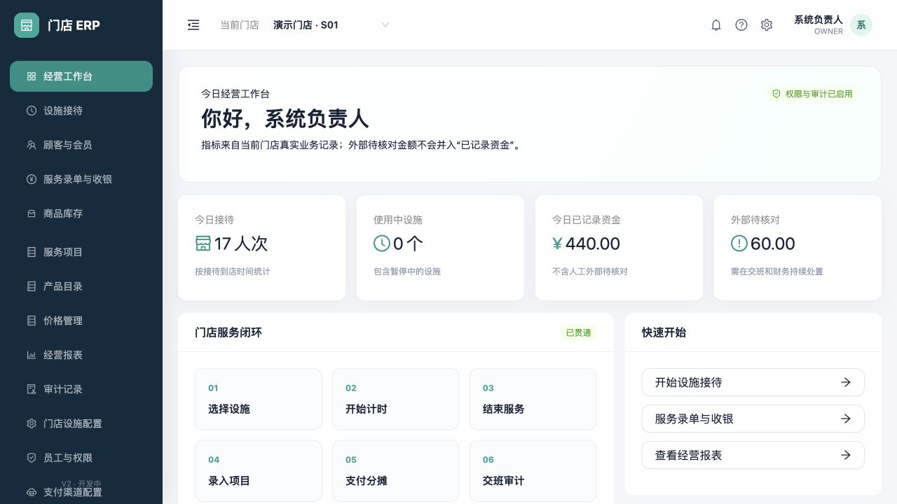
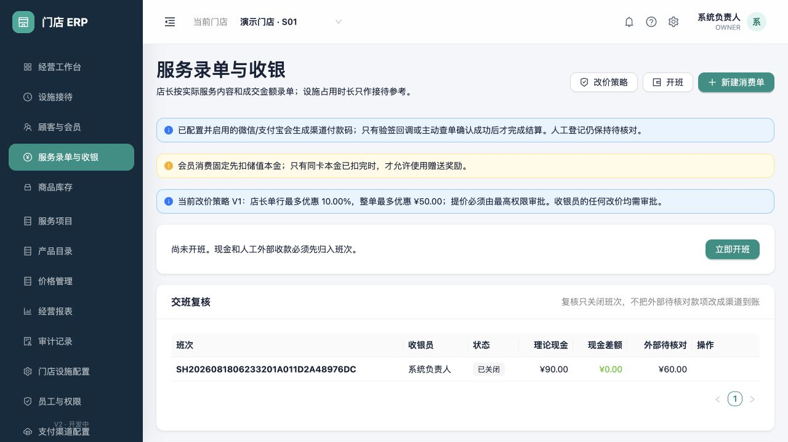
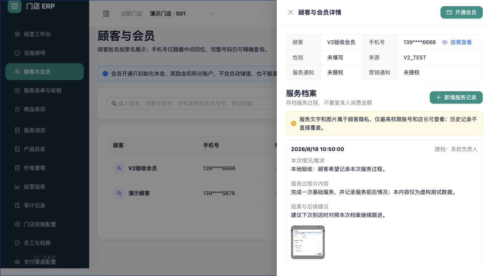
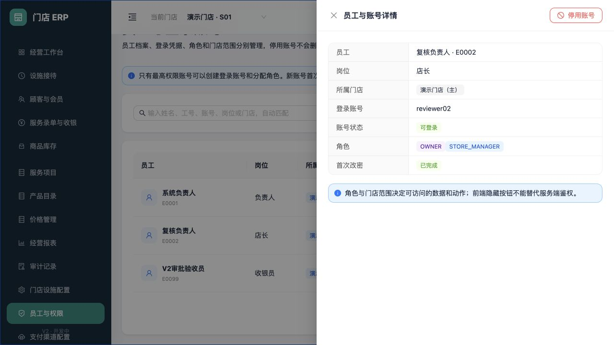

# ERP 上线前产品与工程差距审计

日期：2026-08-18
审计范围：经营工作台、服务录单与收银、顾客与会员、员工与权限，以及对应服务端、测试、发布和数据库代码。

## 结论

当前系统已经具备可运行的门店核心业务闭环，适合继续做内部验收和单店试点准备；但正式营业前仍有几项硬缺口，不能只把代码复制到服务器就视为上线完成。最重要的是正式空库初始化、Linux 真机发布闭环、真实 API/数据库自动化测试、监控备份、服务器端分页，以及顾客/员工/门店基础资料的生命周期管理。

## 整改执行规则

本报告同时作为后续实现与验收台账，代码、数据库、测试、交互和文档必须使用同一个编号。状态含义如下：

- `待实现`：尚无满足验收标准的代码。
- `实现中`：已有改动，但尚未完成本地验证。
- `本地完成`：代码和自动化验证已通过，但涉及服务器、域名或第三方商户的部分仍未验收。
- `外部待验收`：仓库内可交付物已经完成，必须在目标 Linux、真实支付商户或短信供应商环境完成最后验证。
- `已验收`：代码和目标环境验收均有证据。

任何“外部待验收”都不能写成“已上线”。数据库只允许 Flyway 前向迁移，不修改已执行迁移，不以删库或清表解决升级问题。

## 页面证据

### 1. 经营工作台：健康

- 门店上下文、今日指标、资金口径和核心流程入口清楚。
- “外部待核对”与“已记录资金”分开，避免把人工登记误报为渠道到账。
- 侧栏已改为构建注入的 SemVer 和环境标识；本地显示 `0.0.0-local · 本地开发`，Linux 发布包显示实际版本和生产环境。

### 2. 服务录单与收银：已完成工作台分区

- 已拆为“今日收银”“待处理”“交班复核”三个工作区，审批数量和待复核数量直接显示。
- 今日收银保留班次、待录单指标和订单；顾客、项目、员工、状态、日期和关键词会自动组合查询。
- 现金结算记录实际交付和服务端计算的找零；小票首次打印与补打使用递增序号并写审计。

### 3. 顾客详情：会员和档案较完整，资料生命周期不完整

- 手机号脱敏、按需查看、服务档案、会员卡与独立账户关系表达清楚。
- 已补基本资料修改、停用/恢复及带阻断预览的重复档案逻辑归并；服务档案追加更正仍待完成。
- 列表依赖整行点击打开详情，缺少明确的“查看”按钮和键盘操作语义。

### 4. 员工与权限：生命周期已形成闭环

- 员工、登录账号、角色、门店范围和账号状态已经分开显示。
- 已补姓名/岗位修改、门店调动、角色变更、离职/复职、管理员重置初始密码和账号启停；复职不会擅自恢复登录。
- 角色在列表与详情显示中文业务名称，内部代码只作为编辑选项的次级信息。
- 当前用户不可变更自己的授权、离职、停号或由管理员入口重置密码；最后一个有效 `OWNER` 受服务端保护。密码正文不回显、不进入审计元数据。

## 上线前必须补齐（P0）

| 编号 | 状态 | 整改内容 | 验收标准与当前证据 |
| --- | --- | --- | --- |
| P0-01 | 本地完成 | 正式空库初始化 | `dotnet Erp.Api.dll --bootstrap` 只从环境变量取值；非空库拒绝；事务创建品牌、首店、五类角色、负责人、默认策略和支付方式；真实渠道默认停用；负责人强制首次改密。已用临时 PostgreSQL 执行全部25版迁移，验证结果为品牌1、门店1、角色5、用户1、支付方式7、停用真实渠道2，第二次初始化被拒绝。目标 Linux 仍需实际执行。 |
| P0-02 | 本地完成 | Linux 新机部署与发布闭环 | 已实现 Ubuntu 24.04 新机初始化、SSH公钥与防火墙收口、PostgreSQL 18最小权限账号、Nginx公网IP HTTPS、回环Blue/Green systemd、受保护环境文件、固定摘要Flyway、不可变包逐文件校验、发布前备份、两级健康门禁、原子切流和失败恢复。Bash解析和仓库规则测试通过；仍须在目标Linux完成第27版schema、证书续期和失败切流真机演练。原Windows资产只保留历史，不再适配。 |
| P0-03 | 本地完成 | 真实 API/PostgreSQL 自动回归 | 已用 Testcontainers PostgreSQL 18.4、全量25版迁移和真实 HTTP API 覆盖：空库初始化、Cookie/CSRF 登录、首次改密门禁、顾客、服务/产品、预约排班及冲突、设施接待/结束、录单、现金开班/支付与找零、小票补打审计、部分退款及退货入库。新增 push/PR CI 门禁；依赖审计无已知漏洞。 |
| P0-04 | 本地完成 | 生产监控和告警 | 已实现systemd五分钟健康检查：活动服务、HTTPS入口、schema、PostgreSQL、根磁盘、36小时备份和24小时证书余量；失败写journald，可选以受保护HTTPS webhook外发。仍需在目标Linux接入真实告警接收方并制造一次故障验收。请求耗时/错误率和支付异常的指标聚合继续列入试点增强。 |
| P0-05 | 本地完成 | 异地联合备份与恢复 | 已实现每日数据库、附件和Data Protection密钥联合清单、age公钥加密、SHA-256和14天本机保留；隔离恢复脚本拒绝覆盖既有库，校验归档路径、逐文件摘要、custom dump和schema后自动删除临时库。仍需配置服务器外复制并在隔离Linux持有私钥完成真实恢复与图片解密抽查。 |
| P0-06 | 本地完成 | 高增长业务列表服务端分页 | 已建立统一 `{items,total,page,pageSize}` 契约和每页1–100校验；顾客、员工、待录单接待、消费单、支付、退款、交班、储值、库存流水/单据、服务档案、改价审批和渠道对账均在数据库执行 `Count + Skip/Take` 与稳定排序。消费单、库存、储值、服务档案和对账页面使用真实总数受控翻页；收银待处理选择器使用上限100的队列页。真实PostgreSQL API覆盖业务分页及非法上限。通知和服务记录的消费单选项仍为有意限制的短待办/选择器，不属于历史列表。 |
| P0-07 | 外部待验收 | 安全入口收口 | 已泄露服务器密码必须轮换，RDP只允许管理IP；取得域名、证书并强制HTTPS；支付回调只接受公网HTTPS。仓库不能代替云控制台和域名验收。 |

## 单店试点首月补齐（P1）

| 编号 | 状态 | 整改内容 | 验收标准 |
| --- | --- | --- | --- |
| P1-01 | 本地完成 | 顾客生命周期 | 已完成资料编辑、停用/恢复、版本冲突、手机号重复检测、合并预览和逻辑归并。第22版迁移保存合并血缘；跨门店、进行中接待、未完成消费单、有效验证码及合并链冲突会阻断。历史订单、服务档案和账务外键不改写，保留档案聚合卡、余额与历史；源手机号/姓名/卡号查询只返回目标。写操作均保留原因与审计。 |
| P1-02 | 本地完成 | 员工生命周期 | 已完成姓名/岗位编辑、角色与门店调动、离职/复职、账号启停和管理员重置初始密码；使用版本号防并发覆盖，离职同步停号、复职不自动启用。禁止自改授权/自离职/自停号/管理员入口自重置，最后一个有效 OWNER 不可停用、离职或移除。密码正文不回显、不写审计；真实PostgreSQL HTTP回归覆盖新增、编辑、改权、重置、离职、复职和重新启用。 |
| P1-03 | 本地完成 | 品牌/门店主数据 | 新增“品牌与门店”设置页和OWNER专属API，支持品牌编辑、门店新增/编辑/停用/恢复及版本冲突保护；列表汇总店长、在职员工、服务区和服务位。OWNER自动获得全部有效门店范围，普通角色仍按分配收口。最后一家有效门店、活动设施、未完成接待/订单和未关闭班次会阻断停用；历史数据不删除。真实PostgreSQL回归覆盖跨店可见、停用后上下文移除、最后门店保护和恢复。 |
| P1-04 | 本地完成 | 价格、服务档案与订单修正 | 价格草稿可编辑和取消，已发布版本继续不可变；第23版迁移增加仅追加的服务档案更正记录和数据库防改触发器，页面保留原文及全部更正历史；订单已支持顾客、项目、员工、状态、日期以及单号/顾客/项目/员工/备注关键词组合查询。真实PostgreSQL回归覆盖草稿编辑/取消、档案更正和订单筛选。 |
| P1-05 | 本地完成 | 收银工作台分区 | 页面已拆分“今日收银、待处理、交班复核”；第24版迁移保存现金实收和服务端计算找零。已付款消费单可打印小票，首次标记顾客联，后续标记递增补打联；每次打印记录操作者、时间、支付单和序号审计。真实PostgreSQL验证200元实收、150元应收、50元找零及连续两次打印。物理打印机型号适配仍属于目标门店验收。 |
| P1-06 | 本地完成 | 前端业务回归 | 前端11项自动测试覆盖CSRF安全提交与过期令牌单次恢复、结构化失败、自动检索防抖/取消、员工列表显式详情入口、现金分摊/残留实收保护和预约时间规则；103项领域测试及29项真实HTTP/PostgreSQL集成测试覆盖登录、新建、编辑、停用/恢复、预约排班、收银、退款和权限拒绝。失败恢复不靠重复生成业务命令。完整真实浏览器商户支付仍属P2-06。 |
| P1-07 | 本地完成 | 可访问性和屏幕适配 | 已移除1180px硬最小宽度，侧栏在窄屏自动收起，表格局部横向滚动，表单/指标响应式改单列；顾客、员工、消费单、审计列表增加显式“查看”按钮并保留键盘焦点样式。真实浏览器在960×720和600×800验证页面宽度等于视口宽度，收银三分区和操作列仍可见。 |
| P1-08 | 本地完成 | 文档与版本标识同步 | 支付手册已同步三分区、现金实收/找零和小票规则；侧栏改为构建注入的SemVer及本地/预发布/生产环境标识，Linux构建脚本强制注入发布版本，仓库规则测试锁定该行为。 |

## 后续业务扩展（P2，不阻塞首个试点）

| 编号 | 状态 | 整改内容 | 验收标准 |
| --- | --- | --- | --- |
| P2-01 | 本地完成 | 预约与排班 | 第25版迁移新增预约与员工班次；预约支持新增、修改、分页自动查询、员工/设施冲突、到店转接待、取消和爽约，班次支持新增、修改、取消和重叠阻断。取消保留历史，到店与设施实际可用性复核同事务，计时不生成收费。103项领域测试、29项真实HTTP/PostgreSQL集成测试、11项前端测试和生产构建通过；本地真实浏览器确认菜单、双页签、查询、预约表单和排班列表可见。真实门店排班习惯仍待试点校准。 |
| P2-02 | 本地完成 | 会员扩展 | 第26版迁移支持储值部分退款，按累计本金退款比例向上取整收回赠送金，余额已消费时拒绝；第27版新增次卡、积分批次与不可变流水。次卡购买/赠送次数分账并先扣购买次数，支持核销、撤销、过期；积分按最早到期批次使用，支持增减、撤销和过期。107项领域测试、29项真实HTTP/PostgreSQL集成测试、14项前端测试通过；真实浏览器确认顾客详情、次卡/积分入口和发放表单。次卡正式售卡收款、复杂退卡作价和跨店清算仍为后续边界。 |
| P2-03 | 本地完成 | 供应链与高级库存 | 第28版迁移新增供应商、采购入库、成本/效期批次、批次分摊、冻结账面盘点和跨店调拨。盘点申请人与审批人分离；调拨按待出库、在途、已收货推进并保留原批次成本；过账事实和明细由数据库禁止修改/删除。112项领域测试、30项集成测试（核心流程使用真实HTTP/PostgreSQL）、14项前端测试、静态检查和生产构建通过；本地真实浏览器确认五个页签与必填/可选字段。采购订单、采购退货和供应商应付不在本项范围，真实门店实物盘点仍待试点验收。 |
| P2-04 | 待实现 | 薪酬发放 | 按比例/固定金额提成进入结算期，复核、锁定、发放和冲正可追踪；“已核算”不等于“已发放”。 |
| P2-05 | 外部待验收 | 真实短信 | 完成供应商适配、模板、签名、发送回执、重试、费用监控；必须有真实供应商账号验证送达。 |
| P2-06 | 外部待验收 | 微信/支付宝正式验收 | 完成真实商户下单、签名验签、回调幂等、退款、日账单对账和异常冲正；必须具备域名、HTTPS及商户证书。 |

## 证据边界

本次页面检查使用当前本地开发数据和最高权限账号，能够证明页面结构和已有交互入口，不能替代真实门店压力测试、Linux 真机部署、支付商户验收、短信送达验证或完整无障碍测试。

## 执行记录

- 2026-08-18：建立本整改台账。
- 2026-08-18：完成 P0-01 仓库实现和临时 PostgreSQL 空库验证；真实 Linux 首次初始化仍属于 P0-02 的目标环境验收。
- 2026-08-18：根据部署方向变更，将 P0-02 从 Windows/IIS 改为 Linux/Nginx/systemd；撤回本轮尚未提交的 Windows 建站实现，原 Windows 发布资产停止扩展。
- 2026-08-18：完成 P0-03 真实 API/PostgreSQL 全链路测试与 push/PR CI 门禁；因 Testcontainers 间接依赖触发高危漏洞告警，已显式升级到修复版 SSH.NET 2026.0.0 后通过漏洞审计。
- 2026-08-18：完成 P0-02、P0-04、P0-05 的Linux仓库实现：公网IP短期证书、Blue/Green发布、失败切流恢复、每日age联合备份、隔离恢复验证和systemd健康监测；真实主机、外部告警和异地副本仍属于外部验收边界。
- 2026-08-18：环境目标进一步收口为Linux；Windows目录和历史沟通记录只保留决策追溯，不再维护、构建或验收。
- 2026-08-18：完成P2-03供应链与高级库存本地闭环；真实PostgreSQL覆盖供应商、采购批次/成本/效期、盘点提交/取消和跨店出库/收货，浏览器仅查看表单、未提交测试数据。
- 2026-08-18：启动P0-06统一分页，首批完成顾客与员工；全量87个领域测试、29个集成测试和2个前端测试继续通过。
- 2026-08-18：完成P0-06高增长业务列表分页，清除交易历史中的固定`Take(100/200/300)`；真实PostgreSQL新增验证消费单、支付、退款、库存流水/单据的分页契约与非法上限，后端87/87、集成29/29、前端2/2、静态检查和生产构建均通过。
- 2026-08-18：启动P1-01，完成顾客资料编辑、停用/恢复、版本冲突、手机号重复检测、完整手机号编辑前留痕和审计；真实PostgreSQL验证编辑后精确查询及停用/恢复后继续业务，领域测试增至89个。重复档案合并仍在后续切片。
- 2026-08-18：完成P1-01重复顾客逻辑归并：第22版迁移记录源/目标血缘，合并预览汇总卡、余额与历史，跨店/活动接待/未完成订单/验证码/合并链冲突阻断；真实PostgreSQL验证源手机号重定向、源会员卡聚合和活动接待阻断，历史不可变外键不改写。
- 2026-08-18：完成P1-02员工生命周期：资料、岗位、门店与角色可版本化编辑，离职停号、复职不自动启用，管理员密码重置强制首次改密；界面角色中文化，服务端保护自操作与最后一个有效OWNER。领域测试91/91、真实PostgreSQL集成测试29/29、前端静态检查与生产构建通过。
- 2026-08-18：完成P1-03品牌与门店主数据：OWNER可编辑品牌并新增、编辑、停用/恢复门店，跨店汇总店长/员工/设施；停用阻断进行中业务并保留最后有效门店，停用门店从会话门店范围自动移除。真实PostgreSQL回归和前端构建通过，领域测试增至92个。
- 2026-08-18：完成P1-04价格草稿编辑/取消、服务档案追加更正和订单组合自动查询；第23版迁移禁止更正记录更新/删除，真实PostgreSQL回归通过，领域测试增至94个。
- 2026-08-18：完成P1-05收银工作台三分区、现金实收/找零和小票首次打印/补打审计；第24版迁移持久化现金快照，领域测试96/96、真实PostgreSQL集成测试29/29、前端2/2及生产构建通过。
- 2026-08-18：完成P1-06至P1-08：前端测试扩充至9/9并加入失效CSRF自动恢复；移除1180px硬宽度、补显式查看入口和焦点样式；600/960像素真实浏览器无页面级横向溢出。侧栏及Linux发布包改为真实版本/环境标识，P1本地整改全部闭合。
- 2026-08-18：完成P2-01预约与排班纵向闭环：第25版迁移、角色和门店权限、员工/设施预约冲突、员工班次冲突、到店转接待、取消/爽约、自动查询、幂等终态和审计均接通；领域测试103/103、真实HTTP/PostgreSQL集成测试29/29、前端11/11及生产构建通过，本地真实浏览器确认菜单、预约表单和排班页签可用。
- 2026-08-18：完成P2-02会员扩展纵向闭环：第26版储值部分退款按累计比例收回赠送金，第27版新增次卡、积分批次和不可变流水；真实HTTP/PostgreSQL覆盖储值500+赠送100退本金200、次卡核销/撤销、积分增减/撤销。领域测试107/107、集成测试29/29、前端14/14、静态检查和生产构建通过；真实浏览器确认顾客详情入口和次卡发放表单。部署方向仅保留Linux，Windows资产停止适配。
