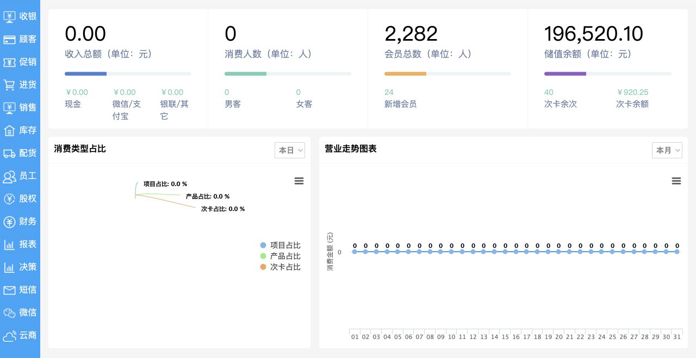
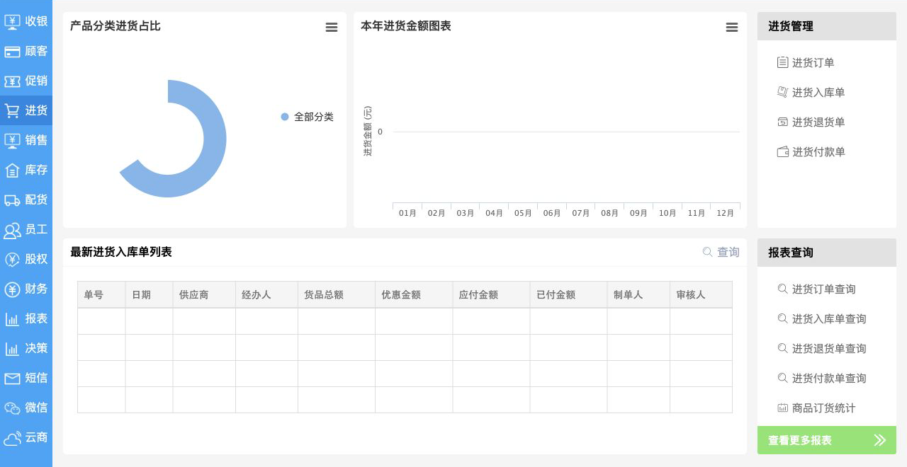
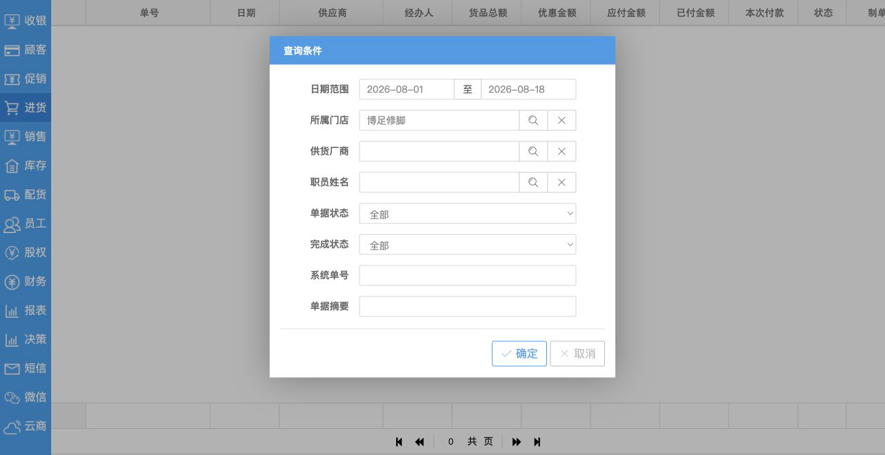
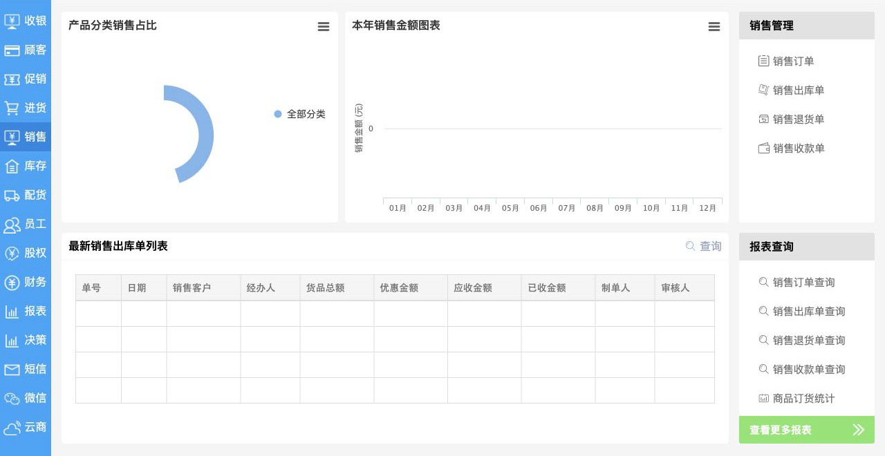
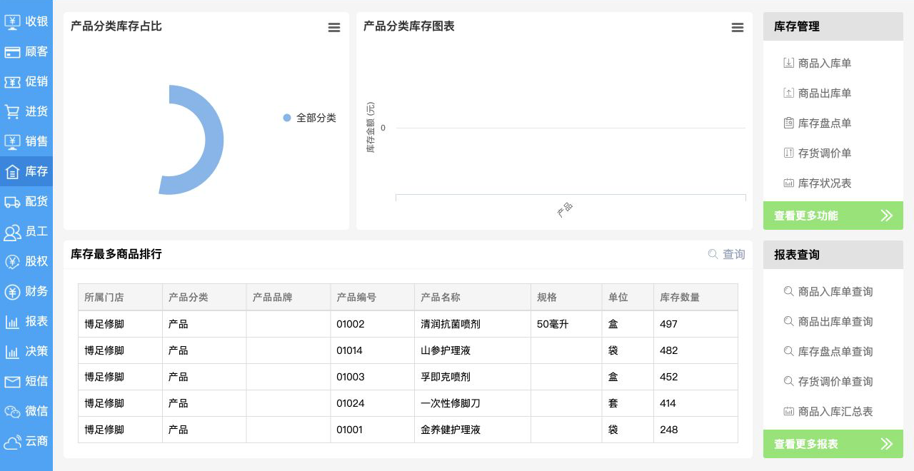
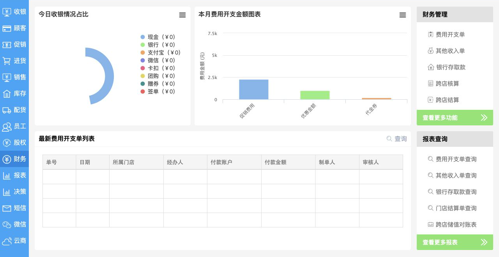
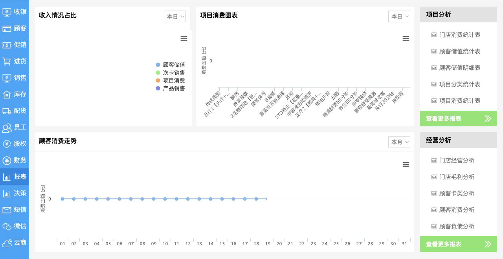
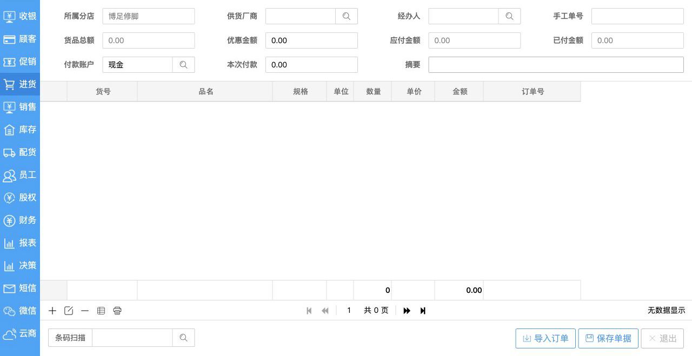
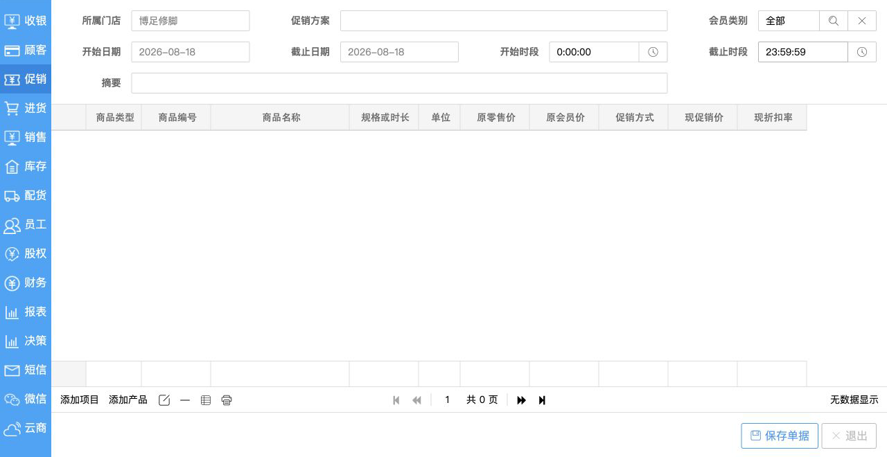

# 思维云店 ERP 模板设计审阅

审阅日期：2026-08-18  
审阅方式：以只读查看为原则；未保存、删除、审核、结算、发送、导出、打印或提交查询条件。收银房台入口存在“仅打开即改变等待状态”的隐式写入异常，已在PRD中单独记录。

本报告截图均已裁去顶部账户信息；含真实顾客、员工、手机号或薪资记录的页面不留图。完整功能与需求拆解见 [ERP PRD](../docs/PRD.md) 和 [覆盖矩阵](../docs/coverage-matrix.md)。

## 总体判断

这个模板不是通用 ERP，而是一套面向连锁门店、会员与服务零售场景的经营系统。它的产品结构成熟，核心方法是按业务域拆分工作区，再让每个工作区复用同一种页面骨架；但视觉与交互明显偏旧，信息密度、权限动作隔离、空状态和可访问性都需要重新设计。

最值得继承的是业务结构，不应照搬它的 iframe 页面架构、窄侧栏、右侧功能墙和弹窗式查询体验。

后续全量遍历覆盖了12个纳入模块；股权、微信、云商按用户要求排除。报表26个入口全部成功打开，决策21个入口中14个打开、7个无可辨识变化；其他无响应入口也按模块列入覆盖矩阵，未被误判为可用能力。

## 页面骨架

1. 左侧固定一级业务导航：收银、顾客、促销、进货、销售、库存、配货、员工、股权、财务、报表、决策等。
2. 顶部固定账户工具栏：账号、知识库、提醒、续费、设置、反馈、退出。
3. 中央模块工作区：KPI 或图表、最近单据列表、趋势分析。
4. 右侧模块快捷入口：业务操作与报表入口分组陈列。
5. 详细列表页：标题、动作工具栏、数据表格、分页；筛选条件使用居中弹窗。

## 审阅步骤

### 1. 系统总览 — 状态：结构清楚，空状态较弱

总览以四个核心指标、业务占比和营业趋势构成。指标入口直观，但零数据时图表仍保留大面积空白，没有解释、引导或建议动作。

### 2. 进货工作区 — 状态：业务闭环完整，入口过密

同一页同时覆盖订单、入库、退货、付款及相关统计，形成采购闭环。右侧入口较密，亮绿色“查看更多”比核心业务信息更抢眼。

### 3. 查询条件弹窗 — 状态：字段完整，操作打断明显

日期、门店、供应商、职员、状态和单号等筛选维度齐全，但打开列表后立即弹出条件层，打断用户查看；更适合改为页面内可折叠筛选栏或筛选抽屉。

### 4. 单据列表 — 状态：功能齐全，风险动作隔离不足

查询、刷新、打印、导出和删除被平铺在同一工具栏，视觉层级接近。删除等敏感动作应由权限控制，放入次级菜单并要求二次确认；表格需要固定关键列、列设置和横向滚动提示。

### 5. 销售工作区 — 状态：与进货模块高度一致

销售订单、出库、退货、收款与统计采用和进货相同的页面模板。跨模块一致性很好，适合新系统继续采用统一工作区模板。

### 6. 库存工作区 — 状态：信息实用，数据密度可优化

库存排行提供了直接可行动的信息，但缺少低库存、滞销、临期和异常库存等优先级信号。新系统应突出异常，而不只是展示数量最多的商品。

### 7. 财务工作区 — 状态：覆盖全面，重点不够突出

支付方式、费用趋势与单据列表被放在同一层级。新系统应优先呈现待审核、应收应付到期、现金风险和对账异常。

### 8. 报表工作区 — 状态：分析维度丰富，导航负担较重

服务项目、会员储值、次卡、毛利与顾客分析覆盖较全，但报表入口依赖长列表。建议提供搜索、收藏、最近使用和按角色推荐。

### 9. 进货入库单表单 — 状态：单据结构完整，录入引导不足

表单采用“单据头 + 商品明细表 + 汇总金额 + 底部操作”的经典结构，系统单号、日期、门店、供应商、经办人、付款信息与商品行较完整。问题是字段和表格几乎处于同一视觉层级，必填项、校验状态、未保存状态和金额关系不够突出。

### 10. 促销开单表单 — 状态：规则维度清楚，复杂规则承载有限

促销表单覆盖门店、会员范围、有效期、时段、项目/产品、原价、促销价和折扣率。它适合简单门店促销，但复杂规则仍需要条件组、互斥规则、预算上限、叠加策略和效果预估等能力。

### 11. 顾客开卡表单 — 状态：业务字段全面，隐私与表单分组需加强

开卡表单覆盖卡类、卡号、手机号、姓名、生日、密码、推荐人、签单额度、渠道、短信偏好、储值、销售分成和顾问等字段。由于页面背景包含真实顾客信息，本报告不保存或展示该截图。新系统应按“身份信息、会员权益、营销授权、储值、归属与分成”分组，并对手机号等个人信息进行默认脱敏和权限控制。

## 值得继承

- 以业务域组织一级导航，而不是按数据库表组织。
- 采购与销售使用镜像闭环：订单、入/出库、退货、收/付款。
- 每个模块复用“概览 + 最近单据 + 常用操作 + 报表”的一致结构。
- 总览、业务执行、单据查询、经营分析分层明确。
- 门店、会员、储值、次卡、服务项目等行业能力已经进入主信息架构。

## 不建议照搬

- 十五个一级入口全部塞进窄侧栏，缺少分组、折叠和角色化显示。
- iframe 与多层弹窗承载核心页面，容易造成浏览器历史、键盘焦点和响应式问题。
- 查询页把查看、打印、导出和删除混在同一动作区。
- 图表在无数据时仍占据大量空间，缺少有效空状态。
- 字体与灰色图标对比偏低，顶部大量图标仅靠图形表达含义。
- 固定宽度表格在当前视口已出现右侧内容被截断的风险。
- 新增表单直接生成系统单号并进入“制单中”，但离开时缺少明显的未保存提示；需要明确草稿是否已落库、何时占号以及如何回收。
- 收银空房台仅被打开就从“干净”变为“顾客等待”，说明查看与创建主单未分离；目标系统必须使用显式开始接待动作和可审计状态机。
- 顾客页默认展示姓名和完整手机号，数据最小化与脱敏不足。

## 对新 ERP 的建议骨架

建议保留它的业务逻辑，换成现代化桌面优先 Web 应用：

- 可展开侧栏：经营、客户、供应链、库存、财务、组织、分析七组。
- 顶部全局栏：门店切换、全局搜索、待办、消息、个人账户。
- 页面标题区：面包屑、页面说明、主要动作；敏感动作与查看动作分离。
- 模块首页：关键指标、异常待办、趋势、最近单据、快捷操作。
- 列表页：常驻快速筛选、可展开高级筛选、可配置表格、保存视图。
- 单据详情：基本信息、明细、金额、状态流转、审批记录与操作日志。
- 权限模型：按组织、门店、角色、数据范围、字段和动作分层控制。

## 可访问性与证据限制

从截图可见的风险包括低对比灰色文字、图标含义依赖视觉、表格密集和弹窗层级较深。键盘操作、焦点顺序、屏幕阅读器语义、缩放与响应式表现未做操作测试，因此不能据此判断完整的 WCAG 符合性。
