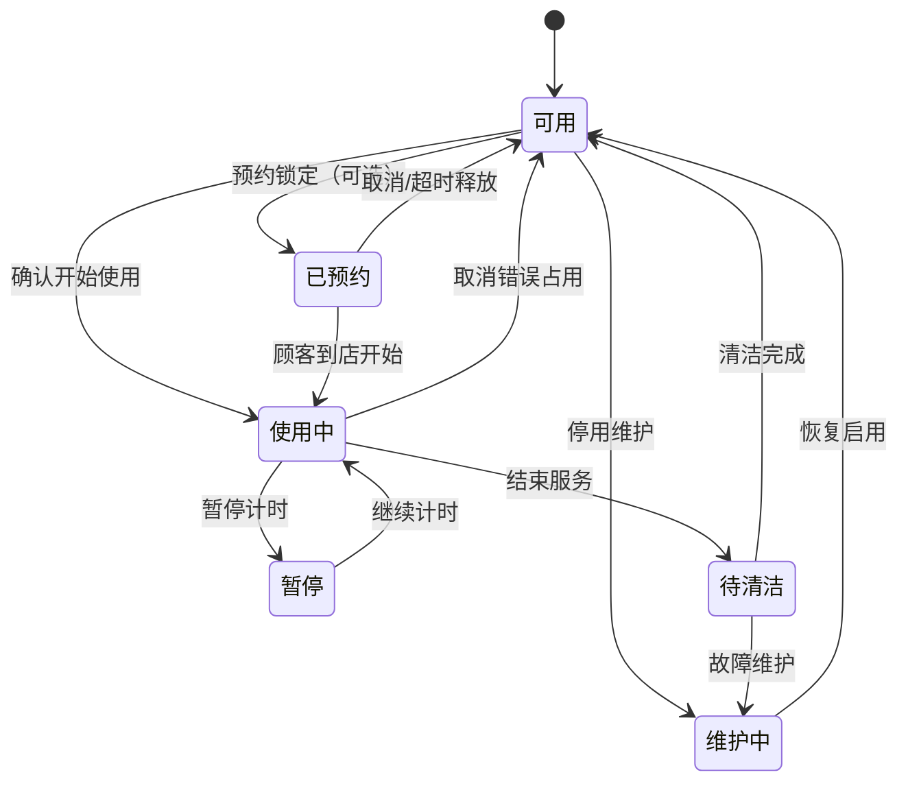

# 门店接待、设施计时与收银领域设计 v2

日期：2026-08-18  
依据：门店实际业务补充 + 老板系统收银、储值与交班页面核对

参考证据见 [老板系统：收银与会员资金业务逻辑审阅](../../design-audit/cashier-business-logic-2026-08-18/report.md)。
首个开发闭环的状态码、迁移命令、并发规则和验收案例以 [V1核心状态机与验收用例](../v1-state-machines-and-acceptance-cases.md) 为准。

## 1. 真实业务流程

顾客到店后先与店长或前台沟通。店长为顾客选择一个可用设施，明确执行“开始使用”后，设施进入占用状态，系统从服务端开始计时。此时可以暂不识别顾客，也可以选填顾客和预计服务作为后续识别上下文。服务结束后停止计时并释放设施，店长补录或确认实际服务项目、服务内容、服务时长和最终收费金额；顾客可以在结算前再提供姓名、手机号或会员卡信息，随后完成会员权益核验与结算。预计服务不等于实际服务，不产生任何自动收费。

因此，“设施使用”和“消费结算”不能建成同一个状态：顾客可以已经结束服务、设施已经释放，但账单仍处于待结算状态。设施占用计时只记录运营事实，与收费金额没有自动关联。


## 2. 三个独立业务对象

| 对象 | 作用 | 生命周期结束条件 |
|---|---|---|
| 接待记录 Visit | 表示一次顾客到店，串联顾客、设施、服务和账单 | 顾客离店且所有服务、结算或取消处理完成 |
| 设施使用记录 Facility Session | 表示某设施被一次接待占用和计时 | 服务结束、换台结束或取消占用 |
| 消费单 Service Order | 记录本次实际收费的项目、产品、员工、优惠和支付 | 已结算、已作废或完成退款/冲正 |

一个接待记录可以包含多段设施使用记录，例如顾客从沙发换到修脚位，也允许同一次接待同时关联多个不同设施；同一设施同一时刻只允许一条有效使用记录。接待可以包含一张主消费单和后续追加单，第一期默认“一张主单”，保留扩展能力。接待记录的顾客标识允许为空，在结算前再关联已有会员、快速建档或按散客完成结算。

## 3. 设施模型

“设施”是统一资源概念，可以代表房间、床位、修脚位、沙发、采耳位或其他可计时服务位置。

设施基础信息包括：

- 所属门店、区域和设施类型
- 设施编号、名称和排序
- 是否允许预约
- 是否允许同时服务多人
- 默认清洁时长
- 启用、停用和维护状态

设施实时状态建议为：



第一期支持“待清洁”状态；门店可以把清洁流程配置为自动完成，从而在结束服务后直接恢复可用。

## 4. 设施计时规则

- 点击设施卡片只能查看详情或打开操作面板，不能直接产生占用。
- 必须执行明确的“开始使用”动作后，才创建设施使用记录。
- 开始时间以服务端时间为准，前端只负责显示经过时长。
- 页面刷新、换电脑或短暂断网后，计时必须根据服务端时间继续计算。
- 暂停采用独立的暂停区间记录，不能直接修改开始时间。
- 结束服务后记录结束时间、总经过时长、暂停时长和实际使用时长。
- 人工修改开始时间、结束时间或时长必须具备权限、填写原因并保留修改前后值。
- 同一设施同一时刻默认只能存在一条有效使用记录；数据库需要唯一性或并发锁保证。
- “换设施”采用结束旧设施使用记录并创建新记录的方式，不能覆盖原设施历史。

实际使用时长建议按以下公式计算：

```text
实际使用时长 = 结束时间 - 开始时间 - 累计暂停时长
```

## 5. 服务内容与时长

店长可以在服务过程中录入项目，也可以在服务结束后统一补录。系统需要分别保存：

- 项目标准时长：来自项目档案，用于排班和经营分析。
- 设施实际使用时长：来自设施计时。
- 项目实际服务时长：店长确认或填写。
- 最终收费金额：由店长根据实际服务内容输入或确认。

这些信息不能使用同一个字段。设施使用时间可能包含等待、沟通和准备时间，并不一定等于项目服务时长。设施时长和项目时长都不能自动推导收费金额。

人工填写的项目时长可以将设施实际时长作为参考，但默认不自动带入，避免店长误把占用时间当成服务时长；任何项目时长调整都不反向修改设施原始计时记录。

项目、产品、卡类、会员价和促销规则由最高权限账号统一维护，采用生效时间和版本号保留历史价格。店长不能修改价格档案，但可以在结算时录入或确认本次实际成交金额。

实际金额必须同时保存标准价、价格版本、折扣/改价金额、改价原因和操作者。老板可以为店长配置改价权限范围；超过范围时进入审批，不能通过直接改明细单价绕过。这样既保证老板拥有定价权，也保留门店处理真实服务差异的能力。

## 6. 接待与消费单状态

### 6.1 接待状态

```text
已到店 → 服务中 → 服务已结束/待录单 → 待结算 → 已完成
```

其他状态包括：已取消、未消费离店、部分退款处理中。

### 6.2 消费单状态

```text
草稿 → 待确认 → 待结算 → 支付中 → 已结算
```

异常分支包括：支付失败、已撤回、已作废、部分退款、已退款、已冲正。

设施释放与账单结算分开：

- “结束服务”停止设施计时并释放或转入待清洁。
- “确认服务内容和收费金额”生成待结算账单。
- “完成支付”才产生支付、权益、库存和财务台账。

## 7. 设施看板交互

### 7.1 设施卡片

每张设施卡片至少展示：

- 设施名称和类型
- 当前状态
- 开始时间和已使用时长
- 顾客原名；未关联档案时显示“匿名顾客”
- 当前服务项目（已录入时）
- 服务员工（已分配时）
- 超过预计时长提醒

### 7.2 可用设施动作

点击可用设施后打开开始接待面板：

1. 可选择已有顾客、快速新客，也可以暂不录入顾客身份。
2. 可选录入预计项目、预计时长和服务员工。
3. 点击“开始使用”。
4. 系统再次确认设施、顾客和开始时间，随后创建接待及设施使用记录。

### 7.3 待录单识别

服务结束后，待录单队列按“顾客原名 + 预计服务 + 经历设施 + 到店时间”展示。占用时长自适应显示到秒，用于区分短时接待；接待单号仅为追溯字段。操作人选中接待后自动恢复顾客关联，预计服务必须再次明确点击“带入预计服务”，才成为可编辑消费单草稿行。

### 7.4 使用中设施动作

- 查看接待详情
- 追加或修改服务项目
- 分配/更换服务员工
- 暂停/继续计时
- 更换设施
- 结束服务
- 异常取消占用（要求权限和原因）

### 7.5 服务结束后的待办

结束服务时提供两个连续动作：

- “结束并去录单”：停止计时、释放设施并打开服务内容确认页。
- “结束，稍后结算”：停止计时、释放设施，将接待加入待录单/待结算队列。

不能因为账单未结算而继续占用设施。

## 8. 老板系统实证的结算结构

参考系统当前页面表明：

- 消费单保存消费金额、优惠金额、应收金额、积分和多渠道实收分摊。
- 支付渠道包括现金、银联、储值、奖励、支付宝、微信、团购、赠券、签单和还款；外部渠道还记录交易号/订单号及手续费。
- 储值业务是独立资金单据，区分储值本金、储值奖励和储值合计，并同样记录收款渠道。
- 消费单与储值单都有待审核、已审核和已作废状态，说明单据审核与支付渠道记录是两个维度。
- 收银交班按顾客消费、储值、次卡销售、还款、各类退款、工资和手续费汇总，再按现金、银行、支付宝、微信、卡扣、团购、赠券和签单做对账。

参考系统把支付方式平铺成固定字段。新系统保留它的业务口径，但改为“支付单 + 支付分摊明细 + 账户流水 + 对账记录”的可扩展结构。

## 9. 目标结算规则

结算前先完成顾客身份处理：可以通过手机号、会员卡号或姓名辅助查询并关联已有会员；也可以快速建档或直接散客结算。关联会员后再读取会员价、储值、次卡和积分等权益，但不能改变原始设施计时。

姓名和手机号只用于辅助检索候选顾客。真正扣减储值、奖励、次卡或积分前必须核对完整手机号；超过系统配置阈值的权益扣减需要一次性验证码确认。验证码确认不能替代店员权限和消费单金额校验。

结算页汇总：

- 服务项目、产品、数量、员工、项目实际时长和设施参考时长
- 店长输入的服务金额、商品金额和最终收费金额
- 原价、会员价、促销、手工折扣及折扣原因
- 储值、次卡、积分、优惠券等权益核销
- 应收、已收、欠款、找零和组合支付
- 顾问、服务员工和业绩归属

点击“确认支付”后才执行资金与权益变化。支付成功后产生：

- 支付流水或欠款记录
- 储值/次卡/积分等权益流水
- 产品库存出库流水
- 员工业绩与提成依据
- 门店营业收入和交班汇总

任何一项失败都必须给出明确结果，禁止界面显示成功但部分台账未生成。

### 9.1 支付接口未上线或不可用时的确认规则

系统必须区分“店长登记的收款金额”和“已经被渠道或财务核实的收款事实”：

- 现金：由收银员登记，交班时以实交现金复核。
- 微信、支付宝已经形成 [外部支付开发设计](../payment-integration-development-guide.md)，但在接口未通过验收、门店未启用或渠道不可用时只进入“人工登记待核对”，要求填写外部交易参考号或按权限上传凭证；财务/交班对账后改为“已核对”。银行卡、团购等未接渠道沿用同一降级规则。
- 储值、奖励、次卡、积分：由系统内部账户余额和不可变流水校验，可在同一事务内确认。
- 欠款/签单：不是已收资金，生成应收记录并进入后续清账流程。

支付必须使用三个独立状态轴：支付单结果区分待处理、处理中、已支付、已取消、部分退款、已退款和待冲正处置；支付分摊确认区分内部确认、现金登记、人工外部登记待核对、渠道确认、失败和已取消；财务对账区分无需对账、待核对、已匹配、有差异和已处置。支付确认、财务核对与消费单状态不能共用一个字段，精确定义以状态机文档为准。

### 9.2 组合支付与对账

一张消费单可以有多个支付分摊，分摊金额之和必须等于实收金额；实收加欠款应等于应收金额。每个分摊独立保存支付方式、金额、外部参考号、手续费、确认来源和核对状态。

交班时系统按门店、收银员和班次计算理论收入、支出及各支付渠道应交金额；收银员录入实际交接金额，差额必须填写原因并形成待复核记录。交班不能篡改原业务单或支付流水。

## 10. 概念数据模型

| 实体 | 关键字段 |
|---|---|
| facility | tenant_id、store_id、type_id、code、name、enabled、maintenance_status |
| customer_visit | tenant_id、store_id、customer_id（可空）、guest_label（可空）、arrival_at、identified_at、status、created_by、completed_at |
| facility_session | visit_id、facility_id、started_at、ended_at、pause_seconds、actual_seconds、status、started_by、ended_by、version |
| facility_session_pause | session_id、paused_at、resumed_at、reason、operator_id |
| price_book / price_version | tenant_id、item_id、scope、price、effective_from、effective_to、version、approved_by |
| service_order | visit_id、customer_id、store_id、status、original_amount、discount_amount、receivable_amount、paid_amount、audit_status |
| service_order_line | order_id、item_id、description、quantity、standard_seconds、actual_seconds、price_version_id、reference_price、entered_price、price_override_reason、line_amount |
| service_staff_assignment | order_line_id、employee_id、role、performance_ratio、commission_rule_version |
| payment_method | tenant_id、code、name、category、requires_reference、verification_mode、enabled |
| payment | order_id、request_no、status、amount、paid_at、operator_id、verification_status |
| payment_allocation | payment_id、method_id、account_id、amount、external_reference、fee_amount、confirmation_source、reconciliation_status |
| member_account | customer_id、account_type、balance、version、status |
| member_account_ledger | account_id、business_type、business_id、direction、amount、balance_after、occurred_at |
| cashier_shift | store_id、cashier_id、opened_at、closed_at、status、theoretical_amount、actual_amount、difference_amount |
| shift_reconciliation | shift_id、payment_method_id、expected_amount、actual_amount、difference_amount、review_status |

此处是概念模型，不是最终物理表；租户隔离、索引、唯一约束、台账和审计表在数据库设计阶段细化。

## 11. 关键约束

- 同一设施不能同时存在两条运行中的使用记录。
- 同一开始使用请求不能因重复点击创建两条记录。
- 计时以服务端为权威，客户端时间不可作为结算依据。
- 设施占用时长和项目实际时长都不得自动生成或修改收费金额。
- 顾客身份允许在服务开始后补充；后补会员身份不得修改设施原始记录。
- 最终收费金额由店长输入或确认，系统保留操作者、参考价格和金额差异。
- 价格档案只能由最高权限账号或被授权角色维护；所有价格变更必须版本化。
- 外部支付只有合法渠道通知或主动查单确认后才能标记为“渠道已确认”；接口未上线、未启用或不可用时只能人工登记并等待对账。
- 新增或停用支付方式不得要求修改消费单、储值单等核心业务表结构。
- 会员账户余额只能由账户流水驱动，禁止直接覆盖余额。
- 支付分摊金额、实收、欠款和应收必须满足金额平衡约束。
- 已结束设施记录不可直接修改，只能通过有审计的修正操作调整。
- 已结算消费单不可删除；退款或差错使用退款、作废或冲正流程。
- 设施占用、服务完成和支付结算是三个独立的业务动作。

## 12. 已确认的第一期边界

- 一个设施同一时刻只允许一条有效使用记录，不同时服务多张接待单。
- 一次接待可以先后或同时关联多个不同设施，每段设施使用分别计时。
- 结束服务后支持待清洁状态；门店可以配置为自动清洁完成。
- 店长改价必须填写原因，超过可配置金额或比例阈值时由最高权限账号复核。
- 会员查询可以使用姓名和手机号，权益扣减核对完整手机号，大额扣减增加验证码。
- 前台默认可以执行正常开始、暂停、继续、换设施和结束服务；异常取消和时间修正仍由店长发起或更高权限审批。技师默认不直接改变设施状态。
- 店长改价的V1初始化阈值为单行降幅不超过10%且各优惠行汇总不超过50元；优惠不与提价抵消，任一超限或手工高于标准价由最高权限账号审批。收银员可以提交改价草稿，但所有偏差都必须先获最高权限批准。
- 单笔使用储值本金与奖励金合计达到500元时，需要完整手机号核对和一次性验证码。
- 现金交班差额绝对值不超过10元可由未参与该班次交班的店长复核；其他差额由最高权限账号处理。OWNER作为品牌业务最终兜底可复核本人班次，但必须填写说明并保留审计，交班提交后24小时内完成复核。
- V1已结算退款必须从原单发起并优先原路退回；无法原路退款时由最高权限账号批准替代渠道和异常退款原因。

## 13. 待业务确认

- 是否需要预约提前锁定设施，以及锁定多久自动释放。
- 服务过程中是否需要店长实时录项目，还是主要在结束后补录。
- 超出项目标准时长是否影响员工绩效或仅用于经营分析；已确认不影响顾客收费。
- 微信/支付宝采用普通商户直连、服务商代接还是其他商户模式，以及各门店是否共用商户号；银行卡仍采用接口确认、交易号登记还是凭证上传后人工复核。
