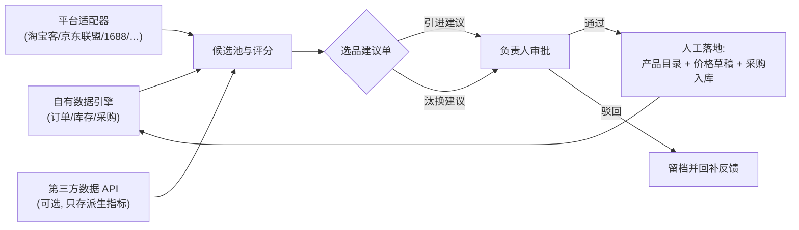

# 电商自动选品：平台调研与功能设计

> 调研时间：2026-08；分支：`feat/ecommerce-auto-selection`。本文是设计与调研文档，**尚未实现任何代码**；平台能力与费率以各平台官方控制台实时信息为准。

## 1. 目标与定位

"自动选品"在本系统中的定义：**利用电商平台的市场需求数据与本系统自有的销售/库存数据，自动生成"商品引进建议、滞销汰换建议和货源匹配建议"，经负责人审批后进入现有产品目录、价格与采购闭环。**

它与现有系统原则的一致性：

- **自动不等于免审批。** 系统只产生建议；商品进入目录、发布标准价、执行采购仍走现有人工流程（对应"设施结束计时不自动收费"同一设计哲学）。
- **建议是可追溯的业务单据。** 选品建议单有状态机、版本和审计，不直接改目录。
- **多租户隔离。** 所有市场数据和评分按商户（租户）隔离，与顾客、订单数据同一边界。

不在本期范围：自动上架第三方平台店铺、自动向供应商下单、自动调价。这些可以在建议单审批通过后由人工执行，或作为后续独立模块评估。

## 2. 结论速览

1. **没有平台向第三方开放"全市场真实销量"数据。** 所有官方开放平台分两层：商家自运营接口（只能操作授权店铺）和公开市场数据接口（淘宝客/京东联盟/多多进宝/1688/AliExpress 联盟/Amazon 目录）。
2. **国内可行的合法数据组合**：淘宝客物料 API（零售热度与价格锚，含 `biz30day` 月销量）+ 京东联盟 API（`inOrderCount30Days`）+ 多多进宝（低价带参照）+ **1688 开放平台（唯一同时具备"市场选品 + 批发货源 + 分销代发"全链路的平台）**。
3. **国际侧**：Amazon SP-API 提供 `salesRanks`（BSR）、任意 ASIN 报价与费用试算，但销量需自建估算模型；AliExpress DS/联盟 API 准入门槛最低；eBay Browse 需合作方资质；Shopee/TikTok Shop/Temu/Walmart 对非商家第三方基本不可得。
4. **合规红线明确**：不自建爬虫（2025 年修订的《反不正当竞争法》数据专条明文禁止绕开技术管理措施取数；淘宝 v. 美景、抖音 v. 创锐、大众点评 v. 百度三案均判抓取方败诉）；不还原/转售平台指数数据；不存储个人信息；对采购的第三方数据只保留派生指标。
5. **最优先建的不是平台对接，而是自有数据选品引擎**：本系统已有的订单、库存、采购数据可以做 ABC 分析、动销分析、趋势检测和需求转移估计，零外部依赖、零合规风险，且与门店实际客群最相关。平台数据是"市场信号"，自有数据才是"本店真相"。

## 3. 平台调研

### 3.1 国内平台

| 平台 | 非商家第三方的数据可得性 | 关键 API 与字段 | 门槛 | 选品适配 |
|---|---|---|---|---|
| 淘宝/天猫 | **高**（淘宝客物料 API，免费免授权） | `taobao.tbk.dg.material.optional.upgrade` 物料搜索、`taobao.tbk.item.info.get` 详情；折后价、佣金比例、**`biz30day` 近 30 天成交件数**、优惠券、类目 | 淘宝联盟实名（个人可）+ 媒体备案 + pid；上线后约 500 万次/天 | ★★★★☆ |
| 1688 | **高**（选品+货源+采购全链路） | `alibaba.product.search`/`alibaba.product.get`（价格区间、起批量、SKU）、图片搜相似商品、`alibaba.cross.same.product.search` 同款比价、行业榜单、fenxiao 分销代发 | 阿里巴巴账号实名；企业认证解锁增值 API；约 10 QPS 起，基础免费+增值按量 | ★★★★★ |
| 京东 | **中高**（京东联盟 API） | `jd.union.open.goods.search`、`jd.union.open.goods.query`；价格、类目、是否自营、**`inOrderCount30Days` 30 天引单量** | union.jd.com 媒体资质（ICP 备案）+ 应用审核 1–3 天；2026-07 起 JOS 并入商家开放平台 | ★★★★☆ |
| 拼多多 | **中**（多多进宝） | `pdd.ddk.goods.search` 等推广者接口（含百亿补贴池） | 开放平台注册 + pid；限流约百次/分钟级 | ★★★☆ |
| 抖音电商 | 低（仅精选联盟检索，需达人/抖客授权） | 精选联盟商品检索 | 服务商须企业、成立≥1 年、注册资本≥100 万；API 预充值收费 | ★★☆ |
| 快手电商 | 低（仅授权店铺接口；规范明文禁止未授权爬取） | `open.item.*` 店铺自运营 | 企业开发者 | ★☆ |
| 小红书 | 低（仅授权店铺权限包；蒲公英是商单平台） | 店铺商品/订单 | 服务商企业资质 | ★☆ |

要点：

- 淘宝客/京东联盟/多多进宝返回的都是**"可推广商品池"**切片，不是全量商品库，做趋势与热度信号足够，做"全市场规模测算"不够。
- 生意参谋、京东商智、电商罗盘等官方数据产品只面向商家自身，不对第三方开放底层数据 API；**绕过它们还原指数是淘宝 v. 美景案的直接打击对象**。
- 抖音/快手/小红书本质是"店铺操作系统"而非"市场数据源"。若某商户本身在这些平台开店，可另立"自有店铺数据接入"需求，与市场选品分离开题。

### 3.2 国际平台

| 平台 | 第三方可得数据 | 关键 API | 门槛 | 选品适配 |
|---|---|---|---|---|
| Amazon SP-API | **中高**：目录、任意 ASIN 属性/**BSR（`salesRanks`）**/报价/费用试算；无全市场真实销量 | Catalog Items、Product Pricing（`getItemOffers`）、Product Fees（`getMyFeesEstimateForASIN`）；2025 年起另有 Customer Feedback、搜索表现报表（仅自家 ASIN） | 私有开发者需专业卖家账号（$39.99/月）；API 费用 2026-05 已取消；Catalog 限流约 5 req/s | ★★★★☆ |
| AliExpress | **高**：DS 商品 API + 联盟 API（非卖家可入） | `aliexpress.ds.product.get`、`aliexpress.ds.image.search`、`aliexpress.affiliate.product.query` | 联盟注册门槛低；配额不公开 | ★★★★★ |
| eBay | 中：Browse 搜任意在售商品；成交数据在受限的 Marketplace Insights API | Browse API、Taxonomy API | Buy API 生产权限需合作方资质，审核约 10 个工作日；默认 5,000 次/天 | ★★★☆ |
| Shopee | 低：仅授权店铺自有商品（含浏览/销量/评分） | `v2.product.get_item_list` | Partner 账号 + 应用审核 | ★★☆ |
| TikTok Shop | 低：仅授权店铺 | `/product/202309/*` | 开发者审核 + 逐店授权 | ★★☆ |
| Temu | 低：仅卖家自运营；Match 接口是上架辅助 | BG 族接口（登录后文档） | 仅 Developer 型可线上注册 | ★☆ |
| Shopify | 无市场数据（仅商家自店） | Admin API | Partner 免费 | ★★☆（交付渠道而非数据源） |
| Walmart | 低：Scintilla 仅 1P 供应商订阅 | Marketplace API | 卖家/供应商身份 | ★☆ |

要点：

- Amazon 的 BSR、报价、费用均可通过 SP-API 对**任意 ASIN** 合法获取，这是国际侧最厚的合规数据面；Helium 10/Jungle Scout 的"销量"同样是 BSR→销量的统计估算（实测误差 ±20–30%），并非官方数字。
- 若未来商户需要"选品结果落回线上店铺"，Shopify/各平台商家授权 API 是**交付渠道**，与选品数据源是两件事。

### 3.3 第三方成品数据（可选采购层）

市场级信号（全类目规模、竞品价格与 BSR 历史曲线、ASIN 销量估算、评论增速）自算不出来、官方不授权，只能采购成品数据：Keepa（€29/月起，价格/BSR 历史曲线 + API）、SmartScout（$29/月起，ASIN 级指标 + API）、卖家精灵（¥680/月起 API）、蝉妈妈（抖音，¥99–280/月）。采购合同要点：仅限本系统内部使用、禁止再分发；**设计上只保留派生指标（评分、分位），不长期保存原始快照**。

## 4. 选品方法论与评分模型

### 4.1 信号体系

| 信号 | 来源 | 用途 | 陷阱 |
|---|---|---|---|
| 月销量/引单量 | `biz30day`、`inOrderCount30Days`、BSR 估算 | 需求分主口径 | 推广池切片，非全量 |
| BSR + 锚点校准 | Amazon `salesRanks` | 换算月销（类目内锚点表） | 禁止跨类目套用；周级均值降噪 |
| 评论数与增速 | 平台详情 | 动销持续性交叉验证 | 不存储评论者任何个人信息 |
| 同款卖家数/价格带分布 | 1688 同款搜索、联盟搜索 | 竞争分 | 头部垄断 vs 腰部空位要看分布 |
| 季节性 | 自有时序 + Google Trends API（2025-07 起 Alpha） | 备货节奏 | Trends 是相对指数 |
| 毛利率测算 | 标准价 − 1688 批发价 − 物流损耗 | 利润分 | 全程整数分 |
| 本店动销/ABC/周转 | **自有订单与库存数据** | 匹配分与汰换 | 最可靠的一层 |

### 4.2 BSR→销量锚点校准法（Amazon 侧）

1. 以小类 BSR 为主口径，大类交叉验证，识别"小类靠前、大类靠后"的伪头部；
2. 同类目内选已知销量的锚点商品，建立"BSR 区间→日销区间"换算表，**严禁跨类目**；
3. 取周级均值解读，剔除大促脉冲；
4. 结论只作为区间估计进入评分，不作为采购量依据（采购量另由库存模型决定）。

### 4.3 五段式流程与评分

业界主流流程：**类目筛选 → 趋势检测 → 竞争分析 → 利润测算 → 供应商匹配**。落成本系统的评分模型：

```text
机会分 = 需求分 × 趋势分 × 竞争分 × 利润分 × 匹配分

需求分：月销量估计（多平台交叉）经对数压缩后分位归一
趋势分：4 周移动平均斜率 + 突变检测（z-score / 残差检验）
竞争分：同款卖家数分位（越少越高）+ 价格带拥挤度
利润分：(标准价 − 批发价 − 物流损耗) ÷ 标准价，映射到 0–1
匹配分：候选商品类目与门店销售结构聚类的重合度
```

### 4.4 自有数据算法（零外部依赖，优先建设）

- **ABC 分析 + 动销率 + 周转 + 毛利率**：由产品目录、消费单、库存流水、采购成本联表计算，输出"汰换候选"。
- **趋势分解与突变检测**：对 SKU 日销时序做季节分解（经典/STL），残差检验识别"稳定款突然滞销"与"长尾突然起量"。
- **需求转移（自噬）分析**：用缺货期的替代购买记录估计 SKU 间替代关系；汰换低效 SKU 前先确认其需求可转移至同簇商品。
- **门店聚类选品**：按门店销售结构聚类，"同店群同盘"差异化铺货建议。

## 5. 系统设计（映射到现有架构）

### 5.1 业务闭环



### 5.2 领域模型（新增 `Erp.Domain/Selection/`）

| 聚合 | 职责 | 关键规则 |
|---|---|---|
| `MarketplaceListingSnapshot` | 平台商品引用与派生指标 | 只存评分所需派生字段与必要快照，按保留期清理；不含任何个人信息 |
| `SelectionCandidate` | 归一后的候选商品 | 多平台同款归并（1688 同款搜索/图搜辅助）；租户隔离 |
| `SelectionScore` | 评分与因子明细 | 因子可解释、可回放；模型版本号纳入快照 |
| `SelectionProposal` | 选品建议单（引进/汰换） | 状态机 `Draft → PendingApproval → Approved / Rejected → Converted`；审批通过只解锁人工落地动作，不自动改目录 |
| `MarketplaceChannelConfiguration` | 平台凭据配置 | 复用 `PaymentChannelConfiguration` 模式：只保存凭据配置名，不读取不回显密钥正文；缺项时拒绝启用 |

### 5.3 与现有模块的集成点

| 现有模块 | 复用方式 |
|---|---|
| 产品目录 `ProductItem` | 建议单审批后人工创建/停用目录项；候选商品预填编码、名称、单位 |
| 价格管理 `PriceBook` | 引进建议附"建议标准价（整数分）"，进入价格草稿，仍走发布流程 |
| 供应链 `Supplier`/采购入库 | 货源匹配建议填充供应商与预计单位成本；采购成本仍只对最高权限展示 |
| 库存 `InventoryLot` | 汰换建议参考账面库存与周转；落地后由现有入库/出库流水承接 |
| 通知与审批 | 选品审批进入顶部待办，与改价/退款审批同交互 |
| 审计 | 同步、评分、审批、落地全程审计事件（含请求号） |
| 权限 | 新增权限点（建议查看/审批/渠道配置），沿用角色并集 + 门店范围 + 服务端二次鉴权 |

### 5.4 平台适配器与后台同步

- 适配器统一接口 `IMarketDataSource`（搜索、详情、同款、类目），实现放 `Erp.Infrastructure/Selection/Adapters/`，与微信/支付宝适配器同级；限流退避、部分失败重试、幂等请求号。
- **现状缺口：系统当前没有常驻后台任务基础设施**（无任何 HostedService/定时器，README 架构图中的"持久化后台任务"尚未落地）。本功能需要先补一个基于数据库任务表的调度器（单实例互斥、可重放、失败留痕），这也是后续对账、报表预聚合等需求的地基。
- 每个数据源的调用与存储量按"候选集"收敛（如每租户每类目 Top N），不做全库镜像——既是成本约束也是合规约束。

### 5.5 数据保留

- 自有数据：不受限，随业务流水永久保留。
- 官方 API 数据：按各平台条款设保留期，默认只保留评分所需派生指标 + 短期原始快照（可配置，过期由后台任务清理）。
- 第三方采购数据：只存派生指标；供应商合同变更时同步调整保留策略。

## 6. 合规红线（设计约束，不是建议）

1. **不自建爬虫抓平台数据。** 2025 年修订《反不正当竞争法》新增数据专条，禁止"避开或破坏技术管理措施"获取数据；《网络数据安全管理条例》（2025-01-01 施行）禁止干扰网络正常运行的自动化访问。淘宝 v. 美景、抖音 v. 创锐、大众点评 v. 百度三案均判抓取/搬运方败诉。
2. **不还原、不转售平台指数数据**（生意参谋指数转换、BSR 换算表打包出售一类）。
3. **不采集、不存储个人信息**（评论者身份、买家画像）；误采即删或匿名化。
4. **不把平台/第三方数据持久化后当作自有数据资产对外提供**；评分与建议是"分析结论"，可以展示；原始数据不导出。
5. 国际侧注意：欧盟允许纯 ToS 禁止抓取（Ryanair 案），美国即便 CFAA 风险低（hiQ 案）合同违约风险仍在——一律走官方 API 或持牌数据商。

## 7. 分阶段交付计划

| 阶段 | 内容 | 外部依赖 | 交付判定 |
|---|---|---|---|
| **0. 自有数据选品引擎** | ABC/动销/周转/趋势/汰换建议 + 门店聚类；建议单状态机、审批、审计 | 无 | 空库+种子数据可跑通"生成建议→审批→人工落地"闭环；领域单测覆盖状态机 |
| **1. 1688 货源对接** | 凭据配置、适配器、同款比价、批发价进入利润分；候选→供应商匹配 | 阿里巴巴企业认证 + API 资质 | 真实凭据沙箱验收；限流与部分失败有回放测试 |
| **2. 国内市场热度信号** | 淘宝客 + 京东联盟（+可选多多进宝）信号进入需求分与竞争分 | 联盟媒体备案 + pid | 多平台交叉验证的评分回归用例 |
| **3. 国际信号（按需）** | Amazon SP-API BSR/报价/费用 + 锚点校准销量估算；AliExpress 货源 | 专业卖家账号/联盟资质 | 锚点表与估算误差的回测报告 |
| 横切 | 后台任务调度器、数据保留清理、权限/文档/手册同步 | — | 每阶段随附 |

每阶段完成前同步更新 README、用户手册与本文"当前边界"。

## 8. 当前边界

- 本文为调研与设计，**仓库中尚无选品相关代码、迁移或页面**。
- 阶段 0 之外的每一步都依赖真实外部资质（企业认证、媒体备案、卖家账号、数据商合同）；没有真实凭据前，相应适配器只能以契约测试 + 录制回放开发，不能宣称可用——与支付渠道的既有边界口径一致。
- 评分模型 v1 的参数（权重、分位阈值）需要在阶段 0 用真实门店数据校准，文档中的公式是框架而非定论。
- 市场数据只能覆盖"可推广商品池/联盟池"，不承诺全市场规模结论。

## 9. 主要资料来源

- 淘宝开放平台：https://open.taobao.com/ （淘宝客物料 API docId=24518/64759；流量限制 articleId=101269）
- 1688 开放平台：https://open.1688.com/ （`alibaba.product.get`、`alibaba.cross.same.product.search`、图搜能力）
- 京东开放平台：https://jos.jd.com/ （联盟 API 分组；2026-07 宙斯融合迁移公告）
- 拼多多开放平台：https://open.pinduoduo.com/ 、多多进宝 https://jinbao.pinduoduo.com/
- 抖店开放平台：https://op.jinritemai.com/ （精选联盟接口与入驻公告）
- 快手电商开放平台：https://open.kwaixiaodian.com/ ；小红书开放平台：https://open.xiaohongshu.com/
- Amazon SP-API：https://developer-docs.amazon.com/sp-api/ （Catalog Items `salesRanks`、Roles、Release Notes）
- eBay 开发者：https://developer.ebay.com/ （Browse API 概览、Buy API 准入要求、调用限额）
- AliExpress：https://openservice.aliexpress.com/ 、联盟 https://portals.aliexpress.com/
- Shopee：https://open.shopee.com/ ；TikTok Shop：https://partner.tiktokshop.com/ ；Temu：https://partner.temu.com/ ；Shopify：https://shopify.dev ；Walmart Data Ventures：https://www.walmartdataventures.com/
- 方法论与判例：万里牛 BSR 锚点校准法；FPP《预测：方法与实践》；《网络数据管理条例》；2025《反不正当竞争法》修订；淘宝 v. 美景（2018）、大众点评 v. 百度（2017）、抖音 v. 创锐判例文书；hiQ v. LinkedIn（2022）、Ryanair v. PR Aviation（C-30/14）
