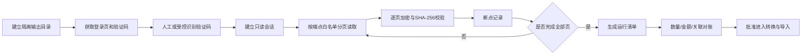

# 旧系统数据只读导出与迁移 PRD

日期：2026-08-19
状态：顾客与基础资料只读导出完成，权益余额、业务单据、库存和档案端点继续登记
适用源系统：`https://app5.siweicloud.com/swshop/`

## 1. 目标

在不修改旧系统任何业务数据、不直接连接旧数据库的前提下，通过旧系统登录后的只读列表接口，完整导出迁移所需数据，经过加密留存、字段映射、数量与资金对账后，再受控写入新 ERP。

本需求取代此前“新系统不迁移旧系统历史数据”的决定。新系统数据库仍从空库建立，但允许在正式启用前运行一次经过验收的历史数据导入任务。

## 2. 已确认的源系统事实

- 登录接口：`POST /swshop/login/login.php?act=login`，提交账号、密码和四位图片验证码。
- 顾客和基础资料列表：使用 `GET /swshop/base/*.php?act=grid` 的逐项登记端点，以 jqGrid 的 `page`、`rows` 等分页参数返回 JSON；精确清单见第 10 节。
- 未登录访问顾客列表时，旧系统返回跳转登录页脚本，接口依赖 PHP 会话。
- 页面还声明了新增、修改、删除、导入和退款等写入端点；迁移工具不得实现、拼接或调用这些端点。
- 旧系统前端出现 `base_member` 等内部表标识，但当前没有发现任意 SQL、任意表名或数据库连接接口；迁移只依赖应用层的业务查询接口。

## 3. 不可突破的安全边界

1. 源站固定为 `https://app5.siweicloud.com`，禁止重定向到其他主机，禁止 HTTP 降级。
2. 除登录外只允许 GET；登录 POST 只能指向精确的登录端点。
3. 读取接口使用代码内白名单，不接受操作者输入任意 URL、路径、`act` 或 SQL。
4. 明确拒绝包含 `add`、`adds`、`edit`、`update`、`save`、`drop`、`delete`、`import`、`refund` 等写入语义的动作。
5. 账号、密码、验证码、会话 Cookie 和导出加密密钥不得写入源码、配置样例、命令行历史或普通日志。
6. 导出目录必须位于 Git 工作区之外；包含业务数据的文件使用 AES-256-GCM 加密；Unix 顶层及模块目录为 `0700`，所有导出文件为 `0600`。
7. 日志只记录模块、页码、条数、耗时、校验值和错误分类，不输出姓名、手机号、卡号、余额或原始响应。
8. 工具不包含任何连接旧数据库的驱动、连接串或执行 SQL 的能力。
9. 首次全量导出、增量补录和正式导入使用不同运行编号，所有产物均可追溯。

## 4. 数据范围与顺序

| 批次 | 数据域 | 主要对象 | 对账重点 |
|---|---|---|---|
| 1 | 组织主数据 | 品牌、区域、门店、员工、岗位 | 门店和员工数量、有效状态 |
| 2 | 目录主数据 | 服务项目、产品、分类、单位、卡类 | 编码唯一、价格与适用门店 |
| 3 | 顾客与权益 | 顾客、会员卡、储值本金、奖励金、次卡、积分 | 人数、账户数量、余额与余次合计 |
| 4 | 业务单据 | 服务/消费单、产品销售、充值、退款、还款、权益核销 | 单据数量、状态、金额、明细合计 |
| 5 | 库存与档案 | 库存余额、库存流水、护理/服务记录、可迁移附件索引 | 库存合计、关联完整性、附件缺失 |

股权、微信运营和云商仍不进入当前新系统业务范围，也不纳入默认导出清单。是否保留其原始归档由后续单独决定。

## 5. 导出流程

### 5.1 会话建立

- 工具先请求登录页以建立 PHP 会话。
- 请求验证码片段并下载当次图片；验证码成功登录前不得刷新。
- 账号、密码优先从进程环境或安全输入读取；密码不回显。
- 登录结果必须明确为成功，否则不启动任何业务数据请求。

### 5.2 分页与断点

- 默认每页 100 条；以接口返回的总页数为准，并设置最大页数安全上限。
- 每一页先加密并原子落盘，再写检查点；中断后从最后一个已验证页面继续。
- 恢复时重新计算已存在页文件的 SHA-256，文件不一致立即停止。
- 会话过期、返回 HTML 登录脚本、JSON 结构变化或条数倒退均停止运行，不自动跳过。

### 5.3 原始数据保留

- 原始响应按数据域和页码保存，内容不做字段删改。
- 另生成逐行记录文件，方便后续转换和比对。
- 清单记录源主机、数据域、端点标识、页数、条数、开始/完成时间、加密算法和文件摘要。

## 6. 转换与新系统导入

导出和导入是两个独立命令。完成原始导出不代表允许写入新 ERP。

- 每条目标记录保留 `legacy_source`、`legacy_entity`、`legacy_id` 和源记录哈希，防止重复导入。
- 旧门店先映射到新系统 `tenant_id` 与 `store_id`，其后顾客、订单、库存和员工才能转换。
- 金额统一转换为“分”的整数；无法无损转换的金额必须进入异常清单。
- 顾客去重不能只依赖姓名；手机号、旧会员卡号和旧主键分别保留，冲突由人工复核。
- 储值本金和赠送金必须分开导入，不允许只导一个总余额。
- 订单、支付、权益、库存等历史记录通过专用迁移任务写入，不调用日常业务页面，不伪造当前操作者操作。
- 导入新库必须可重复执行且幂等；失败批次可清理重建迁移环境，但不得修改源数据。

## 7. 全量、增量与切换

1. 第一次全量导出用于发现字段、异常和历史数据规模。
2. 在测试库完成完整转换、导入和对账演练。
3. 上线前执行第二次全量或基于旧主键/更新时间/内容哈希的增量补录。
4. 最终切换窗口停止旧系统新增业务，记录最终时间点，再执行末次差异检查。
5. 新系统启用后，旧系统保持只读查询一段约定时间，不做反向同步。

## 8. 验收标准

- 自动测试证明非白名单主机、HTTP、任意路径、非登录 POST 和所有写动作均被拒绝。
- 凭据、Cookie、验证码和业务数据不出现在日志、Git 变更或错误文本中。
- 导出可从网络中断、会话过期和进程中断处安全恢复，且不会重复记录。
- 每个数据域都有源记录数、导出记录数、目标记录数和差异说明。
- 会员本金、奖励金、次卡余次、积分、库存和业务金额分别完成总额及抽样逐笔对账。
- 所有未映射字段、孤儿关系、重复顾客和金额异常都有可下载的异常清单。
- 正式导入前完成一次使用真实导出数据、隔离测试库和相同程序版本的全量演练。

## 9. 已实现只读切片

### 9.1 顾客

第一切片只读取顾客列表，用于验证验证码登录、会话、GET 白名单、jqGrid 分页、加密落盘、断点恢复和清单校验。该切片通过后，按照数据范围表逐个登记并审核其他读取端点，禁止通过“通用 URL 参数”绕过端点审查。

2026-08-19 真实运行结果：登录及验证码成功；顾客接口共读取 23 页、2286 条，接口总记录数与生成的逐行记录数一致；原始页面和汇总文件均已加密，验证码临时文件已删除，SHA-256 复算通过。

### 9.2 基础资料

基础资料切片在同一个只读登录会话中按 12 个精确端点执行，并为每个模块独立保存断点、原始页密文、逐行密文和清单。重试时先校验已完成页摘要，不重复请求已完成模块。

2026-08-19 真实运行结果：共导出 12 个模块、258 条记录；门店 5、员工 40、服务项目 74、产品 51、次卡目录 8、会员卡类 23、储值方案 21、设施 9、品牌 0、单位 15、员工工种 4、来店渠道 8。所有模块的导出条数均与源接口 `records` 一致，所有页密文和逐行密文 SHA-256 复算通过；目录权限为 `0700`、文件权限为 `0600`，验证码临时文件不存在。品牌 0 条是源接口明确返回的空数据，不代表解析失败。

两批合计完成 13 个模块、2544 条原始记录的只读加密导出。当前尚未解密转换、建立字段映射、执行资金/关联对账或写入新 ERP，因此不能把“导出完成”表述为“迁移完成”。

## 10. 端点登记状态

13 个已导出模块的真实字段画像、初步映射和当前阻断项见 [旧系统字段画像与初步映射矩阵](legacy-system-field-profile-and-mapping.md)。该矩阵只用于迁移设计，不代表已经允许转换或导入。

| 数据域 | 页面入口 | 已确认读取端点 | 状态 |
|---|---|---|---|
| 顾客 | `base/frame.php?act=member` | `GET /swshop/base/member.php?act=grid` | 已完成，2286 条 |
| 门店 | `base/frame.php?act=shop` | `GET /swshop/base/shop.php?act=grid` | 已完成，5 条 |
| 员工 | `base/frame.php?act=emplee` | `GET /swshop/base/emplee.php?act=grid` | 已完成，40 条 |
| 服务项目 | `base/frame.php?act=service` | `GET /swshop/base/service.php?act=grid` | 已完成，74 条 |
| 产品 | `base/frame.php?act=product` | `GET /swshop/base/product.php?act=grid` | 已完成，51 条 |
| 次卡目录 | `base/frame.php?act=numcard` | `GET /swshop/base/numcard.php?act=grid` | 已完成，8 条 |
| 顾客卡类 | `base/frame.php?act=iclevel` | `GET /swshop/base/iclevel.php?act=grid` | 已完成，23 条 |
| 储值方案 | `base/frame.php?act=icfull` | `GET /swshop/base/icfull.php?act=grid` | 已完成，21 条 |
| 房台/设施 | `base/frame.php?act=room` | `GET /swshop/base/room.php?act=grid` | 已完成，9 条 |
| 品牌 | `base/frame.php?act=brand` | `GET /swshop/base/brand.php?act=grid` | 已完成，源数据 0 条 |
| 单位 | `base/frame.php?act=unit` | `GET /swshop/base/unit.php?act=grid` | 已完成，15 条 |
| 员工工种 | `base/frame.php?act=ework` | `GET /swshop/base/ework.php?act=grid` | 已完成，4 条 |
| 来店渠道 | `base/frame.php?act=source` | `GET /swshop/base/source.php?act=grid` | 已完成，8 条 |

库存、储值、消费、退款、次卡和积分报表已经定位到 `print/frame.php?act=...` 页面入口，但报表页面不等同于可迁移的原始明细接口。只有确认其分页端点、主键、明细关系和金额口径后才能登记，不能直接把汇总报表当作历史台账导入。
