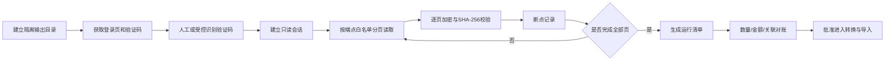

# 旧系统数据只读导出与迁移 PRD

日期：2026-08-21
状态：当前加密基线已完成65个结构化模块、92920条记录和147张顾客档案图片；护理文字记录保留，护理图片按产品范围明确排除；B01 测试品牌等待按修正映射重建
适用源系统：`https://app5.siweicloud.com/swshop/`

## 1. 目标

在不修改旧系统任何业务数据、不直接连接旧数据库的前提下，通过旧系统登录后的只读列表接口，完整导出迁移所需数据，经过加密留存、字段映射、数量与资金对账后，再受控写入新 ERP。

本需求取代此前“新系统不迁移旧系统历史数据”的决定。新系统数据库仍从空库建立，但允许在正式启用前运行一次经过验收的历史数据导入任务。

## 2. 已确认的源系统事实

- 登录接口：`POST /swshop/login/login.php?act=login`，提交账号、密码和四位图片验证码。
- 顾客和基础资料列表：使用 `GET /swshop/base/*.php?act=grid` 的逐项登记端点，以 jqGrid 的 `page`、`rows` 等分页参数返回 JSON；精确清单见第 10 节。
- 未登录访问顾客列表时，旧系统返回跳转登录页脚本，接口依赖 PHP 会话。
- 页面还声明了新增、修改、删除、导入和退款等写入端点；迁移工具不得实现、拼接或调用这些端点。
- 旧系统前端出现 `base_member` 等内部表标识，但当前没有发现任意 SQL、任意表名或数据库连接接口；迁移只依赖应用层的业务查询接口。

## 3. 不可突破的安全边界

1. 源站固定为 `https://app5.siweicloud.com`，禁止重定向到其他主机，禁止 HTTP 降级。
2. 除登录外只允许 GET；唯一例外是护理页取得 jqGrid 列模型所需的空 `POST /swshop/vip/nurse.php?act=custom`。该请求无业务字段且响应仅为表格结构；登录 POST 仍只能指向精确登录端点，其他 POST 全部拒绝。
3. 读取接口使用代码内白名单，不接受操作者输入任意 URL、路径、`act` 或 SQL。
4. 明确拒绝包含 `add`、`adds`、`edit`、`update`、`save`、`drop`、`delete`、`import`、`refund` 等写入语义的动作。
5. 账号、密码、验证码、会话 Cookie 和导出加密密钥不得写入源码、配置样例、命令行历史或普通日志。
6. 导出目录必须位于 Git 工作区之外；包含业务数据的文件使用 AES-256-GCM 加密；Unix 顶层及模块目录为 `0700`，所有导出文件为 `0600`。
7. 日志只记录模块、页码、条数、耗时、校验值和错误分类，不输出姓名、手机号、卡号、余额或原始响应。
8. 工具不包含任何连接旧数据库的驱动、连接串或执行 SQL 的能力。
9. 首次全量导出、增量补录和正式导入使用不同运行编号，所有产物均可追溯。

## 4. 数据范围与顺序

| 批次 | 数据域 | 主要对象 | 对账重点 |
|---|---|---|---|
| 1 | 组织主数据 | 品牌、区域、门店、员工、岗位 | 门店和员工数量、有效状态 |
| 2 | 目录主数据 | 服务项目、产品、分类、单位、卡类 | 编码唯一、价格与适用门店 |
| 3 | 顾客与权益 | 顾客、会员卡、储值本金、奖励金、次卡、积分 | 人数、账户数量、余额与余次合计 |
| 4 | 业务单据 | 服务/消费单、产品销售、充值、退款、还款、权益核销 | 单据数量、状态、金额、明细合计 |
| 5 | 库存与档案 | 库存余额、库存流水、护理/服务记录、可迁移附件索引 | 库存合计、关联完整性、附件缺失 |

股权、微信运营和云商仍不进入当前新系统业务范围，也不纳入默认导出清单。是否保留其原始归档由后续单独决定。

## 5. 导出流程

### 5.1 会话建立

- 工具先请求登录页以建立 PHP 会话。
- 请求验证码片段并下载当次图片；验证码成功登录前不得刷新。
- 账号、密码优先从进程环境或安全输入读取；密码不回显。
- 登录结果必须明确为成功，否则不启动任何业务数据请求。

### 5.2 分页与断点

- 默认每页 100 条；以接口返回的总页数为准，并设置最大页数安全上限。
- 每一页先加密并原子落盘，再写检查点；中断后从最后一个已验证页面继续。
- 恢复时重新计算已存在页文件的 SHA-256，文件不一致立即停止。
- 会话过期、返回 HTML 登录脚本、JSON 结构变化或条数倒退均停止运行，不自动跳过。

### 5.3 原始数据保留

- 原始响应按数据域和页码保存，内容不做字段删改。
- 另生成逐行记录文件，方便后续转换和比对。
- 清单记录源主机、数据域、端点标识、页数、条数、开始/完成时间、加密算法和文件摘要。

## 6. 转换与新系统导入

导出和导入是两个独立命令。完成原始导出不代表允许写入新 ERP。

- 每条目标记录保留 `legacy_source`、`legacy_entity`、`legacy_id` 和源记录哈希，防止重复导入。
- 旧门店先映射到新系统 `tenant_id` 与 `store_id`，其后顾客、订单、库存和员工才能转换。
- 金额统一转换为“分”的整数；无法无损转换的金额必须进入异常清单。
- 顾客去重不能只依赖姓名；手机号、旧会员卡号和旧主键分别保留，冲突由人工复核。
- 储值本金和赠送金必须分开导入，不允许只导一个总余额。
- 订单、支付、权益、库存等历史记录通过专用迁移任务写入，不调用日常业务页面，不伪造当前操作者操作。
- 导入新库必须可重复执行且幂等；失败批次可清理重建迁移环境，但不得修改源数据。

### 6.1 当前 B01 演练切片

2026-08-20 起，迁移工具增加服务器管理员专用导入命令，当前代码只允许目标品牌 `B01`。默认完整执行转换和约束检查后回滚；只有显式 `--apply` 才提交。该切片导入门店、员工档案、服务、产品、卡类、顾客基础档案，以及由顾客备注/照片和护理文字记录形成的历史服务档案。当前范围不导入护理图片。

旧员工不自动创建账号；旧服务、产品和卡类使用明确的 `LEGACY-*` 技术编码；旧门店由新系统业务编码生成器分配不可变 `S###` 编号。每条目标记录写入来源实体、来源主键、来源 SHA-256 和目标主键映射，内容变化时拒绝静默覆盖。

旧顾客当前 `member_store` 作为可消费本金，`member_bonus + member_sbonus` 作为可消费赠送金；两者之和必须逐分等于旧系统首页“储值余额”。`member_money`、信用、欠款和积分只进入 `legacy_customer_financial_snapshots` 非消费证据，不参与收银。期初余额以不可变迁移流水入账，不生成充值订单或支付，因此不计入迁移当日收入。

金额增量同步只接收门店与顾客模块。对已迁移顾客，系统读取上一版来源财务证据，以来源本金和赠送金的变化量追加 `LegacyBalanceSync` 流水；不以旧系统绝对余额覆盖新系统账户。来源哈希、上一版哈希、原始金额和差额进入追加式修订表。历史消费/充值单不参与当前余额重算，避免重复入账；来源扣减超过目标当前可用余额时必须整笔停止并人工对账。

导入运行、来源映射、异常和非消费资金快照由 Flyway `V202608200032` 新建；映射和快照使用数据库触发器禁止更新/删除。迁移工具随发布包放在 `ops/legacy-migration`，系统没有公网迁移 API。

### 6.2 2026-08-20 B01 生产演练结果

- 发布版本 `0.2.0-20260820.6`、schema `202608200032` 就绪后，先生成age加密联合备份，再运行真实数据干跑。
- 干跑完整转换2545条结构化来源和139张照片，随后数据库与附件均回到迁移前基线。
- 显式提交新增5门店、40员工、74服务、51产品、23卡类、2287顾客、1874服务档案和139附件；同一来源指纹复跑返回已完成，没有重复写入。
- 生成4354条来源映射、2287条非消费资金快照；可消费快照为0。1994个无法可靠解释的生日保持为空并进入警告清单。
- 演练后统一整理为五家连续门店编码：`S001` 博足修脚、`S002` 交通局店2店、`S003` 金辰公馆4店、`S004` 水木清华3店、`S005` 王电街状元府5店；另一品牌全部业务与迁移计数保持原基线。

2026-08-21 的业务验收发现首轮导入存在门店归属缺陷：旧顾客和员工的门店字段是名称文本，而导入器只匹配旧主键和门店代码，未命中时又静默使用第一家旧门店。因此首轮导入的顾客、员工和服务档案门店归属不能作为正式迁移结果。整改后的导入器同时登记旧主键、门店代码和门店名称；空值才允许使用明确的演练默认门店，任何非空未映射值或重复名称均中止整个事务。

测试品牌现已依据加密来源归档中的 `member_shop`、`emplee_shop` 和顾客档案来源映射完成受控纠偏：2287名已导入顾客、40名员工和1874条既有顾客档案记录均重新分配到实际门店。门店目标编码统一以 [`legacy-store-mapping.csv`](legacy-store-mapping.csv) 为唯一迁移表：来源ID `1` 至 `5` 必须分别显式映射到 `S001` 至 `S005`。目标数据库使用门店UUID维持全部业务外键，编码整理不改变顾客、员工、服务档案或历史业务归属。后续从空库正式导入必须传入全部五项显式映射，不得再次依赖自动编号或创建重复总店。

本次纠偏不代表历史业务单据已经导入：旧源中的31312条消费单和3458条充值单均有非空 `bill_shop`，覆盖5种门店值，但当前测试库尚无 `customer-sales` 来源映射；1760条护理文字记录同样已归档但尚未形成目标来源映射。它们必须在订单、支付、金额和门店分布对账通过后另行导入。

## 7. 全量、增量与切换

1. 第一次全量导出用于发现字段、异常和历史数据规模。
2. 在测试库完成完整转换、导入和对账演练。
3. 上线前以旧主键和内容哈希执行门店、顾客及余额增量补录；金额变化按来源快照差额入账。
4. 最终切换窗口停止旧系统新增业务，记录最终时间点，再执行末次差异检查。
5. 新系统启用后，旧系统保持只读查询一段约定时间，不做反向同步。

## 8. 验收标准

- 自动测试证明非白名单主机、HTTP、任意路径、非登录 POST 和所有写动作均被拒绝。
- 凭据、Cookie、验证码和业务数据不出现在日志、Git 变更或错误文本中。
- 导出可从网络中断、会话过期和进程中断处安全恢复，且不会重复记录。
- 每个数据域都有源记录数、导出记录数、目标记录数和差异说明。
- 会员本金、奖励金、次卡余次、积分、库存和业务金额分别完成总额及抽样逐笔对账。
- 所有未映射字段、孤儿关系、重复顾客和金额异常都有可下载的异常清单。
- 正式导入前完成一次使用真实导出数据、隔离测试库和相同程序版本的全量演练。

## 9. 已实现只读切片

### 9.1 顾客

第一切片只读取顾客列表，用于验证验证码登录、会话、GET 白名单、jqGrid 分页、加密落盘、断点恢复和清单校验。该切片通过后，按照数据范围表逐个登记并审核其他读取端点，禁止通过“通用 URL 参数”绕过端点审查。

2026-08-20 最终快照：登录及验证码成功；顾客接口共读取 23 页、2287 条，接口总记录数与生成的逐行记录数一致；原始页面和汇总文件均已加密，验证码临时文件已删除，SHA-256 复算通过。

### 9.2 基础资料

基础资料切片在同一个只读登录会话中按 12 个精确端点执行，并为每个模块独立保存断点、原始页密文、逐行密文和清单。重试时先校验已完成页摘要，不重复请求已完成模块。

2026-08-19 真实运行结果：共导出 12 个模块、258 条记录；门店 5、员工 40、服务项目 74、产品 51、次卡目录 8、会员卡类 23、储值方案 21、设施 9、品牌 0、单位 15、员工工种 4、来店渠道 8。所有模块的导出条数均与源接口 `records` 一致，所有页密文和逐行密文 SHA-256 复算通过；目录权限为 `0700`、文件权限为 `0600`，验证码临时文件不存在。品牌 0 条是源接口明确返回的空数据，不代表解析失败。

2026-08-20 当时两批合计完成13个结构化模块、2545条原始记录的只读加密导出，并完成顾客档案照片139张；当时护理查询因缺少旧页面的总查询开关而错误得到0条。2026-08-21 已修正并重新全量导出，最新基线见9.3。导出完成不等于迁移完成，B01 仍须依次通过备份、干跑、差异核对、显式提交和幂等复跑。

### 9.3 顾客增量、护理列表与档案照片

2026-08-21 再次全量读取时旧系统顾客已增加到2293条、仍为23页，因此不能沿用2287人的旧迁移基线。工具逐份检查2293个顾客档案，导出142张照片，2151份档案无照片，失败0；照片清单与密文文件摘要均通过校验。

“顾客护理”页面不会只凭 `act=grid` 返回历史数据：必须先加载护理页，通过精确空 `POST ...?act=custom` 取得列模型，再在 GET 查询中携带 `search_find=Y`、起止日期、门店、分类和会员筛选参数。旧实现缺少总开关，接口静默返回空数据。修正后从2019-01-01至导出日读取18页、1743条护理记录，来源主键全部唯一；`bill_member` 1743条均能对应顾客来源主键。

顾客编辑页有 `member_image1`、`member_image2` 两个可选照片槽位。照片地址在只读顾客档案 HTML 中以相对路径出现，工具只接受解析后落在 `/swshop/picture/<安全目录>/member/<安全文件名>` 的 JPEG、PNG 或 WebP；页面图标、路径穿越、其他目录和其他扩展名均拒绝。每张图片保留明文与密文 SHA-256，原始字节使用 AES-256-GCM 加密并支持断点恢复。

顾客自由文本 `member_memo` 已在顾客列表导出中；导入时只将非空备注或存在照片的档案转换成带“旧系统顾客档案备注（迁移）”标记的服务档案，不伪造消费单和收费金额。护理记录则按 `bill_member` 关联顾客、按 `bill_shop` 映射门店，并把护理时间、症状/说明、处理方案、下次护理、护理人员、备注和最多两张图片写入独立历史服务档案；它同样不生成订单、支付或收入。

护理详情和静态图片分别设置超时与失败清单。详情页保持串行读取以规避旧 PHP 会话锁，发现图片地址后再限流并发下载；网络中断、TLS 提前断开和进程停止都从已验证检查点继续，不能把超时误记成“无照片”。最终护理图片数量以本次全量清单和服务器导入对账为准。

产品范围现已明确：护理图片不迁移，不再视为“暂缓”或正式验收阻断项；护理文字记录必须完整迁移。旧检查点中的护理图片只作为历史技术产物保留，不进入当前基线、压缩包清单、导入数量或差异对账。顾客档案图片仍属于本次范围，必须完成索引、加密下载和失败清单为0。

### 9.4 当前迁移基线

当前只读基线共65个结构化模块、92920条记录：顾客2311、护理文字记录1760、顾客消费单31312、消费服务明细44138、消费产品明细4980、充值单3458、充值明细3425、工资核算75，以及组织目录、次卡、库存、采购、销售和资金等模块。29个模块存在实际记录，其余空模块也保留清单以证明源端明确返回0条。

服务和产品主档导入后会出现在设施接待目录中。旧系统售价字段在业务口径确认前不会被猜测为新系统标准价；尚未进入已发布价格版本的条目明确显示“未设置目录价”，必须填写本次成交价并按改价权限处理，而不是在设施接待中被静默隐藏。

顾客档案2311份已全部检查，成功加密147张顾客图片，2164份无图片，失败0。护理图片未读取、未下载且未进入当前归档。全部1196个密文与分页文件完成SHA-256复算，目录权限为`0700`、文件权限为`0600`，验证码临时文件不存在。

旧“收银交班”页面返回页面结构而不是可分页JSON明细，不能伪装成已导出模块。迁移时由已导出的消费、支付拆分、收银员、制单时间和资金流水重建可核验的交班历史；如果这些字段不足以复原某个班次，则进入迁移异常清单，不生成猜测数据。

## 10. 端点登记状态

65个已导出结构化模块的真实字段画像、初步映射和当前阻断项见 [旧系统字段画像与初步映射矩阵](legacy-system-field-profile-and-mapping.md)。该矩阵只用于迁移设计，不代表已经允许转换或导入。

| 数据域 | 页面入口 | 已确认读取端点 | 状态 |
|---|---|---|---|
| 顾客 | `base/frame.php?act=member` | `GET /swshop/base/member.php?act=grid` | 已完成，2311条；顾客图片147张、失败0 |
| 护理记录 | `vip/nurse.php` | `GET /swshop/vip/nurse.php?act=grid`（含完整查询参数） | 护理文字记录已完成1760条；护理图片明确不迁移 |
| 门店 | `base/frame.php?act=shop` | `GET /swshop/base/shop.php?act=grid` | 已完成，5 条 |
| 员工 | `base/frame.php?act=emplee` | `GET /swshop/base/emplee.php?act=grid` | 已完成，40 条 |
| 服务项目 | `base/frame.php?act=service` | `GET /swshop/base/service.php?act=grid` | 已完成，74 条 |
| 产品 | `base/frame.php?act=product` | `GET /swshop/base/product.php?act=grid` | 已完成，51 条 |
| 次卡目录 | `base/frame.php?act=numcard` | `GET /swshop/base/numcard.php?act=grid` | 已完成，8 条 |
| 顾客卡类 | `base/frame.php?act=iclevel` | `GET /swshop/base/iclevel.php?act=grid` | 已完成，23 条 |
| 储值方案 | `base/frame.php?act=icfull` | `GET /swshop/base/icfull.php?act=grid` | 已完成，21 条 |
| 房台/设施 | `base/frame.php?act=room` | `GET /swshop/base/room.php?act=grid` | 已完成，9 条 |
| 品牌 | `base/frame.php?act=brand` | `GET /swshop/base/brand.php?act=grid` | 已完成，源数据 0 条 |
| 单位 | `base/frame.php?act=unit` | `GET /swshop/base/unit.php?act=grid` | 已完成，15 条 |
| 员工工种 | `base/frame.php?act=ework` | `GET /swshop/base/ework.php?act=grid` | 已完成，4 条 |
| 来店渠道 | `base/frame.php?act=source` | `GET /swshop/base/source.php?act=grid` | 已完成，8 条 |
| 顾客消费与明细 | `print/frame.php?act=vip_sell_list/vip_sell_child` | 固定登记的消费单与服务、产品、次卡明细 GET 端点 | 已完成，消费单31312、服务明细44138、产品明细4980、次卡明细111 |
| 储值与明细 | `print/frame.php?act=vip_full_list/vip_full_child` | 固定登记的充值单与充值明细 GET 端点 | 已完成，充值单3458、明细3425 |
| 库存 | 库存查询与明细页 | 固定登记的入出库、盘点、库存余额及明细 GET 端点 | 已完成，含库存余额185、入库229/明细365、盘点48/明细182 |
| 工资核算 | `pay/frame.php?act=pdata` | `GET /swshop/pay/pdata.php?act=grid` | 已完成，75条；源分页元数据声明32，按实际75行保留并列为对账项 |

所有已登记台账均保存原始分页密文和逐行密文；“已导出”只证明来源读取与完整性校验通过，不代表金额口径已经批准导入。正式导入仍需完成主从关联、金额总计、门店分布、支付方式、退款/作废状态和目标表计数对账。
