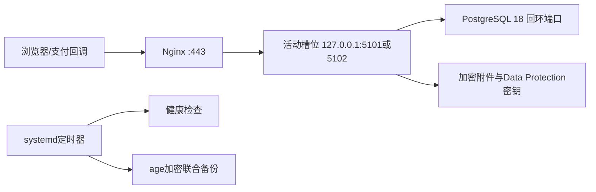

# Linux 单机部署与容量基线

更新日期：2026-08-19
状态：已采用

## 目标

第一版测试和生产统一使用 Ubuntu Server 24.04 LTS。当前 2 核 CPU、4 GB 内存、70 GB SSD 的单机承载 Nginx、两个交替运行的 ASP.NET Core 槽位和 PostgreSQL 18；V1 不使用 Kubernetes。Windows 发布资产只保留历史追溯，不再维护、构建或验收。

## 运行拓扑

- 公网只开放 SSH 22、ACME/跳转 80 和 HTTPS 443；数据库和 Kestrel 不向公网监听。
- SSH 只允许专用部署账号使用公钥登录，禁止 root 和密码登录。
- Nginx 使用公网 IP 短期证书；取得正式域名后替换证书与地址，不改变应用拓扑。
- 应用账号无 DDL 权限；Flyway 迁移、应用读写和备份分别使用独立数据库角色。

## 资源预算

| 项目 | 初始预算 |
|---|---:|
| PostgreSQL | 约 1.0–1.4 GB |
| 单个活动 API 槽位 | 约 0.6–1.0 GB |
| 发布时第二 API 槽位 | 临时约 0.6–1.0 GB |
| Nginx、系统与监测 | 约 0.5–0.8 GB |
| 保留余量 | 至少 0.5 GB，磁盘使用率 85% 告警 |

2核4GB机器不同时运行大报表、备份压缩和批量任务。若稳定期内持续内存超过80%、数据库和应用争抢CPU，或需要多实例高可用，应先升级机器或拆分数据库，再讨论容器编排。

## 发布与恢复

- CI 在 Ubuntu runner 生成 `linux-x64` 框架依赖不可变包并记录 Git SHA、schema 范围和逐文件 SHA-256。
- 发布脚本从受信记录接收包摘要；非空库强制先备份，再执行 Flyway 前向迁移。
- 新版本只在非活动回环槽位启动，通过槽位与公网入口两级健康检查后切流；失败恢复原 Nginx upstream。
- 应用回退要求旧包声明兼容当前 schema；数据库不自动降级。
- 每日备份数据库、附件和 Data Protection 密钥，使用不在服务器上的 age 私钥对应公钥加密；必须复制到服务器外并定期在隔离 Linux 恢复。

可执行命令、目录和配置见 [deploy/linux/README](../deploy/linux/README.md)。

## 完成边界

仓库内构建、脚本解析、规则测试和 `linux-x64` 包生成通过，只证明本地发布链成立。目标云服务器还必须完成 SSH 收口、证书签发与续期、schema 30 空库初始化、独立平台管理员初始化、正常切流、故障恢复、外部告警、异地复制和隔离恢复演练，之后才能标记为生产部署验收通过。Windows 资产仅作历史归档，不再进入构建、验收或新增功能范围。
