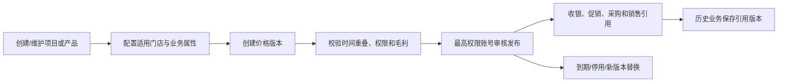

# 项目、产品与定价中心

## 模块目标

统一管理服务项目、零售产品、次卡商品、礼品、分类、单位、成本和价格版本。该模块是收银、促销、采购、销售、库存、员工提成和经营分析共同使用的主数据来源。

## 核心对象

- 服务项目：编码、名称、分类、标准时长、适用门店、启停状态和服务要求。
- 产品：编码、条码、分类、品牌、规格、单位、供应商、库存属性和税务属性。
- 次卡/权益商品：包含项目范围、购买/赠送次数、有效期、适用门店和核销规则。
- 价格簿：标准售价、会员价、采购参考价、批发价及其适用组织范围。
- 价格版本：生效时间、失效时间、审批人和历史差异。
- 成本资料：标准成本、采购成本或库存成本来源；成本查看单独授权。

## 主流程

## 状态与规则

- 主数据：草稿 → 待审核 → 已启用 → 已停用；已经被业务引用的编码不能删除或复用。
- 价格版本：草稿 → 待审核 → 已发布 → 已生效 → 已失效；同一适用范围和价格类型的生效区间不能重叠。
- 项目、产品、卡类和会员标准价格由最高权限账号或其明确授权角色维护。
- 门店店长不能修改价格档案；结算时只能在授权范围内确认实际成交价，并记录参考价格版本、差额和原因。
- 店长发生改价必须填写原因；系统同时支持金额差和比例差阈值，任一超过配置时提交最高权限账号复核，不能先结算后补审批。
- V1空库初始化值为：单行降价比例不超过10%且整单降价差额不超过50元时，店长可以在填写原因后自批；任一超限或手工高于标准价均由最高权限账号审批。阈值通过版本化配置维护，禁止写死在代码中。
- 停用主数据只阻止新业务引用，不影响历史单据、退款、报表和库存追溯。
- 服务项目的标准时长用于排班和经营分析，不自动换算收费；设施使用时长也不改变项目价格。
- 产品必须明确是否管理库存、批次、效期和成本；非库存服务项目不能产生库存流水。
- 次卡商品定义“卖什么权益”，顾客账户记录“某顾客剩多少权益”，两者不能混成一张表。
- 成本与售价权限分离；价格发布前可校验毛利底线，但没有权限的门店只看到允许展示的价格。

## 跨模块关系

- 收银引用项目/产品、价格版本和标准时长，保存实际成交价。
- 促销在标准价格之上计算优惠，不覆盖价格簿。
- 采购、销售和库存共享产品、单位、批次与成本属性。
- 顾客模块使用卡类、次卡商品和权益规则创建顾客账户。
- 员工模块引用项目/产品分类和业绩规则。
- 报表/决策按稳定编码和历史版本统计，不能用当前名称或当前价格重算历史。

## 待确认

- 价格是否支持总部统一、区域覆盖、门店例外三级继承。
- 产品是否第一期启用批次、效期、序列号和多单位换算。
- 次卡能否跨门店核销，以及跨店结算价格。
