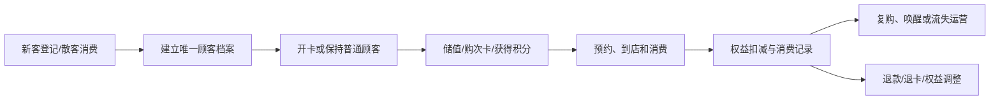
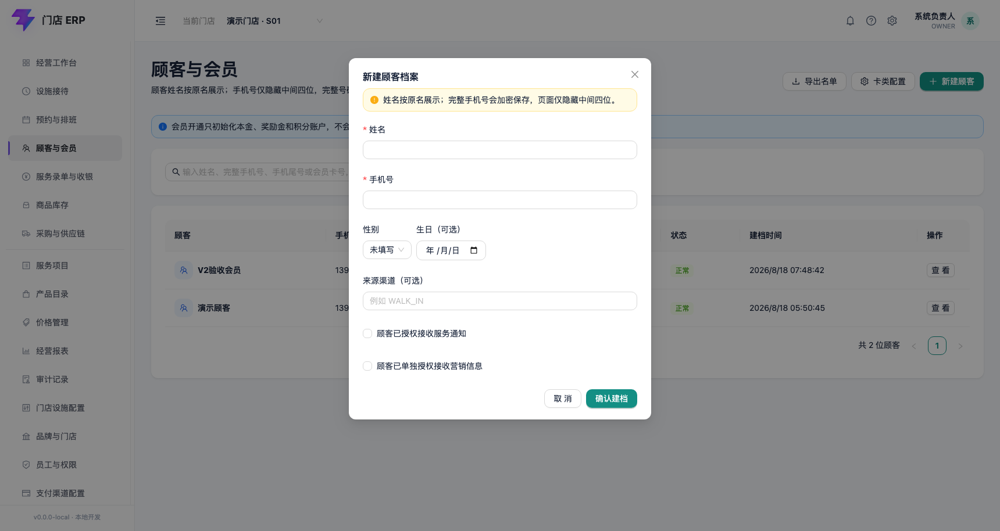

# 顾客模块

## 已发现入口

顾客信息、顾客开卡、顾客储值、顾客预约、顾客护理、消费退货、储值退款、次卡退卡、积分增减、兑换储值、兑换礼品，以及消费、储值、次卡、欠款、还款、积分等查询报表。

## 已查看页面

### 顾客模块首页

现状：展示顾客卡类占比、月储值趋势、最新登记顾客列表、常用功能与报表入口。首页直接显示真实姓名和完整手机号。

需求：个人信息默认脱敏；按门店、角色和业务场景控制字段可见性；查看完整手机号需要明确权限和审计。

## 核心业务逻辑

### 核心对象

- 顾客档案：自然人的基础身份、联系方式、来源、标签和营销授权。
- 会员卡：卡号、卡类、归属门店、有效期和会员身份载体；会员卡不等于资金账户。
- 会员账户：储值本金、奖励金、积分、次卡、欠款分别建账和记流水。
- 预约与到店：预约服务、时间、门店、员工/设施意向以及到店、取消、爽约结果。
- 护理/服务档案：记录服务过程和顾客注意事项，敏感信息单独授权。
- 权益交易：开卡、储值、退款、售卡、退卡、积分调整、兑换、欠款与还款。

### 顾客生命周期

### 会员识别与合并

- 手机号是主要查询条件，但不能单独作为永不变化的自然人主键；系统内部使用顾客ID。
- 同一顾客可以有多张会员卡或多类权益账户，但默认只保留一份顾客主档。
- 新建时校验手机号、卡号及潜在重复档案；疑似重复进入人工合并，不直接覆盖。
- 合并档案必须保留原ID映射、账户、消费、预约、推荐和营销授权来源，且支持审计追溯。
- 结算时允许先按散客服务、后关联会员；关联动作不能倒改设施和服务原始记录。
- 姓名和手机号可以用于辅助查询候选会员；真正扣减储值、奖励、次卡或积分前必须核对完整手机号，不能只凭模糊姓名直接扣减。
- 超过可配置阈值的会员权益扣减增加一次性验证码确认；验证码只保存哈希、用途、有效期和验证结果，不保存明文。

### 权益账户规则

- 储值本金、奖励金、积分和次卡采用独立账户及不可变流水，余额是流水汇总或受控快照。
- 储值：先形成储值资金单，支付确认后分别增加本金与奖励账户。
- 消费扣款：当前固定先扣同卡储值本金，本金耗尽后才允许扣奖励；每次扣减都关联消费单和支付分摊，避免先花赠送金额再退完整本金。
- 储值退款：关联原储值及后续消费，按规则处理已消费、赠送回收和可退金额；不能直接手改余额。
- 次卡：记录购买次数、赠送次数、已使用、已冻结、已退和剩余次数；每次核销关联服务项目与消费单。
- 积分：记录获得、使用、调整、过期和冲回；人工增减必须填写原因并受权限控制。
- 欠款与还款：欠款关联原消费单，还款按明确规则核销具体应收，禁止只有一个不可解释的总余额。

### 预约与护理规则

- 预约状态：待确认 → 已确认 → 已到店 → 服务中 → 已完成；分支为顾客取消、门店取消、爽约和改期。
- 同一员工或不可共享设施的时间段不能重复占用；冲突必须在确认预约时校验。
- 护理记录与普通消费备注分离，按敏感数据处理；修改保留版本，不允许覆盖历史。

### 跨模块关系

- 收银模块消费、储值、退款和还款驱动会员账户流水。
- 促销模块读取会员等级、标签和授权范围，但不能直接改顾客账户。
- 库存模块承接礼品兑换和产品退货的出入库。
- 员工模块接收开卡、储值、售卡、服务和顾问归属，退款时反向冲回业绩。
- 财务模块接收储值负债、退款、欠款与还款数据。
- 短信模块只能向具有相应授权且未退订的顾客发送消息。

### 顾客开卡

现状：覆盖卡类、卡号、手机号、姓名、性别、生日、初始密码、推荐顾客、签单额度、来店渠道、短信偏好、储值、奖励、门店、销售分成和顾问。

需求拆解：

- 将表单分为身份信息、会员权益、营销授权、储值、归属与分成五组。
- 手机号重复校验、会员卡号唯一校验和推荐关系校验。
- 消费短信与营销短信必须分开授权并保留同意记录。
- 储值和开卡应拆分为可独立授权的业务动作。
- 多员工分成比例合计必须等于业务规则要求的比例。

### 其他业务表单

| 页面 | 已看到的主要字段/动作 | 需求结论 |
|---|---|---|
| 顾客储值 | 会员刷卡、卡号、姓名、手机号、储值/奖励余额、储值金额、奖励、销售分成、结算 | “结算”属于资金动作，应展示支付明细、前后余额并要求权限与确认 |
| 顾客预约 | 新增、修改、删除、查询、打印、导出 | 需要预约状态、时间冲突、到店/爽约和提醒机制；删除应改为取消并保留原因 |
| 顾客护理 | 护理分类、护理记录列表及新增/修改/删除等动作 | 护理记录可能包含健康相关信息，应单独定义敏感字段权限和留痕 |
| 消费退货 | 原消费、退货金额、优惠、应付、支付方式、商品/项目明细、顾问与员工、结算 | 必须关联原消费；无单退货、超额退货和跨店退货需单独授权 |
| 储值退款 | 储值余额、奖励余额、退款金额、退款奖励、销售分成、结算 | 本金与赠送余额分开冲销；退款需审核、原路/非原路退款策略和凭证 |
| 次卡退卡 | 次卡作价金额、退款摘要、新增单据、结算 | 需明确已消费次数、剩余次数、作价规则和退卡后权益失效时间 |
| 积分增减 | 加减类型、加减积分、摘要、保存 | 手工调积分必须要求原因、权限和审计；建议支持积分有效期与过期策略 |
| 兑换储值 | 消耗积分、兑换储值、摘要、保存 | 兑换规则需要版本、生效期、上下限和防重复提交 |
| 兑换礼品 | 商品、数量、使用积分、积分合计、摘要、保存 | 应校验礼品库存、兑换上限并生成可追溯的库存出库来源 |

### 查询与报表页面

现状：消费、储值、次卡、欠款、还款和积分查询普遍使用“调阅单据/删除/查询/刷新/打印/导出/退出”的列表工具栏，筛选包含门店、会员、地区、单据类型、状态、单号和摘要。列表列数很大，并直接包含卡号、姓名、手机号和多种支付渠道金额。

需求：

- 查询列表默认脱敏姓名与手机号；完整查看与导出分别授权。
- 列表只保留查看、筛选、刷新等安全动作；删除移入权限菜单。
- 支付方式字段使用可配置列组，默认只展示汇总，避免横向超宽。
- 欠款与还款必须支持来源单据、销账关系和余额追溯。
- “积分兑换储值/礼品、剩余卡次、消费赠送、积分变动、分销佣金”等后七个入口在当前账号下可见，但点击后没有出现新的可辨识页面；暂记为受限或失效入口，不能写成已验证能力。

## 截图策略

该模块存在真实顾客个人信息。包含真实姓名或手机号的截图不进入PRD；后续只截取空白表单、脱敏区域或不含个人数据的局部。

## 遍历状态

顾客模块全部当前可见入口已逐项点击。前六类查询页面已成功打开；后七个报表入口没有出现可辨识页面变化，等待确认是权限限制、功能失效还是交互反馈缺失。
