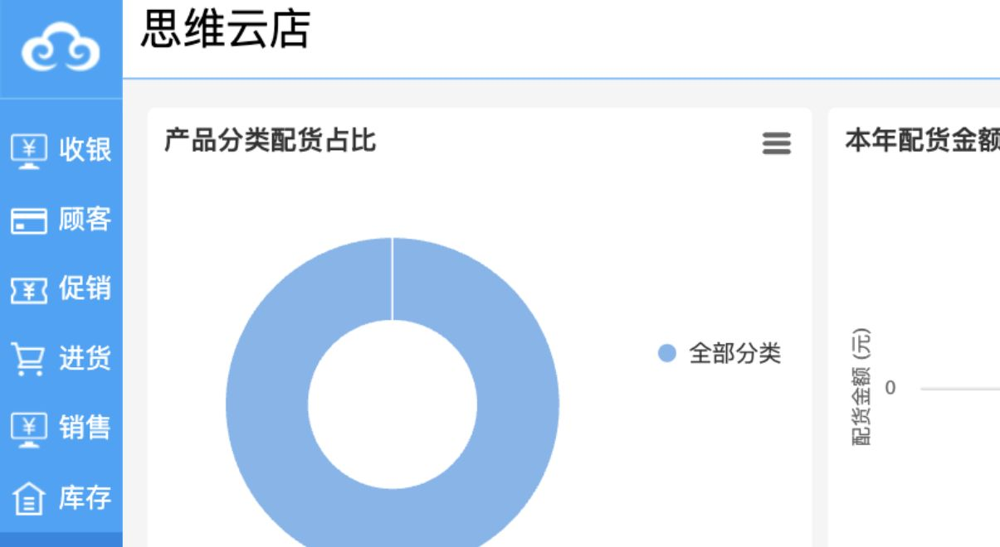
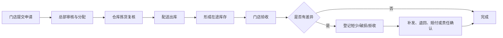

# 配货模块

## 已发现入口

配货申请单、退货申请单、门店配送单、门店退货单，以及申请/配送查询和配送出入库汇总、明细报表。

## 需求拆解草案

- 门店申请、总部审核、仓库拣货、发货、在途、门店收货形成状态链。
- 支持部分配货、缺货回补、差异收货和在途追踪。
- 退货区分申请、审核、寄出/发出、收货与退款/冲销。
- 每个状态动作需要角色、时间、数量和责任人记录。

## 核心业务逻辑

### 核心对象

- 配货申请及申请行：门店提出商品、申请数量、期望到货日和用途。
- 分配/履约计划：总部或仓库决定发货仓、批准数量、缺货数量和替代方案。
- 配送出库单：仓库实际拣货、复核和发出的商品明细。
- 在途记录：承接已出库但门店尚未收货的数量、物流和责任状态。
- 门店收货/差异单：记录实收、短少、破损、拒收和处理结果。
- 门店退货申请及退货单：反向处理门店向中心仓退回的商品。

### 正向配货流程

### 状态与数量关系

- 申请：草稿 → 待审核 → 已批准/部分批准 → 履约中 → 已完成；可驳回、撤回或终止。
- 配送：待拣货 → 拣货中 → 待复核 → 已出库 → 在途 → 部分收货/已收货 → 已完成。
- 退货：申请 → 审核 → 门店发出 → 在途 → 中心验收 → 已入库/拒收 → 已完成。
- 申请行满足：申请数量 = 批准数量 + 驳回数量 + 待处理数量。
- 配送行满足：发货数量 = 验收数量 + 短少数量 + 破损/拒收数量 + 待确认数量。

### 关键规则

- 申请不改变库存；批准可形成计划占用，配送出库才减少发货仓账面库存并增加在途。
- 门店验收后才增加收货门店账面库存；不能在仓库发货时同时增加门店现货。
- 支持一次申请多次配送、一次配送合并多个申请，但每一行都保留来源关系。
- 缺货时明确部分批准、待回补、替代商品或驳回，不允许静默改数量。
- 差异必须记录商品、批次、数量、图片/凭证、责任方和最终处理方式。
- 门店退货按反向在途处理；中心验收通过后才增加中心仓可用库存。
- 跨法人或独立核算门店的配货可产生内部应收应付；同一法人内部调拨只产生库存与成本转移，规则由组织配置决定。

### 跨模块关系

- 库存模块执行计划占用、配送出库、在途、收货和退货入库。
- 采购模块的在途采购可用于预计到货，但不能当作可发库存。
- 财务模块处理需要内部结算的跨店配货金额与差异赔付。
- 报表/决策模块统计满足率、发货及时率、收货及时率、在途天数和差异率。

## 业务单据遍历结果

| 单据 | 主要字段/明细 | 状态语义 |
|---|---|---|
| 配货申请单 | 申请人、交货日期、商品、申请数量、零售价、发货数量 | 申请、审核、待配、部分发货、完成、终止 |
| 退货申请单 | 申请人、交货日期、商品、申请数量、退货数量 | 申请、审核、待退、部分退货、完成、终止 |
| 门店配送单 | 可导入申请；经办人、金额、应收/已收、申请单号、当前库存 | 配送出库、在途、门店验收、差异处理 |
| 门店退货单 | 可导入申请；经办人、应付/已付、申请单号、当前库存 | 门店发出、在途、中心验收、差异处理 |

## 查询与报表遍历结果

已成功打开3个单据查询和4个配送出入库汇总/明细报表，共7个入口。

- 申请查询包含申请门店、申请人、状态、完成状态和交货日期。
- 配送单查询同时展示单据类型、配送门店、金额、审核与验收状态。
- 出入库报表同时保留调出数量/金额、调入或验收数量/金额，可用于差异核对。

需求：配送单必须形成“发货数量、收货数量、差异数量、差异原因”的闭环；门店退货单当前没有独立查询入口，需要确认是否合并在门店配送单查询的单据类型中。

## 遍历状态

配货模块首页、4个业务单据和7个当前可见查询/报表页面均已逐项打开，未保存、删除、审核、验收或提交查询。
