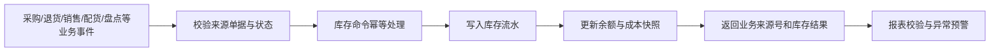

# 库存模块

## 已发现入口

商品入库单、商品出库单、库存盘点单、存货调价单、库存状况表、库存变动表、库存明细表，以及对应查询和汇总/明细报表。

## 已查看页面

现状：首页展示分类库存占比、库存图表和库存最多商品排行。

## 核心业务逻辑

### 核心对象

- 库存维度：租户、门店/仓库、库位、商品、批次、效期和库存状态。
- 库存余额：账面数量、可用数量、占用数量、在途数量和不可售数量。
- 库存流水：每次入库、出库、调拨、盘点、报损和冲销的不可变记录。
- 库存单据：其他入库、其他出库、盘点、调价、调拨及来源业务单据。
- 成本层：批次成本、移动平均或其他成本口径；第一期具体算法待确认。

### 统一变动逻辑

### 状态与数量关系

- 可用量 = 账面数量 - 占用数量 - 冻结/不可售数量；在途量不计入当前账面数量。
- 调拨状态：草稿 → 待审核 → 已出库/在途 → 已收货；调出与调入之间保持在途数量。
- 盘点状态：准备 → 冻结时点 → 盘点中 → 待复盘/待审核 → 差异过账 → 完成。
- 库存单据：草稿 → 待审核 → 已过账；已过账单据不能编辑，只能冲销并重做。

### 关键规则

- 所有库存变化必须有来源业务类型、来源单据和来源明细；禁止直接修改余额。
- 同一业务请求使用幂等号，重复提交不能重复入库或出库。
- 默认禁止负库存；是否允许特定门店临时负库存由最高权限配置并形成异常待办。
- 销售/消费预占只改变可用量；正式出库才改变账面数量。
- 采购入库、销售退货验收入库、配送收货分别产生独立入库流水，但保留上游链路。
- 盘点使用冻结时点计算账面数；盘点期间发生的正常出入库不得被错误计入盘点差异。
- 调价需要明确影响零售价、标准成本还是库存成本；成本调整产生独立差额流水并受财务权限控制。
- 期初 + 各类入库 - 各类出库 = 期末必须按商品、批次和库位自动校验。

### 跨模块关系

- 采购提供入库与采购退货出库来源。
- 销售/收银提供商品出库与退货入库来源。
- 配货提供调拨出库、在途和门店收货来源。
- 促销与顾客兑换可能产生赠品预占和出库。
- 财务读取库存成本、盘盈盘亏、报损和调价差额，但不能直接修改库存。
- 报表/决策读取余额、周转、缺货、滞销、临期和差异指标。

## 需求拆解草案

- 区分采购入库、销售出库、调拨、盘盈盘亏、报损和其他出入库来源。
- 库存数量、可用量、占用量、在途量和安全库存分开表达。
- 支持批次、效期、序列号、成本层和库位的能力待确认。
- 首页优先展示缺货、超储、滞销、临期和负库存异常。
- 调价与盘点必须通过审核后影响账面库存或成本。

## 业务页面遍历结果

| 页面 | 已看到的字段/明细 | 关键需求 |
|---|---|---|
| 商品入库单 | 经办人、金额、摘要；商品数量、单价、金额 | 必须填写入库原因和来源类型，避免与采购入库混淆 |
| 商品出库单 | 经办人、金额、摘要；商品数量、单价、金额、备注 | 必须填写出库原因、领用对象或去向 |
| 库存盘点单 | 经办人、摘要；账面数量、盘点数量、盈亏数量 | 盘点需支持冻结时点、盲盘/明盘、复盘和差异审批 |
| 存货调价单 | 经办人、摘要；数量、调前/调后单价和金额 | 明确调价影响的是成本还是零售价；调价差额需入账 |
| 库存状况表 | 门店、分类、品牌、商品、库存数量、成本均价、库存金额 | 同时展示可用、占用、在途与安全库存 |
| 库存变动表 | 上期结存、各种来源的入库/出库、本期结存 | 需要统一库存变动类型和可下钻的来源单据 |
| 库存明细表 | 门店、单据类型、日期、商品、数量、成本单价和金额 | 形成逐笔库存台账并支持余额校验 |

## 查询与报表遍历结果

已成功打开4个单据查询和8个汇总/明细报表，共12个入口。报表覆盖商品入库、商品出库、盘点和调价的汇总与明细。

- 共同筛选：地区、门店、职员、商品分类、品牌和商品。
- 入出库报表：数量与金额的汇总、逐单明细。
- 盘点报表：账面、盘点和盈亏数量/金额。
- 调价报表：调前/调后数量、单价、金额和差额。

需求：库存变动与单据状态必须可核对；报表的期初 + 入库 - 出库 = 期末需要提供系统校验。

## 遍历状态

库存模块首页、7个功能页面和12个当前可见查询/报表页面均已逐项打开，未保存、删除、审核或提交查询。
