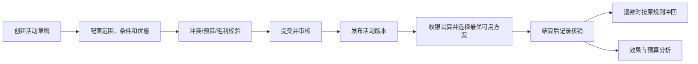

# 促销模块

## 已发现入口

促销开单、门店促销单查询、当前促销项目查询、当前促销产品查询、项目/产品消费汇总与明细报表。

## 已查看页面

### 促销开单

现状：支持门店、促销方案、会员类别、开始/截止日期、开始/截止时段、摘要，以及项目/产品的原价、会员价、促销方式、促销价和折扣率。

需求拆解：

- 适用范围：组织、门店、会员等级、顾客标签。
- 时间规则：日期、时段、星期、节假日和时区。
- 商品规则：项目、产品、分类、品牌与组合包。
- 价格规则：特价、折扣、满减、买赠、阶梯价。
- 冲突规则：是否可叠加、优先级、互斥与券适用性。
- 风控规则：预算、次数、单客上限、总量和异常预警。
- 状态：草稿、待审核、已发布、进行中、暂停、已结束、已作废。

## 核心业务逻辑

### 核心对象

- 促销活动：名称、目的、预算、适用组织、有效期、状态和负责人。
- 适用条件：门店、会员等级、顾客标签、项目/产品、日期、时段、星期和消费门槛。
- 优惠动作：特价、折扣、满减、买赠、阶梯价、优惠券或积分倍率。
- 冲突策略：优先级、互斥组、是否叠加、券适用性和最大优惠。
- 使用记录：顾客、消费单、命中规则、原价、优惠额、规则版本和冲回结果。

### 主流程

### 状态与版本

- 活动：草稿 → 待审核 → 已发布 → 进行中 → 已结束；可暂停、驳回或作废。
- 已发布活动不能原位修改影响历史结算的规则；修改必须生成新版本并重新审核。
- 收银结算保存命中的规则版本和优惠明细，后续活动修改不改变历史单据。

### 关键规则

- 标准价来自老板维护的价格版本，促销只能按授权规则产生优惠，不能改写标准价。
- 试算必须解释“命中了什么条件、原价多少、优惠多少、为什么未命中其他活动”。
- 多活动同时命中时按互斥、优先级和最大优惠规则计算；结果必须稳定且可重复。
- 预算、次数、单客上限、总量和毛利底线在结算确认时再次校验，防止并发超用。
- 取消或退款按原消费单冲回核销次数、预算和赠送权益；不能用当前活动规则重算历史退款。
- 活动暂停只阻止新核销，不影响已支付单据；作废需要原因和审批。

### 跨模块关系

- 从顾客模块读取会员等级、标签和营销授权。
- 从商品与价格主数据读取项目、产品、分类和标准价格版本。
- 收银模块调用促销试算并回写最终核销记录。
- 库存模块承接赠品预占与出库。
- 财务、报表和决策模块读取优惠成本、预算消耗、销售提升和退款冲回。

## 页面覆盖

当前可见入口均已处理，无待遍历页面。

## 查询与统计页面遍历结果

| 入口 | 当前结果 |
|---|---|
| 门店促销单查询 | 成功打开列表；动作包含调阅、删除、查询、刷新、打印和退出 |
| 当前促销项目查询 | 入口可见，点击后没有出现新的可辨识页面 |
| 当前促销产品查询 | 入口可见，点击后没有出现新的可辨识页面 |
| 促销项目消费汇总表 | 入口可见，点击后没有出现新的可辨识页面 |
| 促销项目消费明细表 | 入口可见，点击后没有出现新的可辨识页面 |
| 促销产品消费汇总表 | 入口可见，点击后没有出现新的可辨识页面 |
| 促销产品消费明细表 | 入口可见，点击后没有出现新的可辨识页面 |

需求：对于不可用、无权限或尚未配置的入口，系统必须给出明确状态和原因，不应出现“点击无响应”。

## 遍历状态

当前账号下全部可见入口已逐项点击；1个查询页成功打开，6个入口无可辨识页面变化。
