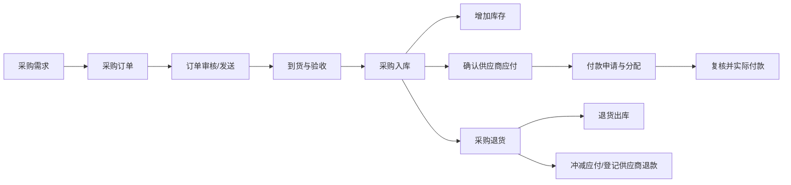

# 进货模块

## 已发现入口

进货订单、进货入库单、进货退货单、进货付款单；对应查询；商品、门店、供应商订货统计及更多明细报表。

## 已查看页面

### 模块首页

现状：分类进货占比、年度进货金额、最新入库单、常用单据和报表入口。

## 核心业务逻辑

### 核心对象

- 供应商与采购价格：供应资格、结算方式、交期、税率和历史报价。
- 采购订单及订单行：约定采购商品、数量、价格、交期和收货门店/仓库。
- 采购入库单：记录实际到货、验收、批次和入库数量。
- 采购退货单：记录从已入库批次退回供应商的数量、原因和退款/冲应付要求。
- 应付单与付款单：分别表示债务确认和实际付款，并按来源单据核销。

### 主流程

### 状态与数量关系

- 采购订单：草稿 → 待审核 → 已审核/待到货 → 部分到货 → 已完成；可驳回、撤回、终止。
- 入库单：草稿 → 待验收 → 待审核 → 已入库；异常为验收差异、驳回、作废和冲销。
- 退货单：草稿 → 待审核 → 待出库 → 已发出 → 供应商确认 → 已完成。
- 付款单：草稿 → 待复核 → 待支付 → 支付中 → 已支付 → 已核对；可失败、撤销或冲正。
- 订单行满足：订货数量 = 已入库数量 + 在途/待入库数量 + 终止数量 + 未完成数量。

### 关键规则

- 采购订单只形成采购承诺，不增加库存、不确认应付、不付款。
- 采购入库审核后才增加库存并确认应付；库存流水和应付明细共享同一业务来源号。
- 支持一次订单多次入库、一次入库对应多批次，以及按授权控制超收和无订单入库。
- 退货优先关联原入库行和批次，可退数量不能超过净入库数量。
- 退货出库、应付冲减和供应商退款是三类事件，允许按顺序处理但必须最终勾稽。
- 付款必须分配到具体应付；预付款单独记账，不能伪装成已核销应付。
- 保存、审核、入库和付款分别授权；制单人不能默认拥有付款复核权限。

### 跨模块关系

- 商品与库存模块提供商品、单位、批次、仓库和库存流水。
- 财务模块接收供应商应付、付款、退款、优惠和账户发生额。
- 配货模块只能使用已入库可用库存，不直接引用未完成采购数量作为现货。
- 报表/决策模块按订单、入库、退货、净进货和应付口径统计。

### 进货入库单

现状：单据头包含系统单号、日期、门店、供应商、经办人、手工单号、金额、付款账户、摘要；明细包含货号、品名、规格、单位、数量、单价、金额和订单号。

需求拆解：

- 支持从采购订单导入，记录订单行与入库行的追溯关系。
- 自动计算货品总额、优惠、应付、已付和本次付款。
- 部分入库、超收控制、批次/效期、序列号和质检策略待确认。
- 保存草稿、提交审核、确认入库、生成应付应为独立状态动作。
- 付款账户和本次付款需要财务权限；不可仅靠单据保存触发付款。

### 入库单查询

现状：提供日期、门店、供应商、职员、单据状态、完成状态、系统单号和摘要筛选；列表动作含调阅、删除、查询、刷新、表格、打印和导出。

需求：查看与危险动作分离；删除进入更多菜单并要求权限、理由与二次确认。

### 进货订单

现状：单据头包含供应商、经办人、交货日期和摘要；明细包含货号、品名、规格、单位、数量、单价、金额、到货数量和备注。

需求：订单行必须记录订货、补订、已到货、终止和未完成数量；交货日期支持整单与分行设置；订单关闭/终止需要原因和剩余量处理。

### 进货退货单

现状：可导入进货单，包含供应商、经办人、手工单号、货品总额、优惠、应收、已收、收款账户、本次收款和进货单号。

需求：退货必须尽量关联原入库行，控制可退数量；退货出库、供应商退款和应付冲销是三个可追踪但可配置联动的动作。

### 进货付款单

现状：可导入单据、自动分配或单行分配，包含供应商、使用结余、付款账户、应付金额、本次付款、优惠、付款后余额和摘要。

需求：付款分配到具体应付单据；自动分配规则需可解释；付款保存、审核和实际支付分离；优惠与结余使用需要单独授权。

### 报表与查询

已成功打开全部当前可见查询和统计入口。共同交互为筛选弹窗、超宽数据表、查询/刷新/打印/导出/退出工具栏。

| 报表组 | 页面 | 主要分析维度 |
|---|---|---|
| 单据查询 | 订单、入库、退货、付款 | 日期、门店、供应商、职员、状态、单号、摘要 |
| 订货统计 | 商品、门店、供应商 | 订货、补订、完成、终止、未完成的数量与金额 |
| 订单明细 | 进货订单明细表 | 单据、供应商、商品和各履约数量/金额 |
| 进货统计 | 商品、门店、供应商、职员 | 入库、退货、净进货的数量与金额 |
| 进货明细 | 进货明细表 | 日期、单号、供应商、经办人、商品、数量、单价、金额 |

需求：所有统计口径需明确“入库金额、退货金额、净进货金额”的计算方式；汇总可下钻到明细并保留筛选条件。

## 遍历状态

进货模块首页、4个业务单据和13个当前可见查询/统计页面均已逐项打开，未保存、删除、审核或提交查询。
