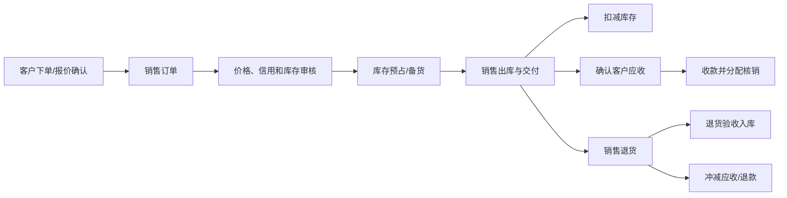

# 销售模块

## 已发现入口

销售订单、销售出库单、销售退货单、销售收款单；对应查询；商品、门店、客户订货统计及更多销售报表。

## 已查看页面

现状：与进货模块形成镜像结构，包括分类销售占比、年度销售金额、最新出库单、销售管理和报表入口。

## 核心业务逻辑

本模块处理面向企业客户、渠道客户或批发客户的商品销售；门店顾客的服务消费继续归收银模块，二者不能混用同一主单。

### 核心对象

- 客户与信用：客户档案、价格政策、信用额度、账期和结算方式。
- 销售订单及订单行：约定商品、数量、价格、交期和收货信息。
- 销售出库单：记录实际拣货、出库和交付数量。
- 销售退货单：记录客户退回商品、验收结果和退款/冲应收。
- 应收单与收款单：分别表示客户债权和实际收款，并按来源单据核销。

### 主流程

### 状态与数量关系

- 销售订单：草稿 → 待审核 → 待履约 → 部分出库 → 已完成；可驳回、撤回或终止。
- 出库单：草稿 → 待拣货 → 待审核 → 已出库 → 已交付；异常为缺货、差异、作废或冲销。
- 退货单：申请 → 待审核 → 待收货 → 待验收 → 已入库/已拒收 → 已完成。
- 收款单：草稿 → 待复核 → 已收款待核对 → 已核对；可撤销、退款或冲正。
- 订单行满足：订货数量 = 已出库数量 + 已预占未出库数量 + 终止数量 + 未完成数量。

### 关键规则

- 销售订单不扣库存、不确认收入；库存预占只减少可用量，不减少账面数量。
- 出库审核后扣减库存并按业务规则确认应收；收款是独立资金动作。
- 出库前校验可用库存、客户信用额度、逾期欠款和价格授权。
- 退货必须引用原出库行；无单退货、跨店退货和超期退货需要独立权限和原因。
- 退货验收通过后增加库存；不可再次销售的商品进入残次/待处理库存。
- 收款必须分配到应收单据；预收款、结余、优惠和坏账不得混为同一余额。
- 净销售数量和金额按出库减退货计算，并明确是否含税、优惠和运费。

### 跨模块关系

- 库存模块执行预占、出库、退货入库和批次追踪。
- 财务模块管理客户应收、收款、退款、账龄和坏账处理。
- 员工模块接收销售归属和佣金依据，退货时按原归属冲回。
- 报表/决策模块按订单、出库、退货、净销售、毛利和回款统计。

## 需求拆解草案

- 订单、出库、退货、收款分别建模，并通过来源单据关联。
- 支持部分出库、部分收款、欠款、优惠与多支付方式。
- 退货必须关联原销售或明确无单退货授权。
- 出库影响库存，收款影响资金，不能由同一个“保存”动作隐式完成。

## 业务单据遍历结果

| 单据 | 主要字段/明细 | 关键需求 |
|---|---|---|
| 销售订单 | 客户、经办人、交货日期；商品数量、单价、金额、到货数量 | 到货数量命名应改为已出库/已交付数量；支持部分履约与终止原因 |
| 销售出库单 | 客户、经办人、手工单号、货品总额、优惠、应收/已收、收款账户；可导入订单 | 出库、收款、开票应解耦；出库前校验库存和信用额度 |
| 销售退货单 | 可导入销售单；应付/已付、付款账户、本次付款、原销售单号 | 控制可退数量、退款金额和原支付渠道；无单退货单独授权 |
| 销售收款单 | 客户、使用结余、收款账户、应收、本次收款、优惠、收款后余额；自动/单行分配 | 收款必须分配到应收单据；预收、结余和优惠分开记账 |

## 查询与统计遍历结果

已成功打开4个单据查询、3个订货统计、订单明细、4个销售统计和销售明细表，共13个查询/统计页面。

- 单据筛选：门店、客户、职员、状态、完成状态、单号和摘要。
- 订货口径：订货、补订、完成、终止、未完成的数量与金额。
- 销售口径：出库、退货和净销售的数量与金额。
- 分析维度：商品、门店、客户、职员和单据明细。

需求：净销售必须给出明确公式；统计页可下钻至原单据；金额列需明确含税、优惠和退货口径。

## 遍历状态

销售模块首页、4个业务单据和13个当前可见查询/统计页面均已逐项打开，未保存、删除、审核或提交查询。
