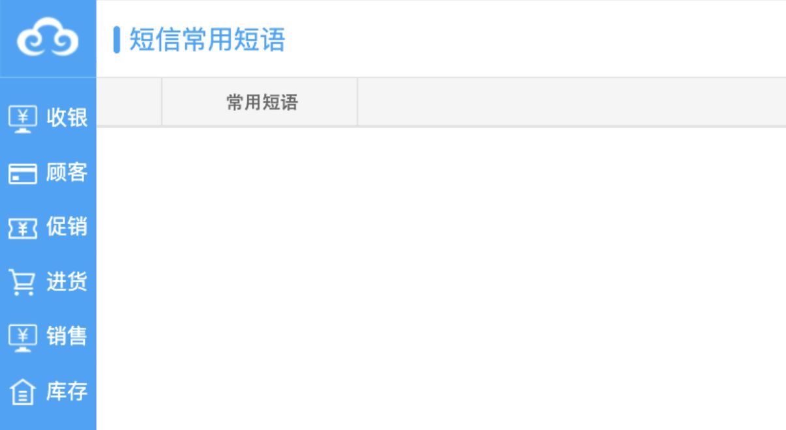

# 短信模块

## 已发现入口

顾客短信、员工短信、短信群发、已发短信、余额查询、常用短语、短信模版、短信账户、修改密码。

## 子页面遍历结果

| 页面 | 当前界面结构 | 风险边界 |
|---|---|---|
| 顾客短信 | 顾客列表、整店短信、发送短信、查询、刷新、表格 | 姓名和手机号默认脱敏；发送前重新校验授权与频控 |
| 员工短信 | 员工列表、发送短信、查询、刷新、表格 | 仅内部通知场景；按组织与数据范围授权 |
| 短信群发 | 群发配置弹窗，确定/取消 | 需要预估人数、条数、费用、重复号码和失败回退 |
| 已发短信 | 门店、手机号、内容、发送人、时间、状态；删除/清空入口 | 发送记录应为审计证据，不允许普通用户清空 |
| 余额查询 | 门店、短信账号、签名、余额 | 余额不足告警与充值职责分离 |
| 常用短语 | 新增、修改、删除、列表 | 内容版本、适用场景、停用与审计 |
| 短信模版 | 全部启用、修改、状态列表 | 禁止“一键全部启用”绕过逐模板审核 |
| 短信账户 | 账户设置弹窗，确定/取消 | 密钥加密、不可回显、管理员双人复核 |
| 修改密码 | 入口可见，点击后无页面变化 | 作为无响应入口记录，目标系统采用统一账户安全中心 |

## 目标需求

- 发送对象、内容、模板、预计条数、费用和发送时间必须预览。
- 发送属于对外沟通动作，需要最终确认和发送日志；本轮只查看界面，绝不发送。
- 顾客营销短信必须检查营销授权、退订状态、频控和敏感词。
- 模板需要草稿、审核、启用、停用与版本记录。
- 账户和密码设置属于高风险权限，仅管理员可见。
- 发送任务采用草稿、待审核、排队、发送中、部分成功、成功、失败、取消状态流。
- 营销短信记录同意来源、同意时间、退订时间和法定发送时段；事务短信与营销短信分开治理。
- 删除/清空发送记录不应成为常规功能；如法规允许清理，应采用保留策略和不可篡改审计。

## 核心业务逻辑

### 核心对象

- 短信账户与签名：供应商账户、所属组织、签名、余额、密钥和状态。
- 短信模板：事务/营销类型、内容、变量、适用场景、审核状态和版本。
- 收件人集合：顾客/员工筛选条件、号码快照、去重结果和排除原因。
- 发送任务：发起人、内容版本、预计条数、费用、计划时间、审批和总体状态。
- 发送明细：每个号码的供应商请求号、提交状态、回执、失败原因和费用。
- 授权与退订：营销同意来源、时间、适用渠道、退订和黑名单。

### 主流程

### 状态与规则

- 模板：草稿 → 待审核 → 已启用 → 已停用；修改已启用模板生成新版本。
- 发送任务：草稿 → 待审核 → 已批准/待发送 → 排队 → 发送中 → 成功/部分成功/失败；可在发送前取消。
- 事务短信和营销短信分开治理；营销短信必须存在有效同意且未退订。
- 收件人在任务提交时形成快照，记录筛选条件、纳入和排除原因，便于事后解释。
- 发送前校验重复号码、黑名单、频控、法定时间窗、敏感词、模板变量和账户余额。
- 批量发送必须先预览人数、条数和预计费用；超过阈值进入审批。
- 重试只针对明确可重试的失败明细，并沿用幂等键，不能向已成功号码重复发送。
- 发送记录和服务商回执是审计证据，不提供普通删除/清空；按保留策略归档。
- 密钥加密保存且永不回显；账户配置、模板审核和发送执行职责分离。

### 跨模块关系

- 顾客模块提供营销授权、退订、标签和脱敏号码访问；员工模块提供内部通知对象。
- 预约、消费、储值等业务可发起事务短信，但只能调用已启用模板和发送服务。
- 财务/经营模块读取短信费用和余额预警，不直接读取账户密钥。
- 报表/决策模块统计送达率、失败率、费用和活动转化，个人号码默认脱敏。

## 遍历状态

9个入口均已逐项点击，8个打开，修改密码无可辨识页面变化。未输入号码、选择对象、发送、保存模板、修改账户、修改密码或删除记录。
