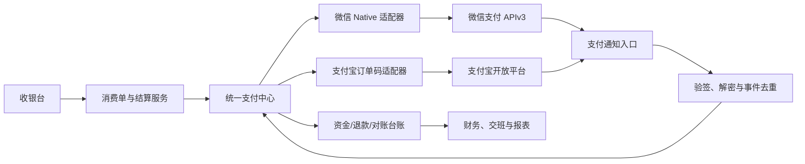
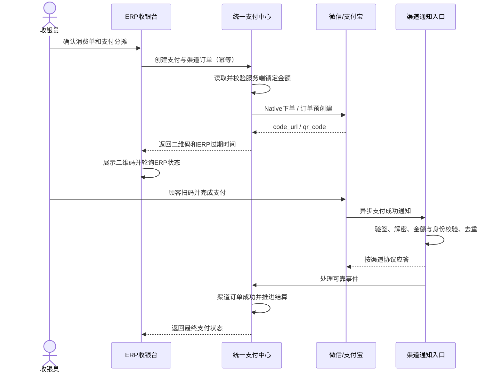

# 微信支付与支付宝支付开发设计 v0.1

日期：2026-08-18  
阶段：真实渠道开发设计基线，尚未接入任何真实商户配置

实现进度说明：统一支付单、可配置支付方式、组合分摊、现金记录、微信/支付宝人工登记待核对和收银班次已经进入可运行代码；V2-04 已实现门店渠道配置映射、服务器凭据缺项诊断、渠道订单/已验签事件状态模型和 OWNER 配置页面，数据库不保存密钥。Native/订单码适配器、回调验签、查单、退款和渠道对账仍在开发。可运行配置路径见[微信支付与支付宝渠道安全配置](user-manual/14-payment-channel-configuration.md)。

## 1. 文档目的与状态边界

本文定义 ERP 收银场景接入微信支付和支付宝支付时的业务边界、统一接口、数据模型、安全规则、异常恢复、退款、对账和验收要求，供后续后端、前端、测试、运维和财务共同使用。

当前仅形成开发设计：

- 未创建支付宝或微信支付沙箱。
- 未申请、读取或保存商户号、应用 ID、私钥、证书、APIv3 密钥等正式配置。
- 未安装项目 SDK，未生成业务代码，未开放公网回调地址。
- 未发起支付、退款、查询、关单或账单下载请求。
- 文中出现的接口名来自官方文档；ERP 内部表名和接口是目标设计，不代表已经建库或上线。

在支付接口通过完整验收并按门店启用前，微信、支付宝仍按“人工登记待核对”处理，不能标记为渠道确认。

## 2. 第一期候选范围

### 2.1 候选支付形态

第一期候选基线是“商家生成动态订单二维码，顾客主动扫码付款”：

| 渠道 | 候选产品 | 官方入口 | ERP 展现 |
|---|---|---|---|
| 微信支付 | APIv3 普通商户 Native 支付 | `POST /v3/pay/transactions/native` | 使用返回的 `code_url` 生成动态二维码 |
| 支付宝 | 订单码支付 | `alipay.trade.precreate` | 使用返回的 `qr_code` 生成动态二维码 |

选择该形态的原因是桌面 Web 收银台无需新增扫码枪，顾客直接用手机扫描收银界面或客显上的订单二维码即可付款。微信官方将 Native 支付定义为 PC 网页浏览器收款能力；支付宝订单码支付定义为商家生成二维码、用户扫码支付。

### 2.2 本期包含

- 生成支付订单和动态二维码。
- 查询支付状态、超时关闭或撤销。
- 支付成功异步通知。
- 全额和部分退款、退款状态查询。
- 交易账单下载与渠道对账。
- 支付接口不可用时的人工登记降级路径。
- 收银组合支付中的微信、支付宝分摊。

### 2.3 本期不包含

- 顾客出示付款码、商家用扫码枪付款的被扫模式；后续可增加微信付款码支付和支付宝当面付。
- 小程序、公众号、App、H5 或 PC 网站跳转收银台。
- 自动代扣、预授权、分账、境外支付和跨境支付。
- 微信或支付宝营销券的创建与发放。
- 将渠道私钥或证书下发到浏览器、门店前端或移动端。

### 2.4 开发前必须确认

- 接入主体是普通商户直连、服务商代接还是其他模式。
- 总部统一商户号，还是每个门店使用独立商户号。
- 微信支付对应 APPID 类型及其与商户号的绑定关系。
- 是否配置扫码枪；若配置，是否把被扫模式纳入第一期。
- 支付宝和微信支付产品权限是否已经开通。
- 正式回调域名、证书和密钥保管责任人。
- 退款审批阈值、原路退款例外和财务复核人。

## 3. 核心业务原则

### 3.1 收费金额与支付金额

1. 设施占用和计时只记录服务现场事实，不生成支付金额。
2. 店长录入或确认本次项目、产品、优惠和实际成交金额。
3. 后端根据权限、价格版本和金额平衡规则生成并锁定消费单应收金额。
4. 支付中心只能基于后端已锁定的待收金额创建支付分摊，前端不得自行决定渠道总金额。
5. 渠道回调的商户号、应用 ID、商户订单号、币种和订单金额必须与本地记录完全匹配。
6. 金额不匹配、订单不属于当前租户/门店或状态不允许时，记录安全事件并停止自动结算。

因此，支付接口证明的是“渠道实际收到多少钱”，不能替代老板价格权限和店长成交金额审批。

### 3.2 结算成功条件

消费单只有满足以下条件时才能进入“已结算”：

```text
内部权益已成功扣减
+ 现金已登记
+ 外部渠道已确认金额
+ 新增欠款金额
= 消费单应收金额
```

- 微信、支付宝必须由有效渠道通知或主动查单结果确认，不能由收银员手工点击为成功。
- 前端二维码页面、同步响应和顾客手机截图都不能作为最终支付成功依据。
- 外部支付已成功但内部权益、库存或业绩写入失败时，不得再次要求顾客付款；系统进入“支付已确认、业务待恢复”。
- 恢复任务应使用同一业务幂等号补齐内部台账，不能重新发起渠道支付。

## 4. 总体架构



职责边界：

| 组件 | 职责 | 禁止事项 |
|---|---|---|
| 消费单与结算服务 | 锁定应收、验证组合支付平衡、驱动权益/库存/业绩 | 不直接调用渠道 SDK |
| 统一支付中心 | 维护支付、渠道订单、退款和对账状态 | 不修改服务价格和消费单明细 |
| 渠道适配器 | 参数映射、签名、请求、响应和状态映射 | 不承载业务结算事务 |
| 通知入口 | 保留原始报文、验签/解密、校验和去重 | 不信任来源 IP 或前端状态代替验签 |
| 财务对账 | 渠道账单与本地台账匹配、处理差异 | 不覆盖原支付流水 |

## 5. 支付主流程



### 5.1 创建支付

1. 收银员选择支付方式和分摊金额。
2. 后端重新读取消费单，不接受前端提交的总应收作为真相。
3. 验证消费单仍为待结算、价格审批完成且没有其他未关闭的冲突渠道订单。
4. 创建 `payment`、`payment_allocation` 和 `payment_channel_order`。
5. 使用渠道商户订单号调用对应下单接口。
6. 保存渠道响应摘要和二维码内容，将渠道订单置为 `QR_READY`。
7. 前端只渲染二维码；禁止直接调用渠道接口或接触私钥。

### 5.2 等待支付

- 前端只轮询 ERP 查询接口，不直接轮询微信或支付宝。
- 后端以受控频率主动查单，不能让每个浏览器刷新都触发渠道查询。
- 支付宝官方快速接入建议每 3—5 秒查询一次；本系统初始采用 5 秒且总时长可配置。
- ERP 可设置比渠道二维码有效期更短的业务倒计时，例如 10 分钟；业务倒计时结束后先查单，再关闭/撤销未支付订单。
- 网络超时或渠道响应不明确时进入 `UNKNOWN`，先查单确认，禁止直接显示失败并让顾客重复付款。

### 5.3 支付确认

- 异步通知与主动查单都进入同一个 `confirmChannelPayment` 领域入口。
- 同一渠道订单只允许首次合法状态推进产生财务影响；重复通知只返回成功，不重复记账。
- 本地状态已成功时收到关闭、失败或旧通知，不得倒退状态。
- 本地未找到订单、金额不一致或商户身份不一致时，保留事件并进入人工安全复核。

### 5.4 关闭与撤销

- 收银员取消二维码或业务倒计时结束后，后端必须先查单。
- 已支付：按成功处理，禁止关闭。
- 未支付：微信调用关闭订单；支付宝调用交易撤销。
- 状态未知：进入后台重试与人工待办，不能立即生成同金额的新渠道订单。
- 关闭成功后若顾客仍提供付款凭证，财务只能通过渠道查单和账单确认，不能手工把已关闭订单改成功。

## 6. 统一状态模型

### 6.1 支付单状态

| 状态 | 含义 | 是否终态 |
|---|---|---|
| `DRAFT` | 支付分摊尚可编辑 | 否 |
| `PENDING` | 已锁定金额，等待创建渠道订单 | 否 |
| `PROCESSING` | 存在二维码或渠道处理中 | 否 |
| `PARTIALLY_PAID` | 部分分摊已确认 | 否 |
| `PAID` | 全部分摊满足结算规则 | 是 |
| `CANCELLED` | 未发生支付并已取消 | 是 |
| `PARTIALLY_REFUNDED` | 已发生部分退款 | 否 |
| `REFUNDED` | 可退款金额已全部退回 | 是 |
| `REVERSAL_REQUIRED` | 渠道成功但内部业务待恢复/冲正 | 否 |

### 6.2 渠道订单状态

| 统一状态 | 微信示例映射 | 支付宝示例映射 |
|---|---|---|
| `CREATED` | 本地下单前 | 本地预创建前 |
| `QR_READY` | `NOTPAY` 且已有 `code_url` | `WAIT_BUYER_PAY` 且已有 `qr_code` |
| `PAYING` | 查询仍未终结 | 等待用户付款 |
| `SUCCEEDED` | `SUCCESS` | `TRADE_SUCCESS` / 按规则处理的 `TRADE_FINISHED` |
| `CLOSED` | `CLOSED` | `TRADE_CLOSED` |
| `UNKNOWN` | 超时、网络错误或无法判定 | `SYSTEM_ERROR`、网络超时或无法判定 |
| `PARTIALLY_REFUNDED` | 由退款汇总推导 | 部分退款后支付交易仍可能是成功状态，由退款汇总推导 |
| `REFUNDED` | 由退款和渠道状态共同确认 | 全额退款结果确认 |

渠道原始状态必须单独保存，统一状态只用于 ERP 业务编排，不能覆盖渠道原值。

## 7. ERP REST API 草案

所有内部 API 使用 `/api/v1` 版本前缀。资金写接口必须鉴权、授权、审计并支持幂等。

### 7.1 内部接口

| 方法与路径 | 用途 | 关键要求 |
|---|---|---|
| `POST /api/v1/payments` | 为业务单创建支付与分摊 | 必须带 `Idempotency-Key`；总应收由后端读取 |
| `GET /api/v1/payments/{paymentId}` | 查询支付与各分摊状态 | 只读本地权威状态，不直接逐次查渠道 |
| `POST /api/v1/payment-allocations/{allocationId}/channel-orders` | 创建微信/支付宝二维码订单 | 分摊金额已锁定；同一分摊不得并行创建冲突订单 |
| `GET /api/v1/payment-channel-orders/{channelOrderId}` | 查询二维码、过期时间和状态 | 二维码过期后不返回可继续支付提示 |
| `POST /api/v1/payment-channel-orders/{channelOrderId}/status-checks` | 请求后台查单 | 返回任务或最新状态；限频、幂等 |
| `POST /api/v1/payment-channel-orders/{channelOrderId}/closures` | 关闭或撤销未支付订单 | 先查单；成功订单拒绝关闭 |
| `POST /api/v1/payments/{paymentId}/refunds` | 按原支付分摊发起退款 | 必须带 `Idempotency-Key`、原因和审批依据 |
| `GET /api/v1/payment-refunds/{refundId}` | 查询退款状态 | 返回本地状态、渠道状态和待办 |

### 7.2 渠道通知接口

| 方法与路径 | 认证方式 | 会话要求 |
|---|---|---|
| `POST /api/integrations/payment-notifications/wechat` | 微信支付回调签名 + APIv3 数据解密 | 不使用 ERP 用户会话 |
| `POST /api/integrations/payment-notifications/alipay` | 支付宝异步通知 RSA2 验签 | 不使用 ERP 用户会话 |

通知入口不开放 CORS，不接受浏览器凭证，不返回堆栈、密钥、SQL 或内部对象详情。

### 7.3 创建渠道订单字段

| 字段 | 必填 | 来源 | 规则 |
|---|---|---|---|
| `allocation_id` | 是 | 路径 | 必须属于当前租户、门店和待结算支付单 |
| `channel` | 是 | 请求 | `WECHAT_NATIVE` 或 `ALIPAY_ORDER_QR` |
| `store_id` | 是 | 请求 + 会话 | 后端校验操作人数据范围 |
| `terminal_id` | 否 | 请求 | 记录收银终端，不作为鉴权凭证 |
| `business_expire_at` | 否 | 请求 | 受服务端允许范围约束 |
| `amount` | 否 | 禁止作为权威 | 如提交仅用于一致性校验，最终使用服务端锁定金额 |

### 7.4 统一错误格式

```json
{
  "error": {
    "code": "PAYMENT_STATE_CONFLICT",
    "message": "当前支付状态不允许执行该操作",
    "request_id": "由服务端生成的请求追踪标识"
  }
}
```

| HTTP 状态 | 场景 |
|---|---|
| `400` | 请求结构或字段格式错误 |
| `401` | 未登录的内部接口请求 |
| `403` | 无门店、退款或支付配置权限 |
| `404` | 当前数据范围内资源不存在 |
| `409` | 状态冲突、幂等键复用但请求内容不同 |
| `422` | 金额不平、余额不足、业务单不可结算 |
| `429` | 查单、创建二维码等操作超过频率限制 |
| `502` | 渠道明确返回技术失败且可安全重试 |
| `202` | 渠道结果未知，已进入后台查询 |

## 8. 概念数据模型

本节是物理表设计输入，后续必须通过 Flyway 版本化迁移实现。

| 实体 | 关键字段 | 关键约束 |
|---|---|---|
| `payment` | tenant_id、store_id、business_type、business_id、status、receivable_minor、paid_minor、debt_minor、currency、version | 一个业务单可有版本化支付过程；金额平衡 |
| `payment_allocation` | payment_id、method_id、amount_minor、status、confirmation_source、confirmed_at | 金额大于0；汇总不得超过应收 |
| `payment_channel_order` | allocation_id、provider、merchant_scope_id、out_trade_no、provider_trade_no、status、provider_status、qr_payload、expires_at、request_hash | 商户范围内 `out_trade_no` 唯一 |
| `payment_channel_event` | provider、event_key、channel_order_id、event_type、signature_verified、payload_digest、received_at、processed_at、process_status | `provider + event_key` 唯一；只追加 |
| `payment_refund` | payment_id、allocation_id、out_refund_no、provider_refund_no、amount_minor、reason_code、status、approved_by | 退款累计不超过渠道已确认金额 |
| `payment_reconciliation_batch` | provider、merchant_scope_id、bill_date、file_digest、status、started_at、completed_at | 同商户同账单类型同日期唯一 |
| `payment_reconciliation_item` | batch_id、channel_order_id、provider_trade_no、channel_amount_minor、local_amount_minor、match_status、resolution | 不覆盖原支付流水 |
| `payment_channel_config` | tenant_id、store_scope、provider、mode、merchant_id、app_id、secret_reference、enabled、version | 数据库只保存密钥引用，不保存明文私钥 |
| `idempotency_record` | tenant_id、operation、idempotency_key、request_hash、resource_id、response_code、expires_at | 相同键不同请求必须返回冲突 |

### 8.1 金额与时间

- 支付事实统一使用 `amount_minor bigint` 保存人民币“分”，避免浮点误差。
- 消费单应收、实收和优惠合计同样使用以“分”为单位的整数；单价和数量计算必须按统一舍入规则形成分后才能进入支付中心。
- 币种第一期固定 `CNY`，仍保留币种字段，回调必须校验。
- 时间使用带时区时间戳保存，界面按门店时区显示。

### 8.2 不可变与删除规则

- 已发送渠道请求的订单、已接收通知、退款和对账结果不得物理删除。
- 错误数据通过关闭、退款、冲正、补偿或人工差异处理修复。
- 渠道原始响应可按安全策略保留加密归档；业务表只保存必要字段和摘要。

## 9. 幂等、并发与可靠事件

### 9.1 幂等键

- 创建支付、创建渠道订单、关单和退款均要求客户端幂等键。
- 服务端保存“操作类型 + 幂等键 + 请求摘要 + 结果资源”。
- 重复请求内容相同则返回首次结果；同一键内容不同则返回 `409`。
- 渠道商户订单号和退款请求号由后端生成，不由浏览器生成。

### 9.2 回调去重

- 微信优先使用通知 ID；支付宝使用可稳定识别交易与状态变化的渠道字段组合并保存报文摘要。
- 验签通过并可靠写入 `payment_channel_event` 后，按渠道协议快速应答。
- 业务处理使用数据库事务、唯一约束和行版本；重复事件不重复增加支付金额、库存、权益或业绩。
- 事件处理失败进入可重试队列；超过阈值进入人工待办，不丢弃事件。

### 9.3 数据库与外部渠道不能同一事务

调用渠道和本地数据库提交不能组成一个原子事务，因此采用以下顺序：

1. 本地创建待发送渠道订单并提交。
2. 调用渠道。
3. 保存明确响应；超时则标记 `UNKNOWN`。
4. 通过通知或查单最终确认。
5. 使用可靠事件推进消费单、会员权益、库存、业绩和财务台账。

禁止在渠道超时后回滚本地记录并当作从未请求过，否则可能造成顾客已付款但 ERP 丢单。

## 10. 渠道适配要求

### 10.1 微信支付 Native

- 使用 APIv3 普通商户文档；若最终确认服务商模式，必须切换到合作伙伴对应接口和字段，不能混用。
- 请求使用商户私钥签名；回调使用微信支付公钥或平台证书验签，并使用 APIv3 密钥解密资源。
- 下单返回 `code_url`，前端将其转换为二维码。
- 通知必须校验 `appid`、`mchid`、`out_trade_no`、`trade_type`、`trade_state`、`amount.total` 和 `amount.currency`。
- 微信回调可能重复，不能只依赖通知；缺少通知时使用查单接口。
- 保存微信 HTTP 响应头 `Request-ID` 供问题排查，但不得记录私钥、APIv3 密钥或完整敏感报文。

### 10.2 支付宝订单码

- 使用 `alipay.trade.precreate` 生成 `qr_code`，产品码按官方订单码接口要求配置。
- 使用 `alipay.trade.query` 查询交易状态；最终仍待付款时调用 `alipay.trade.cancel` 撤销，避免顾客稍后支付旧订单。
- 请求和通知使用 RSA2；私钥只在服务端使用。
- 通知必须先验签，并校验应用、收款方、商户订单号、支付宝交易号、金额、币种和交易状态。
- 支付宝同步下单成功只代表二维码创建成功，不代表顾客已经支付。
- 前端支付结果不可信，最终以合法异步通知或主动查询结果为准。

### 10.3 统一适配器接口

后续代码应围绕以下能力实现，而不是让收银模块直接调用各渠道 SDK：

```text
createQrOrder
queryOrder
closeOrCancelOrder
verifyAndParseNotification
createRefund
queryRefund
downloadBill
```

每个方法输入输出使用 ERP 统一对象；渠道原始字段保留在适配层和审计事件中。

## 11. 退款设计

### 11.1 业务流程

1. 操作人从原消费单或原支付分摊发起退款，禁止录入无来源的渠道退款。
2. 后端校验退款权限、原因、审批、可退金额和已退款累计。
3. 创建本地退款单并提交，随后调用原渠道退款接口。
4. 明确成功则更新状态；结果未知则使用同一退款请求号查询或重试。
5. 渠道退款确认后生成负向资金流水，并按原业务规则冲回库存、权益和业绩。
6. 财务对账确认渠道账单中的退款与本地退款一致。

### 11.2 关键约束

- 默认原路退款；无法原路退款时不得静默改为现金退款，必须走专项审批和差异处理。
- 支持部分退款，但所有退款累计不得超过原渠道确认金额。
- 同一次退款重试必须复用同一退款请求号；新的部分退款使用新的退款请求号。
- 退款接口超时不得再次生成新退款单，必须先查询原请求结果。
- 已退款记录不可删除或改为未退款。

## 12. 对账设计

### 12.1 对账层次

1. **实时确认**：通知和查单确认单笔支付/退款。
2. **收银交班**：按门店、班次、收银员和支付方式汇总理论金额。
3. **渠道日对账**：下载微信/支付宝交易账单，与本地渠道订单和退款逐笔匹配。
4. **银行结算核对**：财务再核对渠道结算资金与银行到账。

### 12.2 差异类型

- 本地有、渠道无。
- 渠道有、本地无。
- 商户订单号相同但金额不同。
- 支付成功状态不一致。
- 退款金额或退款状态不一致。
- 手续费或优惠承担金额不一致。
- 重复渠道交易或重复本地记录。

差异只能形成调查、补记、退款、冲正或财务调整任务，不能直接改原始支付金额。

## 13. 安全设计

### 13.1 密钥与证书

- 私钥、APIv3 密钥、支付宝应用私钥和授权令牌禁止进入源代码、Git、前端包、数据库明文字段和日志。
- 测试 Windows 服务器使用独立低权限服务账号，密钥文件通过 NTFS ACL 仅允许该账号读取。
- `payment_channel_config.secret_reference` 只保存密钥位置或密钥管理系统引用。
- 测试和生产使用完全独立的商户配置、密钥、回调域名和账单目录。
- 建立密钥轮换、证书到期提醒、吊销和紧急替换流程。

### 13.2 通知入口

- 仅 HTTPS，不允许 HTTP 降级。
- 必须使用未被框架改写的原始请求内容进行渠道验签。
- 设置报文大小、内容类型和解析深度限制。
- 来源 IP 白名单只能作为附加防护，不能替代签名验证。
- 验签失败、金额不匹配、未知商户号和重放事件进入安全日志与告警。
- 对外错误响应不暴露内部堆栈、数据库、密钥路径或校验细节。

### 13.3 权限与审计

| 操作 | 建议权限 |
|---|---|
| 创建二维码支付 | 有收银权限且属于当前门店 |
| 取消未支付二维码 | 收银员或店长，记录原因 |
| 发起退款 | 独立退款权限；超过阈值需要复核 |
| 支付渠道配置 | 最高权限账号/系统管理员，双人复核 |
| 查看完整渠道交易号 | 财务、审计或授权店长 |
| 下载对账单和处理差异 | 财务权限 |

每次高风险操作记录操作者、租户、门店、业务单、支付单、渠道订单、请求追踪号、前后状态、原因和结果。

## 14. 收银界面要求

- 结算页先显示应收、已抵扣、待付、欠款和各支付分摊。
- 生成二维码后锁定该分摊金额；修改金额必须先安全关闭原渠道订单。
- 二维码弹层显示渠道、金额、订单倒计时、实时状态和取消入口。
- 支付成功由后端状态驱动，页面不得提供“手工确认微信/支付宝成功”按钮。
- `UNKNOWN` 状态显示“正在确认，请勿重复付款”，并提供受限的“重新查询”操作。
- 支付失败或取消不自动生成新二维码，由收银员明确重新发起。
- 断网、页面刷新或换电脑后，可通过支付单恢复当前二维码或查询结果。
- 打印小票与支付确认分离；打印失败不得回滚支付。

## 15. 降级与故障恢复

| 故障 | 处理 |
|---|---|
| 渠道下单超时 | 标记 `UNKNOWN`，先查单，不立即重建 |
| 通知未收到 | 后台查单 + 日终对账 |
| 通知重复 | 去重后继续返回渠道成功应答 |
| 数据库短暂失败 | 未可靠保存事件时返回渠道失败应答；由渠道重试 |
| 支付成功但内部结算失败 | `REVERSAL_REQUIRED`，补偿内部台账，禁止再次收费 |
| 渠道整体不可用 | 关闭接口入口；允许现金、内部会员账户或人工登记待核对 |
| ERP 重启 | 从数据库恢复未终态支付，继续查单、关单和事件处理 |

支付渠道功能按租户和门店使用功能开关启用。关闭接口时保留人工登记模式，但人工记录与接口确认记录必须使用不同确认来源。

## 16. Windows 测试环境要求

当前测试环境继续使用 Windows Server，支付开发阶段至少需要：

- 独立测试域名和有效 HTTPS 证书；渠道通知地址必须能从公网访问。
- IIS/反向代理只向应用开放通知路径，不暴露数据库和管理端口。
- PostgreSQL、应用、密钥目录、日志和账单文件使用不同服务账号或最小权限 ACL。
- 测试配置不与正式配置混用；正式私钥不得上传到开发人员电脑或聊天工具。
- 系统时间与可信时间源同步；支付签名、证书和通知校验依赖准确时间。
- 对外请求设置连接、读取和总超时；主流程不得无限等待渠道响应。
- 备份支付台账、退款、事件和对账结果；不把可重新下载的账单文件当作唯一数据来源。

## 17. 测试与验收清单

### 17.1 正常流程

- [ ] 微信 Native 下单返回二维码，顾客支付后 ERP 只结算一次。
- [ ] 支付宝预创建返回二维码，顾客支付后 ERP 只结算一次。
- [ ] 支付成功后正确生成支付、会员权益、库存、业绩和财务流水。
- [ ] 现金、储值和一个外部渠道的组合支付金额平衡。
- [ ] 页面刷新、断线重连和应用重启后能恢复支付状态。

### 17.2 幂等与并发

- [ ] 连续点击创建支付只生成一个有效渠道订单。
- [ ] 同一通知重复 20 次不重复记账。
- [ ] 通知和主动查单并发确认时只推进一次状态。
- [ ] 同一退款请求重试不重复退款。
- [ ] 两名操作员同时处理同一消费单时只有一人成功锁定结算。

### 17.3 安全与金额

- [ ] 篡改前端支付金额无法改变渠道下单金额。
- [ ] 伪造签名、错误商户号、错误应用 ID 和错误金额全部拒绝自动结算。
- [ ] 回调重放不能产生重复资金或权益流水。
- [ ] 日志、错误响应、导出和监控中没有私钥、密钥、授权令牌和完整敏感报文。
- [ ] 无门店权限人员不能创建支付或查看其他门店交易。

### 17.4 异常恢复

- [ ] 渠道下单超时后先查单，不要求顾客立即重付。
- [ ] 通知丢失时主动查单可以恢复成功状态。
- [ ] 未支付订单倒计时结束后安全关闭/撤销。
- [ ] 支付成功但内部事务失败时自动恢复，不二次收款。
- [ ] 渠道关闭期间可切换人工登记待核对，恢复后可对账。

### 17.5 退款与对账

- [ ] 全额退款、部分退款和重复退款请求满足金额约束。
- [ ] 退款超时通过原请求号查询，不创建重复退款。
- [ ] 渠道账单能匹配支付与退款，并识别金额、状态和缺失记录差异。
- [ ] 已关班或已关账期间的差异通过调整/冲正处理，不覆盖原流水。

## 18. 建议开发顺序

1. 业务确认商户角色、门店商户号模式和退款审批规则。
2. 确定后端技术栈并选择两家官方支持的服务端 SDK。
3. 先建统一支付表、幂等记录、状态机和模拟渠道适配器。
4. 完成消费单锁价、支付分摊和内部账户结算。
5. 接入支付宝订单码测试环境并验证下单、查询、撤销、通知和退款。
6. 接入微信 Native 测试环境并验证下单、查单、关单、通知和退款。
7. 完成日账单下载、自动对账和财务差异处理。
8. 执行安全审查、故障演练和双渠道验收后，再按门店灰度启用。

## 19. 官方资料

### 微信支付

- [微信支付接入 Skill](https://pay.weixin.qq.com/doc/v3/merchant/4019638116)
- [Native 支付产品介绍](https://pay.weixin.qq.com/doc/v3/merchant/4012791874)
- [Native 支付开发接入准备](https://pay.weixin.qq.com/doc/v3/merchant/4015614538)
- [Native 支付开发指引](https://pay.weixin.qq.com/doc/v3/merchant/4012791891)
- [Native 下单](https://pay.weixin.qq.com/doc/v3/merchant/4012791877)
- [支付成功回调通知](https://pay.weixin.qq.com/doc/v3/merchant/4012791882)
- [商户订单号查询订单](https://pay.weixin.qq.com/doc/v3/merchant/4012791880)
- [关闭订单](https://pay.weixin.qq.com/doc/v3/merchant/4012791881)
- [退款申请](https://pay.weixin.qq.com/doc/v3/merchant/4012791883)
- [查询单笔退款](https://pay.weixin.qq.com/doc/v3/merchant/4012791884)
- [退款结果回调通知](https://pay.weixin.qq.com/doc/v3/merchant/4012791886)
- [申请交易账单](https://pay.weixin.qq.com/doc/v3/merchant/4012791887)
- [支付回调和查单实现指引](https://pay.weixin.qq.com/doc/v3/merchant/4012075249)

### 支付宝

- [支付宝订单码产品接入目录](https://ideservice.alipay.com/cms/site/0izg0z)
- [订单码支付快速接入](https://ideservice.alipay.com/cms/site/0izcro)
- [订单码接入注意事项](https://ideservice.alipay.com/cms/site/0izcs4)
- [异步通知说明](https://ideservice.alipay.com/cms/site/0j2td9)
- [预创建交易](https://ideservice.alipay.com/cms/site/0izl4a)
- [交易查询](https://ideservice.alipay.com/cms/site/0izl4d)
- [交易撤销](https://ideservice.alipay.com/cms/site/0izl4c)
- [交易退款](https://ideservice.alipay.com/cms/site/0izofs)
- [退款查询](https://ideservice.alipay.com/cms/site/0izofr)
- [对账说明](https://ideservice.alipay.com/cms/site/0695en)

正式开发时必须重新核对官方文档更新时间、产品权限、SDK 版本和接口字段；本文不能替代渠道最新文档。
