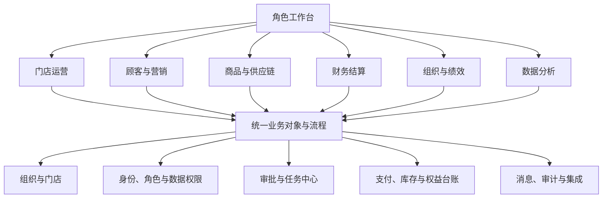
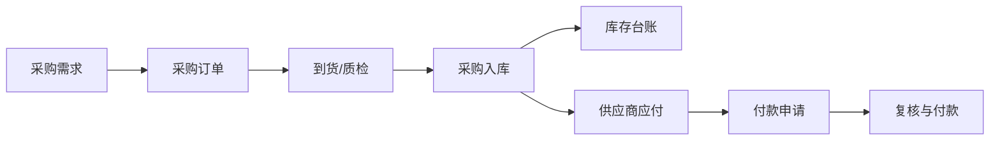
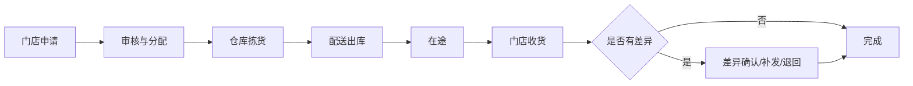

# ERP 产品架构 v2

日期：2026-08-18  
阶段：产品架构基线，等待业务共同确认

## 1. 产品定位

这套系统定位为“连锁服务零售经营平台”，不是传统的进销存工具。它需要同时支撑门店前台服务、会员经营、商品与供应链、资金结算、员工绩效和总部决策。

当前默认边界：桌面端 Web 为主；第一版服务一个品牌下的总部、区域和多门店，数据库预留租户字段，但不开放多商户 SaaS 管理后台；保留未来多品牌、多租户和移动端扩展能力。新系统从空库开始，不迁移旧系统历史业务数据。当前Windows 2核4G、70GB服务器只用于开发验收和测试，正式生产操作系统另行评审。数据库采用PostgreSQL 18，结构变更采用Flyway版本化迁移；详细约束见 [数据库设计与变更治理规范](database-design-and-change-governance.md)、[Windows单机部署与容量基线](windows-server-deployment-baseline.md) 和 [技术架构与开发基线](technical-architecture-and-stack.md)。

各模块的对象、状态、主流程和跨模块边界见 [核心功能业务逻辑总览](core-business-logic.md)。微信与支付宝的开发前集成边界、统一支付模型、回调、退款和对账要求见 [微信支付与支付宝支付开发设计](payment-integration-development-guide.md)。

最近两轮关于CRUD字段规则和发布更新的讨论，分别维护在 [CRUD与版本更新需求沟通纪要](requirements-communication-log.md) 与 [CRUD与版本更新决策登记册](product-decision-register.md)，避免聊天结论在开发过程中丢失或被误当成已确认需求。

## 2. 产品分层

产品从上到下分为四层：

1. 角色工作台：把待办、异常、指标和快捷动作送到具体岗位。
2. 业务域：承载门店经营和总部管理能力。
3. 统一业务对象与流程：保证顾客、订单、支付、库存、员工和门店只定义一次。
4. 平台底座：提供组织、权限、审批、台账、消息、审计和外部集成。

## 3. 一级信息架构

不继续使用旧系统15个并列入口。新系统建议使用8个一级入口，并按角色隐藏无关内容。

### 3.1 工作台

- 我的待办：审核、异常、催办、失败任务。
- 经营概览：今日营业、客流、储值、卡扣、商品销售、退款。
- 门店状态：预约、房台、服务中、待结算、员工在岗。
- 风险提醒：库存不足、余额异常、应收应付、对账差异、短信余额。
- 快捷动作：随岗位变化，不做全员统一快捷区。

### 3.2 门店运营

- 前台收银
- 预约与到店
- 房台与服务单
- 项目/产品开单
- 结算与组合支付
- 退货、退款、撤销与作废
- 签单与清账
- 收银交班
- 门店营业日结

### 3.3 顾客与营销

- 顾客档案与标签
- 会员卡与卡类
- 储值账户
- 次卡与权益包
- 积分账户与兑换
- 顾客护理/服务档案
- 促销、优惠券和活动
- 顾客分层与生命周期
- 短信任务、模板和发送记录
- 分销关系与佣金（如业务保留）

### 3.4 商品与供应链

- 项目、产品、次卡商品与分类
- 价格、成本、单位、品牌和供应商
- 采购订单、入库、退货与应付
- 销售订单、出库、退货与应收
- 库存余额、流水、盘点和调价
- 门店配货申请、配送、收货和差异
- 门店退货、在途库存与调拨
- 仓库、库位、批次、效期（按业务启用）

### 3.5 财务结算

- 收款、付款与组合支付
- 费用开支与其他收入
- 现金银行账户
- 顾客欠款与还款
- 供应商应付、客户/门店应收
- 跨店核算与跨店结算
- 门店对账、收银日结和差异处理
- 经营情况、资金视图和管理资产负债

### 3.6 组织与绩效

- 员工档案与系统账号
- 组织、门店、岗位和职级
- 排班、考勤与在岗状态（待确认是否纳入）
- 服务员工、顾问和销售归属
- 绩效规则与业绩归属
- 奖罚、分成与佣金
- 工资核算、复核与发放

### 3.7 数据分析

- 报表中心
- 决策驾驶舱
- 指标口径中心
- 自定义筛选与保存视图
- 下钻分析
- 报表收藏、订阅和任务
- 导出申请与导出记录

### 3.8 系统管理

- 品牌、区域、门店、仓库
- 用户、角色、数据范围和字段权限
- 审批流程与金额阈值
- 单据编号、字典、原因码和业务参数
- 支付、短信、打印及第三方账户
- 操作日志、登录日志和敏感数据访问日志
- 开放接口、Webhook和同步任务

## 4. 旧模块到新架构的映射

| 旧模板模块 | 新架构归属 | 调整原则 |
|---|---|---|
| 收银 | 门店运营 | 从“房台看板”扩展为预约、接待、服务、结算、交班主链路 |
| 顾客 | 顾客与营销 | 档案、卡、储值、次卡、积分和售后统一到顾客360视图 |
| 促销 | 顾客与营销 + 商品与供应链 | 活动规则属于营销，商品价格与适用对象来自统一主数据 |
| 进货 | 商品与供应链 | 订单、入库、退货、应付解耦，通过来源关系串联 |
| 销售 | 商品与供应链 | 保留批发/客户销售；门店零售消费仍由门店运营负责 |
| 库存 | 商品与供应链 | 建立统一库存台账，所有出入库必须有来源业务事件 |
| 配货 | 商品与供应链 | 使用门店申请、总部/仓库履约、在途、收货差异状态机 |
| 员工 | 组织与绩效 | 员工档案、账号、绩效和工资分权管理 |
| 财务 | 财务结算 | 汇聚各业务域产生的应收、应付、收付款和内部往来 |
| 报表 | 数据分析 | 与决策合并为统一分析中心，保留业务报表分组 |
| 决策 | 数据分析 | 驾驶舱只保留高价值指标，其他指标进入报表中心 |
| 短信 | 顾客与营销 + 系统管理 | 发送任务归营销，账号、签名和安全配置归系统管理 |
| 模板中分散的项目/产品/卡类/价格设置 | 商品与供应链 | 归并为统一项目、产品与定价中心，老板控制价格版本 |
| 顶部设置与后台参数 | 系统管理 | 统一组织、用户、权限、审批、字典、支付方式、集成和审计 |

参考模板中的股权、微信运营/营销、云商模块暂不进入本期架构；收银所需的微信支付通道属于外部支付集成，不在此排除范围内。

## 5. 核心业务对象及唯一归属

| 对象 | 主责业务域 | 关键约束 |
|---|---|---|
| 顾客 | 顾客与营销 | 一个自然人可拥有多个会员卡或权益账户，但档案不能重复 |
| 会员卡/储值/积分/次卡 | 顾客与营销 | 各自使用不可直接修改的权益台账，手工调整必须有原因和权限 |
| 项目/产品/次卡商品 | 商品与供应链 | 统一编码、分类、价格、成本和适用门店 |
| 服务主单/消费单 | 门店运营 | 承载顾客、房台、项目、产品、员工、优惠和结算关系 |
| 支付/退款 | 财务结算 | 业务单据发起，支付中心执行；幂等且可对账 |
| 库存余额/流水 | 商品与供应链 | 只能由已批准的入库、出库、调拨、盘点等事件改变 |
| 员工 | 组织与绩效 | 人员档案与登录账号分离；可跨门店任职但权限单独授权 |
| 门店/组织 | 系统管理 | 作为全部数据范围、核算和权限的共同维度 |
| 指标 | 数据分析 | 每个指标必须有公式、来源、粒度、刷新周期和口径版本 |

## 6. 三条核心端到端主链路

### 6.1 门店服务与收银

关键原则：“打开设施”是查看，“开始使用”才创建接待与设施使用记录；开始时允许顾客身份未知，也可选填顾客与预计服务来帮助后续识别，结算前仍可关联会员。设施在服务结束时释放，不等待支付完成。设施计时和预计服务只记录运营信息，不参与自动计价；最终收费金额由店长输入或确认。待录单界面必须优先展示脱敏顾客、预计服务、设施和时间，机器编号仅用于追溯。设施使用、服务内容确认、权益核销和支付分别产生独立业务事件。详细设计见 [门店接待、设施计时与收银领域设计](domains/store-service-and-cashier.md)。

### 6.2 采购与库存

关键原则：入库影响库存，确认应付影响财务，实际付款影响资金；三个动作不能由一次保存隐式完成。

### 6.3 门店配货

关键原则：发货数量、收货数量、差异数量和责任处理必须逐行追溯。

## 7. 角色工作台

| 角色 | 首页首先看到 | 主要快捷动作 |
|---|---|---|
| 前台/收银 | 房台、预约、待结算、交班状态 | 开始接待、会员识别、结算、退款申请 |
| 店长 | 今日营业、客流、人员、异常、待审批 | 排班调整、异常处理、门店审核、日结 |
| 总部运营 | 门店排名、会员增长、活动效果、经营异常 | 促销配置、门店督办、报表下钻 |
| 采购/仓库 | 待采购、待入库、缺货、在途、差异 | 下单、入库、配货、盘点 |
| 财务 | 待审核资金单据、应收应付、对账差异 | 复核、结算、付款、关账 |
| 人事/薪资 | 员工变动、绩效异常、待核薪 | 档案、规则、复核、发放 |
| 系统管理员 | 账户风险、同步失败、权限变更 | 用户、角色、参数、集成、审计 |

## 8. 导航与页面框架

- 左侧：8个一级入口，可展开到二级功能；按角色和数据范围显示。
- 顶部：品牌/门店切换、全局搜索、我的待办、通知和账户。
- 内容标题区：面包屑、页面说明、主动作、状态和数据范围。
- 工作区：概览、列表、单据、详情、报表使用统一页面骨架。
- 右侧抽屉：轻量详情、筛选和辅助信息；业务主流程不放入多层弹窗。
- 全局任务中心：导出、批量处理、报表生成、短信发送等长任务统一查看结果。

## 9. 现阶段架构决策

| 编号 | 决策 | 当前默认 | 影响 |
|---|---|---|---|
| D1 | 服务零售行业范围 | 先做足疗/修脚/美容等服务门店，可扩展其他连锁服务业 | 决定房台、技师、护理档案等对象是否为核心 |
| D2 | 部署与租户 | 第一期服务单一品牌下的多门店；所有核心业务表保留tenant_id，但不开放多商户管理后台 | 兼顾第一期复杂度与未来数据隔离 |
| D3 | 终端范围 | 第一期桌面 Web；收银台适配触屏大屏 | 影响页面密度和快捷操作方式 |
| D4 | 批发销售 | 保留为供应链中的独立能力，不与门店消费单混用 | 避免销售出库和前台服务结算模型冲突 |
| D5 | 财务深度 | 先做经营财务与业务台账，不直接替代专业总账 | 影响会计科目、凭证和法定报表边界 |
| D6 | 消息渠道 | 第一期短信；模板中的微信运营/营销、云商模块不纳入当前范围 | 影响营销触达和第三方集成，不排除微信支付通道 |
| D7 | 数据库与变更 | PostgreSQL + Flyway版本化SQL；生产禁用自动同步和手工改表 | 决定开发、发布、恢复和审计方式 |
| D8 | 当前部署 | Windows单机承载测试应用与数据库；正式生产操作系统另行评审，代码必须跨平台 | 决定当前资源限制，但不形成长期生产绑定 |
| D9 | 外部支付 | 形成微信 Native 与支付宝订单码开发设计；正式接入前仍使用人工登记待核对 | 决定支付中心、回调安全、退款和渠道对账边界 |
| D10 | 第一版技术架构 | .NET 10模块化单体 + React 19 + PostgreSQL 18 + Flyway；V1不上Kubernetes | 支持当前低资源测试环境并保留Linux迁移能力 |
| D11 | 历史数据 | 新系统从空库开始，不迁移旧系统会员、余额、订单和流水 | 降低首版迁移与对账风险，主数据通过新系统初始化 |
| D12 | 第一开发闭环 | 系统基础、目录价格、设施接待、顾客会员、收银、人工支付、交班审计 | 决定首批页面、表、接口和验收范围 |

## 10. 下一层设计顺序

1. 冻结首个闭环页面清单、字段级矩阵和老板/店长/前台权限矩阵。
2. 确定初始改价阈值、会员大额扣费阈值和审批人。
3. 创建正式仓库、工程骨架、Flyway空库基线和自动测试流水线。
4. 将“前台收银”和“顾客360”转成页面级交互流程和状态机。
5. 完成数据库空库迁移、备份恢复和扩展—收缩技术演练。
6. 基于确定的业务流程制作目标交互原型并开始首个闭环编码。
