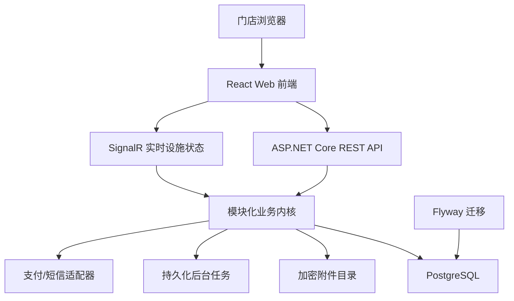

# ERP 技术架构与开发基线 v1

日期：2026-08-18  
状态：已采用，作为第一版工程初始化依据

## 1. 已确认前提

- 第一版服务一个品牌下的总部、区域和多个门店，不开放多商户 SaaS 管理后台。
- 业务表保留 `tenant_id`，为未来数据隔离和多租户升级保留迁移路径。
- 新系统结构从空库开始；正式启用前使用独立只读迁移工具导出旧系统会员、权益、订单、库存和主数据，经加密、映射与对账后受控导入。
- 部署方向已经确定为 Ubuntu Server 24.04 LTS；Windows 资产只保留历史追溯，不再作为实现或验收对象。
- 业务代码保持跨平台，不依赖 Windows 路径、注册表、COM 或 IIS 专属 API。
- 第一批开发聚焦系统基础、目录价格、设施接待、顾客基础、收银结算、人工支付和交班审计。

## 2. 架构选择

第一版采用**模块化单体 + 单一 PostgreSQL 数据库 + 独立前端应用**。



模块按照业务边界组织，第一版部署为一个应用进程；模块之间通过应用服务、领域事件和稳定契约协作，禁止跨模块直接修改对方数据表。

选择模块化单体的原因：

- 当前服务器只有2核4GB，单体比微服务和 Kubernetes 占用更少。
- 收银、会员权益、库存和资金存在强事务关系，第一版在单库事务中更容易保证一致性。
- 保留清晰模块边界后，未来只有在独立扩容、独立发布或团队边界成立时才拆分服务。

## 3. 技术栈

| 层次 | 选型 | 基线 |
|---|---|---|
| 后端运行时 | .NET 10 LTS、C# | 使用受支持的最新安全补丁 |
| Web API | ASP.NET Core 10 | REST JSON、OpenAPI、同源 Cookie 会话 |
| 数据访问 | Entity Framework Core 10 + Npgsql | EF Core 负责映射和事务；禁止 EF 自动建表 |
| 数据库 | PostgreSQL 18 | 固定主版本，持续升级当前安全修复版本 |
| 数据库迁移 | Flyway 版本化 SQL | CI 和发布阶段执行；生产应用账号无 DDL 权限 |
| 前端 | React 19.2 + TypeScript | SPA，同源部署 |
| 构建工具 | Node.js 24 LTS + Vite 8 | 使用锁文件和可复现安装 |
| UI 组件 | Ant Design 6 | 建立 ERP 自有主题、表格和表单封装层 |
| 文件存储 | 应用外持久化目录 + ASP.NET Core Data Protection | 图片加密落盘；数据库只存元数据、随机键和SHA-256；后续可替换对象存储适配器 |
| 服务端测试 | xUnit + ASP.NET Core 集成测试 + Testcontainers | 使用真实 PostgreSQL 运行核心集成测试 |
| 前端测试 | Vitest + Testing Library | 测试字段、权限和状态交互 |
| 端到端测试 | Playwright | 覆盖首个收银闭环和高风险操作 |
| 可观测性 | OpenTelemetry + 结构化日志 | 请求号、业务号和审计号可关联；敏感字段脱敏 |
| 源码与 CI | GitHub 私有仓库 + GitHub Actions | 自动测试、依赖审计、构建和不可修改发布包 |
| Linux 部署 | Ubuntu Server 24.04 LTS + Nginx + systemd | 回环 Blue/Green、双重健康门禁和失败切回 |

补丁版本在工程初始化时通过锁文件、SDK文件和容器/工具清单固定；升级补丁必须经过自动测试，不在本文长期写死所有补丁号。

## 4. 仓库结构

采用单仓库管理，避免第一版前后端、迁移和发布脚本版本错配。

```text
erp/
├── apps/
│   ├── api/                  # ASP.NET Core API和模块
│   └── web/                  # React前端
├── db/
│   ├── migrations/           # Flyway不可变版本迁移
│   ├── repeatable/           # 可重复视图/函数，谨慎使用
│   └── test-seed/            # 仅测试环境种子数据
├── tests/
│   ├── architecture/         # 模块边界与依赖规则
│   ├── integration/          # PostgreSQL集成测试
│   └── e2e/                  # 浏览器端到端测试
├── deploy/
│   ├── linux/                # Nginx/systemd A/B发布、备份和回退脚本
│   └── windows/              # 历史部署资产，不再作为当前目标
├── docs/
└── ERP.slnx
```

## 5. 后端模块边界

第一版先建立以下模块：

| 模块 | 第一批职责 |
|---|---|
| Identity | 登录、会话、密码、账号锁定和安全事件 |
| Organization | 品牌、区域、门店、员工绑定和数据范围 |
| Authorization | 角色、动作、字段、门店范围和金额阈值 |
| Catalog | 服务项目、产品、价格版本和适用门店 |
| Customer | 顾客档案、会员识别和联系方式验证 |
| Facility | 设施、占用、计时、换台和待清洁状态 |
| Cashier | 接待、服务明细、改价、消费单和交班 |
| Membership | 储值、奖励、次卡和积分账户及不可变流水 |
| Payment | 人工支付登记、统一支付契约、核对状态和渠道适配器 |
| Audit | 操作日志、敏感查看和高风险业务审计 |

采购、销售、复杂库存、分销、工资和分析模块先保留文档，不进入第一个开发闭环。

## 6. API 与事务原则

- API 统一使用 `/api/v1` 前缀和 OpenAPI 契约。
- 命令请求通过 `Idempotency-Key` 或稳定业务请求号防止重复执行。
- 设施开始、会员扣减、支付确认、退款和关班必须在服务端校验权限及当前状态。
- HTTP 接口只返回安全错误码、用户可理解信息和请求追踪号，不返回堆栈或 SQL 内容。
- 单模块内优先使用本地数据库事务；跨模块后续动作使用事务内事件记录和 Outbox，禁止在事务提交前假定外部支付成功。
- 对支付渠道、短信和文件存储使用适配器接口，业务模块不引用第三方 SDK 类型。
- 上传文件不进入前端静态目录或版本发布包；业务表只引用文件ID，物理路径和加密细节由文件存储适配器负责。

## 7. 身份认证与安全基线

- 员工账号使用 ASP.NET Core Identity 的安全能力并按项目字段扩展。
- 浏览器使用同源、`HttpOnly`、`Secure`、`SameSite` Cookie 会话，不把访问令牌存入 `localStorage`。
- 所有修改接口启用防跨站请求保护；登录、验证码、会员查询和支付查询分别限流。
- ASP.NET Core Identity 使用自定义 Argon2id 密码哈希器并保存算法参数以支持后续重哈希；连续失败锁定账号，密码重置令牌一次性且短期有效。
- 前端隐藏按钮不是权限边界，每个受保护接口都必须校验角色、动作、门店范围和金额阈值。
- 顾客姓名在授权业务页面按原名展示；手机号、护理记录、会员余额和支付资料按字段权限最小化展示，列表手机号仅保留前三位和后四位。
- 图片上传以服务端真实文件头、大小上限和用途白名单校验；禁止SVG和可执行内容，文件名不能决定存储路径。
- 数据库查询全部参数化；所有外部输入在 API 边界执行类型、长度、格式、状态和权限校验。
- 密钥、证书和连接密码不进入代码库、日志或前端包；测试与正式环境使用不同密钥。
- HTTPS、安全响应头、受限 CORS、依赖漏洞扫描和密钥扫描是发布门禁。

## 8. 数据设计基线

- 新库从 `VyyyyMMddNNNN__baseline_core_schemas.sql` 开始建立；历史业务数据不写入 Flyway 结构迁移，而由可断点、可对账、幂等的独立数据迁移任务导入。
- 所有核心业务表包含 `tenant_id`；第一版写入固定的品牌租户，但查询仍显式限定租户和门店范围。
- 主键采用应用生成的 UUIDv7；业务单号独立生成，不能使用主键承担用户可见编号。
- 时间按 UTC 存储，界面按门店时区展示；设施计时以服务端时间为准。
- 人民币收付金额以“分”的整数保存；比例、数量和成本根据业务精度使用受限 `numeric`。
- 会员余额、支付、库存和业绩通过不可变流水形成，不允许后台直接覆盖结果余额。
- 乐观并发字段用于表单更新；运行中设施、幂等请求号和外部渠道单号建立数据库唯一约束。
- EF Core 迁移功能不作为生产结构来源；模型变化必须同时提交 Flyway SQL 和集成测试。
- 产品图片与服务档案附件使用独立文件元数据表；服务档案、附件关系及文件元数据不可原地更新或删除，补充和纠错新增记录。

## 9. Linux 测试与生产基线

当前 Ubuntu Server 24.04 LTS 目标采用：

- Nginx 终止 TLS 并反向代理 ASP.NET Core；应用 Blue/Green 实例只监听回环地址。
- PostgreSQL 18 仅监听本机或私有网络；Flyway 使用独立迁移账号，应用账号无 DDL 权限。
- 新版本先在非活动 systemd 槽位完成数据库和应用就绪检查，再由 Nginx 原子切流；入口检查失败恢复原代理。
- 数据库只做前向迁移；应用回退必须验证 schema 兼容，不能用自动降级 SQL 伪装安全回滚。
- 2核4GB环境限制后台任务并发，不同时执行报表、备份压缩和批量任务；第一版不上 Kubernetes。

## 10. 发布与版本更新

第一版采用 GitHub Actions + 受控 Bash/Nginx/systemd A/B 发布脚本：

1. 合并代码后运行格式、单元、集成、前端和安全检查。
2. 生成带版本、Git提交、校验值和数据库兼容范围的不可修改发布包。
3. 部署测试环境并执行 Flyway 校验、迁移、健康检查和收银冒烟测试。
4. 人工批准正式发布后，先备份，再迁移数据库，再部署备用站点。
5. 备用站点通过检查后切换流量；异常时切回上一应用版本。

V1 不采购 Octopus Deploy。待出现多套正式环境、多台服务器、多人审批或复杂发布编排后再评估。V1 不使用 Kubernetes；当应用需要多个实例、服务独立扩缩容或高可用集群时重新进行架构决策。

## 11. 第一开发闭环

```text
员工登录
→ 进入授权门店
→ 维护服务项目和价格版本
→ 选择设施并开始计时
→ 关联散客或会员
→ 结束服务并进入待清洁
→ 店长录入服务项目、时长和实际金额
→ 超出改价权限时提交最高权限审批
→ 人工登记支付或使用会员权益
→ 完成结算并生成不可变流水
→ 在交班和审计记录中查询
```

真实微信和支付宝通道不属于第一个闭环的完成条件，但统一支付接口、幂等、支付状态和人工待核对模式必须在第一批模型中预留。

## 12. 工程启动门禁

满足以下条件即可创建正式工程：

- [x] 多品牌隔离、品牌内多门店共享和“空库建结构、受控导入历史数据”已经确认。
- [x] 第一批模块范围已经确认。
- [x] 技术栈、模块化单体和数据库治理已经确认。
- [x] Ubuntu Server 24.04 LTS 作为当前部署基线已经确认。
- [x] 首个闭环的页面清单和字段级矩阵完成，见 [V1页面清单与字段级需求矩阵](v1-page-and-field-matrix.md)。
- [x] 老板、店长、前台、收银员的动作权限及改价初始阈值完成，见 [V1角色权限与审批阈值矩阵](v1-role-permission-and-approval-matrix.md)。
- [x] 首个闭环的状态机和验收用例已固化，见 [V1核心状态机与验收用例](v1-state-machines-and-acceptance-cases.md)。

工程启动门禁已经全部满足，可以创建正式工程并进入首个闭环开发。状态机后续如有业务调整，必须同步版本化文档、接口契约、数据库约束和自动化测试。

## 13. 选型依据

- [.NET 官方支持策略](https://dotnet.microsoft.com/en-us/platform/support/policy)：.NET 10 为当前受支持的 LTS 版本。
- [PostgreSQL 官方版本策略](https://www.postgresql.org/support/versioning/)：PostgreSQL 18 处于官方支持期，主版本提供五年支持。
- [Npgsql EF Core 10 发布说明](https://www.npgsql.org/efcore/release-notes/10.0.html)：对应 EF Core 10，并支持 PostgreSQL 18 和 UUIDv7。
- [Node.js 官方版本状态](https://nodejs.org/en/about/previous-releases)：Node.js 24 为 LTS 分支。
- [React 官方版本页](https://react.dev/versions)：React 19.2 为当前稳定主线。
- [Vite 8 发布说明](https://main.vite.dev/blog/announcing-vite8)：Vite 8 为稳定版本。
- [Ant Design React 介绍](https://ant.design/docs/react/introduce-cn/)：面向企业级中后台并提供完整 TypeScript 类型。
- [ASP.NET Core Linux Nginx 部署指南](https://learn.microsoft.com/en-us/aspnet/core/host-and-deploy/linux-nginx?view=aspnetcore-10.0)：覆盖 Nginx、systemd、反向代理和服务管理。
- [Flyway 数据库支持矩阵](https://documentation.red-gate.com/flyway/getting-started-with-flyway/system-requirements/supported-databases-and-versions)：支持 PostgreSQL 18 的版本化迁移。
