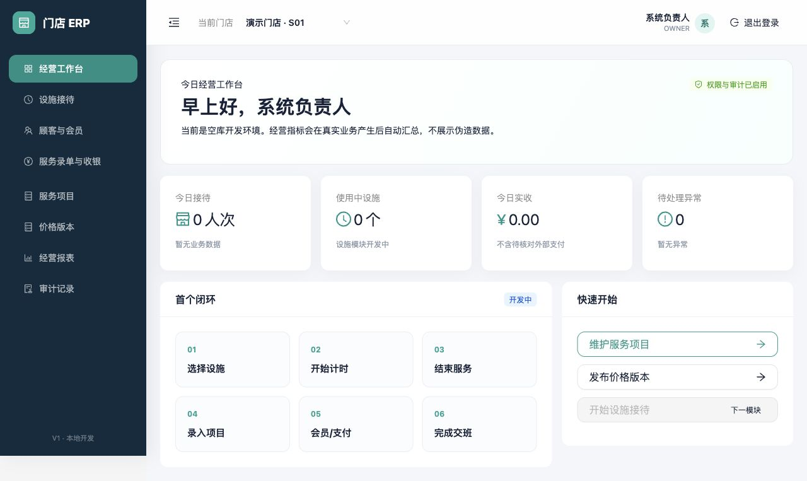

# 本地启动、登录与权限

适用版本：V1 开发基线  
更新日期：2026-08-18

## 1. 启动本地系统

1. 按仓库根目录 `README.md` 准备 `.env`。正式密码不得写入代码或提交到 Git。
2. 启动 PostgreSQL：`docker compose up -d postgres`。
3. 载入 `.env` 后启动 API：`dotnet run --project apps/api/Erp.Api`。
4. 启动前端：`npm --prefix apps/web run dev`。
5. 浏览器访问终端显示的本地前端地址。

API 存活检查地址为 `/health/live`。本地开发允许 HTTP；非 Development 环境必须使用 HTTPS、Secure Cookie 和 HSTS。

## 2. 登录

输入员工账号和密码后点击“进入工作台”。

- 员工账号：必填，最长 100 个字符。
- 密码：必填，最长 256 个字符。
- 在此设备保持登录：可选；只应在受控门店设备上使用。
- 连续失败：同一来源 15 分钟内最多尝试 10 次；超过限制会暂时拒绝请求。
- 错误提示：不会说明账号是否存在，以免泄露员工账号信息。

## 3. 进入工作台

登录后顶部会显示当前门店、消息通知、使用帮助、权限范围内的系统设置，以及当前员工和角色。点击右上角头像可修改密码或退出登录。左侧菜单按业务模块进入，其中“价格管理”用于查看当前价格、安排调价和追溯历史价格。当前 V1 基线中的经营数字来自真实业务汇总；没有业务时显示零或“暂无数据”，不会使用演示数字冒充实际经营数据。

当前门店下拉框只列出该账号被授权的门店。切换门店只改变操作上下文，不扩大账号权限。

## 4. 权限与退出

- 系统负责人 `OWNER`：当前可新建服务项目、建立价格版本和发布价格版本。
- 其他预置角色：门店店长、前台、收银员、技师；具体动作会随对应模块逐步开放。
- 所有写请求都要求登录 Cookie 和防跨站请求令牌。
- 公用终端使用完成后，打开右上角头像菜单并点击“退出登录”。退出成功后会清除登录会话和本页安全令牌。

## 5. 当前边界

本章节只说明已经运行和验收的登录、门店上下文、角色展示及退出入口。员工管理、角色授权界面尚未开放，不应把数据库种子数据当成可交付的后台管理功能。
