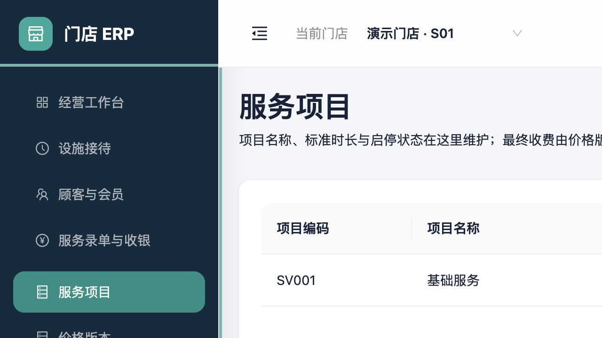
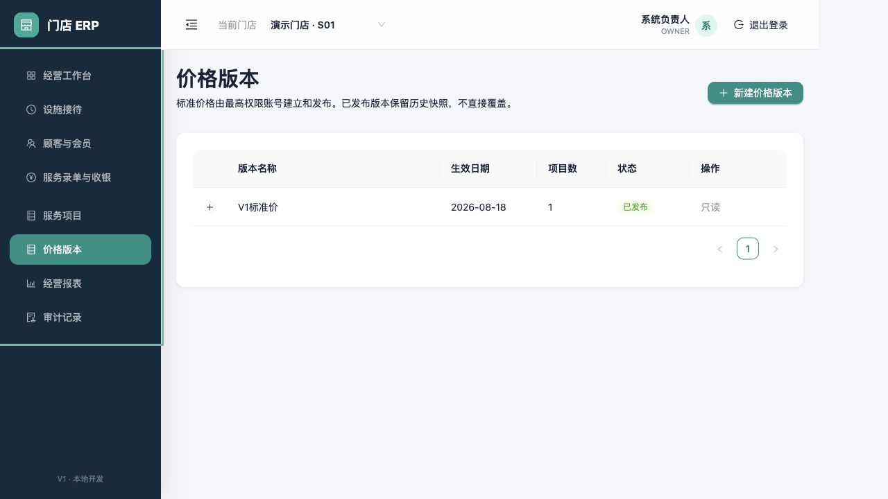

# 服务项目与价格版本

适用版本：V1 目录与价格基线  
更新日期：2026-08-18

## 1. 业务原则

服务项目只描述“提供什么服务”和标准时长；设施计时只记录占用，不自动形成收费。最终标准价由系统最高权限账号通过价格版本建立并发布。已发布价格保留历史快照，不在原记录上直接覆盖。

## 2. 新建服务项目

进入“服务项目”，点击“新建项目”。

| 字段 | 是否必填 | 规则 | 业务含义 |
|---|---|---|---|
| 项目编码 | 必填 | 最长 40 字符；同一租户内不能重复 | 稳定业务标识，例如 `SV001` |
| 项目名称 | 必填 | 最长 120 字符 | 门店自己定义，不写死行业名称 |
| 标准时长（分钟） | 必填 | 0–1440 的整数，默认 60 | 服务记录与排班参考，不自动计价 |

点击“保存”才会写入；点击“取消”或关闭弹窗不会保存。新项目默认启用。当前界面暂未开放编辑和停用动作。

## 3. 建立价格版本

进入“价格版本”，点击“新建价格版本”。系统在没有服务项目时会禁用该按钮。

| 字段 | 是否必填 | 规则 | 业务含义 |
|---|---|---|---|
| 版本名称 | 必填 | 使用可识别的业务名称 | 例如某季标准价；用于历史查询 |
| 生效日期 | 必填 | 日期 | 版本计划开始适用的日期 |
| 每个服务项目的标准价格 | 必填 | 不小于 0；精确到分 | 以人民币输入，服务端按最小货币单位保存 |

首次点击“保存草稿”只建立草稿，不会立即成为正式价格。草稿可由 `OWNER` 点击“发布”。发布后状态变为“已发布”，本版本只读；后续改价应另建新版本。

## 4. 权限和可追溯性

- 服务项目和价格版本列表：已登录账号可查看。
- 新建服务项目、新建价格版本、发布价格版本：当前只允许 `OWNER`。
- 已发布版本包含项目价格快照，后续调整服务项目不会反向篡改历史版本。
- 价格金额以整数分保存，避免浮点数舍入造成账务误差。

## 5. 当前边界

- 当前只交付项目新建、列表，价格草稿新建、列表和发布。
- 项目编辑/停用、草稿修改/作废、按日期自动选价及收银引用，会在后续业务模块实现。
- 当前页面中的本地示例项目和价格仅用于开发验收，不代表真实门店经营数据。
