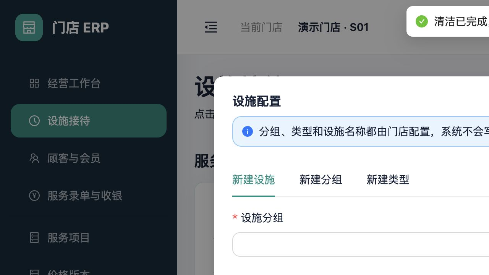
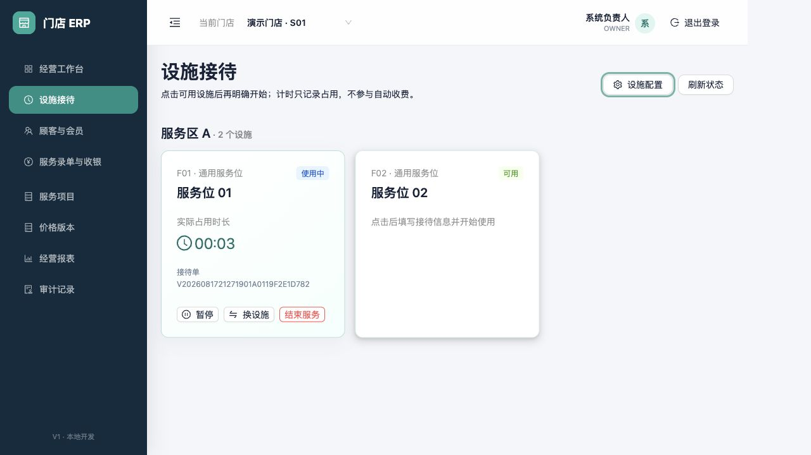

# 设施接待与独立计时

适用版本：V1 设施接待首个闭环
更新日期：2026-08-18

## 1. 业务边界

设施用于记录房间、床位、服务位或其他门店资源的占用和计时。设施名称、类型和分组均由门店配置，不绑定某个行业。

设施计时与收费严格分离：开始、暂停、继续、换设施和结束都不会自动生成项目、价格、应收或支付记录。店长在后续录单环节确认真实服务内容、时长和收费。

## 2. 初始化设施

`OWNER` 在“设施接待”右上角打开“设施配置”，按以下顺序初始化：

1. 新建分组，例如“服务区 A”。
2. 新建设施类型，例如“通用服务位”。
3. 新建设施，并选择前两步的分组和类型。

| 字段 | 是否必填 | 规则 |
|---|---|---|
| 分组显示名称 | 必填 | 1–50 字；同一门店不可重复 |
| 分组排序 | 必填 | 整数；数值较小的优先展示 |
| 设施类型名称 | 必填 | 1–50 字；同一租户不可重复 |
| 设施分组、设施类型 | 必填 | 必须选择当前租户/门店的有效配置 |
| 设施编号 | 必填 | 1–40 字；同一门店不可重复 |
| 显示名称 | 必填 | 1–50 字；工作台直接展示 |
| 排序 | 选填 | 整数 |
| 默认清洁分钟 | 选填 | 0–1440；0 表示结束后直接可用 |
| 允许预约 | 必填布尔值 | 默认关闭；当前版本只保存配置 |

点击保存才会写入。查看设施看板、打开配置或关闭弹窗不会创建占用、接待或账单。

## 3. 查看设施看板

看板按当前门店和配置分组展示设施。状态由服务端从设施基础状态、有效计时记录和清洁任务计算，不能在页面下拉框中直接修改。

- 可用：可以开始接待。
- 使用中：服务器正在计时。
- 已暂停：保留占用，但暂停区间不计入实际使用时长。
- 待清洁：上次服务已结束，完成清洁后才恢复可用。
- 维护中/已停用：不能接待。

## 4. 开始使用

点击一张“可用”设施卡片，只会打开确认窗口；必须再次点击“确认开始”才会创建接待和设施使用记录。

| 字段 | 是否必填 | 规则 |
|---|---|---|
| 设施 | 必填 | 来自当前点击的可用设施；提交时服务端再次校验 |
| 预计时长 | 选填 | 1–1440 分钟；只作提醒，不计价 |
| 接待备注 | 选填 | 最多 500 字；避免填写不必要的敏感信息 |
| 开始时间 | 系统生成 | 使用服务器时间，不允许前端填写 |
| 幂等请求号 | 系统生成 | 重复提交同一请求不会重复占用或创建接待 |

## 5. 使用中、暂停和刷新

使用中卡片显示接待单号、实际占用时长、预计时长和备注。页面每秒更新显示，但最终时长仍以服务器记录为准。

- 暂停：只允许“使用中”执行；新增一个暂停区间。
- 继续：只允许“已暂停”执行；关闭当前暂停区间。
- 刷新或换电脑：重新从服务器开始时间和暂停区间计算，不会把计时归零。
- 同一设施并发开始：数据库唯一约束只允许一个成功，另一个终端会收到状态冲突提示。

## 6. 更换设施

点击“换设施”，目标设施必填，更换原因选填（最多 500 字）。确认后系统在同一事务中结束旧记录并创建新记录，历史不会被覆盖。若目标设施已被其他终端占用，整次更换回滚，原设施继续计时。

## 7. 结束与清洁

点击“结束服务”会停止计时，并把接待推进到服务结束；不会自动生成收费。如果设施的默认清洁分钟大于 0，设施进入“待清洁”；点击“完成清洁”后恢复可用。默认清洁分钟为 0 时，结束后直接恢复可用。

## 8. 权限与审计

- 查看设施看板：已登录且拥有当前门店范围的账号。
- 正常开始、暂停、继续、换设施、结束和完成清洁：`OWNER`、门店店长、前台。
- 新建分组、类型和设施：当前仅 `OWNER`。
- 每个状态动作记录操作者、请求号、服务器时间、前后状态和请求追踪号。
- 直接调用其他门店 ID 会被服务端拒绝，响应不返回该门店设施信息。

## 9. 当前未开放

设施编辑/停用/维护、异常取消占用、人工时间修正、顾客关联、项目和员工预分配尚未进入本切片；这些入口不会以无效按钮冒充已经交付。
