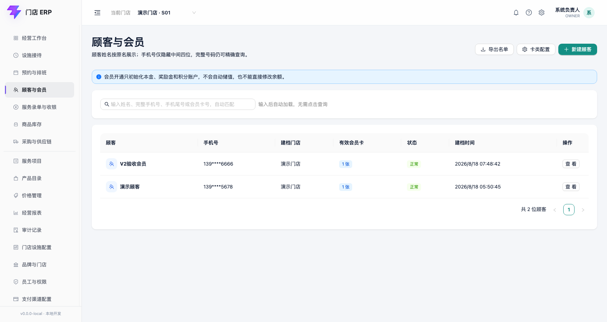
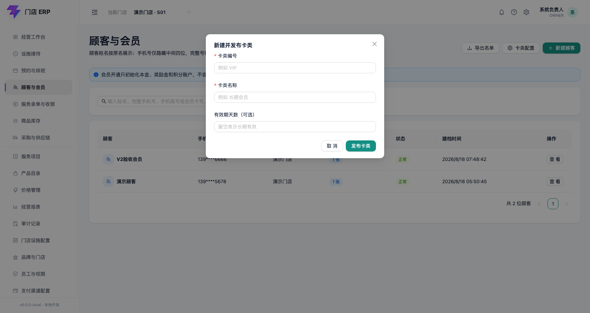

# 顾客档案与会员账户

适用版本：V1 顾客与会员首个闭环

更新日期：2026-08-18

## 1. 业务边界

顾客档案、会员卡和会员账户是三个独立对象：顾客可以不办会员；一个顾客可以有多张会员卡；每张卡分别建立储值本金、奖励金和积分账户。

V1 完成建档、查询、卡类配置、开卡和零余额账户初始化。V2 已增加独立的[会员储值与资金分账](11-member-topups.md)；开卡仍不会自动储值，页面也没有“直接改余额”入口。

## 2. 顾客列表与查询

列表始终显示脱敏姓名和手机号。可以按以下条件查询当前门店顾客：

- 姓名：模糊匹配。
- 完整手机号：服务端计算查询摘要，不使用手机号明文检索。
- 手机尾号：输入 4 位数字。
- 会员卡号：完整精确匹配。

查询、刷新或打开详情都是只读动作，不会创建会员卡、账户或余额流水。当前最多返回最近 100 条候选记录，正式分页将在顾客数据量测试后补充。

## 3. 新建顾客档案

点击“新建顾客”只会打开表单；点击“确认建档”后才写入。

| 字段 | 是否必填 | 规则 |
|---|---|---|
| 姓名 | 必填 | 1–100 字；列表和详情默认脱敏 |
| 手机号 | 必填 | 当前仅支持中国大陆 11 位手机号；保存加密密文、查询摘要和尾号 |
| 性别 | 选填 | 未填写、女、男、其他四个枚举值 |
| 生日 | 选填 | 不得晚于当前日期；当前详情接口不返回生日，等待敏感字段查看权限完成后再开放 |
| 来源渠道 | 选填 | 最多 40 字；当前使用业务编码，例如 `WALK_IN` |
| 服务通知授权 | 选填 | 默认未授权；必须依据顾客真实授权勾选 |
| 营销信息授权 | 选填 | 默认未授权；与服务通知分开记录 |

同一手机号已存在有效档案时，系统会阻止再次建档并提示先查询核对。重复点击或网络重试使用同一幂等请求号时，只创建一份档案。

## 4. 配置会员卡类

只有 `OWNER` 可以新建并发布卡类。

| 字段 | 是否必填 | 规则 |
|---|---|---|
| 卡类编号 | 必填 | 1–40 字；同一租户不可重复；保存时转为大写 |
| 卡类名称 | 必填 | 1–80 字 |
| 有效期天数 | 选填 | 1–3650 天；留空表示长期有效 |

当前卡类创建后立即处于已发布状态。卡类草稿、版本审批、停用和适用门店规则尚未进入本切片。

## 5. 开通会员

在顾客详情点击“开通会员”，选择已发布卡类后确认。会员卡号可以手工输入，也可以留空由系统根据本次幂等请求号稳定生成。

生效日按当前门店时区计算，不使用浏览器日期，也不直接使用 UTC 日期。到期日按卡类有效期自动计算。一个开卡请求会在同一数据库事务中完成：

1. 创建会员卡。
2. 创建储值本金账户。
3. 创建奖励金账户。
4. 创建积分账户。
5. 写入开卡审计和幂等结果。

任一步失败都会整体回滚，不会留下“有卡但缺账户”的半成品。

## 6. 查看会员卡和账户

会员卡号只显示后四位；本金和奖励金按分显示为人民币，积分按整数单位显示。新账户均为 0。

账户余额字段不是普通可编辑资料。数据库中的会员账户流水禁止更新和删除；未来充值、消费扣款、退款和冲正只能新增业务来源明确的流水，并同步受控余额投影。

## 7. 权限与隐私

- 顾客查询和快速建档：`OWNER`、门店店长、前台、收银员，且只能访问授权门店。
- 开通会员：当前为 `OWNER`、门店店长。
- 卡类配置：当前仅 `OWNER`。
- 完整手机号以应用数据保护密钥加密；查询使用独立密钥派生的 HMAC 摘要。
- 顾客搜索按请求来源限流，降低批量枚举手机号和会员卡号的风险。
- 列表和普通详情接口不返回手机号明文、完整卡号或生日。
- 顾客建档、卡类发布和开卡均记录操作者、请求号、服务器时间和追踪号。

## 8. 待确认与未开放

以下规则尚未得到最终业务确认，因此当前不擅自扩展：

- 家庭成员共用同一手机号时，是否允许多档案以及如何核验。
- 顾客合并、手机号变更与重新验证流程。
- 海外手机号、证件号或其他唯一联系方式。
- 卡类草稿审批、跨门店适用范围和多卡权益合并规则。
- 完整手机号和生日的“明确查看 + 查看原因 + 审计”入口。
- 会员本金和奖励金的储值入账已进入 V2；消费扣款、积分增减、次卡、退款和冲正仍待后续闭环。
