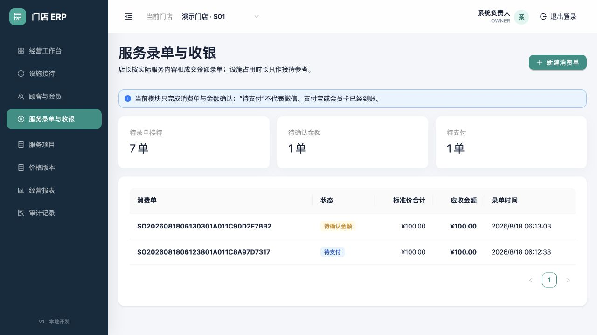

# 服务录单与金额确认

适用版本：V2 消费单与改价审批闭环

更新日期：2026-08-18

## 1. 业务边界

本模块用于服务结束后，由店长或收银员录入实际服务项目、项目时长和成交价格，并把核对无误的消费单推进到“待支付”。

设施占用计时、项目实际服务时长和收费金额彼此独立：设施时长只记录运营事实；项目时长由操作员按实际情况填写；最终应收金额由服务项目、数量和店长输入的成交单价计算，不根据任何时长自动计费。

“待支付”只表示金额已经确认，**不表示微信、支付宝或会员卡已经到账或扣款**。现金、人工外部收款和交班见[支付与收银交班](06-payments-and-cashier-shifts.md)；会员账户、真实渠道和退款分别由独立状态机处理，不能从消费单页面手工改成成功。

## 2. 消费单工作台

页面顶部显示三类待办：

- 待录单接待：设施服务已经结束，但尚未形成有效消费单。
- 待确认金额：消费单仍是草稿，可以继续核对。
- 待支付：金额已经确认，等待真实支付结果。

列表展示消费单号、状态、标准价合计、应收金额和录单时间。消费单号中的日期按门店时区生成；切换电脑或刷新页面不会改变单号、价格快照和状态。

## 3. 新建消费单

点击“新建消费单”只打开表单，点击“保存草稿”后才会写入。可以从两种来源开始：

1. 服务结束后直接补录：适用于顾客服务完成后报姓名、手机号或匿名结算的场景，系统自动建立一条已结束接待记录。
2. 从已结束的设施接待录入：按顾客原名、预计服务、经历设施和到店时间选择待录单接待，页面同时显示设施累计占用时长供核对；机器接待编号只作次要追溯。

选择接待后，系统恢复该接待已关联的顾客。预计服务不会自行加入消费单；只有操作人点击“带入预计服务”才生成一条可编辑明细，此后仍须核对实际服务、成交单价并明确保存草稿。

设施占用时长显示到秒：短于一分钟显示秒，超过一分钟显示分秒，超过一小时显示时分秒。秒数用于区分和核对接待，不参与价格计算。

| 字段 | 是否必填 | 规则 |
|---|---|---|
| 录单来源 | 必填 | 直接补录或已结束接待 |
| 已结束接待 | 条件必填 | 录单来源为设施接待时必填；按顾客、预计服务、设施和时间识别，同一接待只允许一张未作废消费单 |
| 顾客/会员 | 选填 | 可关联当前品牌顾客，也可以匿名录单；消费单仍归当前经营门店 |
| 服务项目 | 必填 | 来自当前有效的已发布价目表；一张消费单 1–100 行，同一项目不重复录入 |
| 数量 | 必填 | 1–999；金额按成交单价乘数量计算 |
| 实际时长 | 选填 | 0–1440 分钟；只记录，不参与金额计算 |
| 成交单价 | 必填 | 0–100,000,000 元；由具备权限的操作员按实际业务输入 |
| 改价原因 | 条件必填 | 成交单价不同于标准价时必填，2–500 字 |
| 整单备注 | 选填 | 最多 1000 字，避免填写不必要的敏感信息 |

保存时，系统把项目编号、名称、标准价、成交价、数量和改价原因写成消费单价格快照。以后发布新价格版本不会追改历史消费单。

## 4. 核对并确认金额

打开一张“待确认金额”消费单，核对项目、数量、项目实际时长、标准价、成交价、改价原因和应收合计后，点击“确认金额”。

系统先按服务端当前生效的改价策略判断是否需要审批：

| 操作人 | 成交价规则 | 保存后的授权状态 |
|---|---|---|
| 任意可录单角色 | 全部使用标准价 | 无需审批，可直接确认金额 |
| `OWNER` | 任意有原因的合法改价 | 由最高权限直接授权，并记录审计 |
| 门店店长 | 单行降幅不超过10%、整单优惠不超过50元且没有提价 | 策略范围内直接授权 |
| 门店店长 | 超过任一优惠阈值或存在提价 | 等待 `OWNER` 审批 |
| 收银员 | 任意偏离标准价 | 等待 `OWNER` 审批 |

“整单优惠”按各优惠行汇总计算，不能用另一行提价抵消。待审批单会同时出现在收银页“改价审批”和右上角待办通知中；只有 `OWNER` 可以批准或驳回，且不能审批自己发起的申请。批准只授权当前订单、当前金额和当前策略快照，不会替申请人修改价格。

审批通过后才能点击“确认金额”。审批驳回后，原成交价和原因仍按事实保留，但该单不能确认或收款；应作废后按正确金额重新录入。每次发布阈值都会生成新的策略版本，旧订单继续显示自己的历史版本，不会被新配置追改。

确认动作使用消费单版本号和幂等请求号：重复点击不会重复推进；两个终端同时为同一接待录单时，只允许一个成功。确认后状态变为“待支付”，当前版本不提供直接修改已确认金额的入口。

## 5. 待支付详情

详情页持续显示“仍需完成真实支付后才能结算”。标准价和成交价分别展示，避免把店长输入金额误认为系统标准价；项目实际时长也单独展示，不能据此推断收费规则。

当前状态含义：

- 待确认金额：草稿已保存，金额还未锁定。
- 待支付：金额已锁定，但没有任何到账结论。
- 已结算：支付分摊平衡且当前启用的内部业务步骤已完成；人工外部分摊仍可保持“待核对”。
- 已作废：预留状态；未来只能记录作废原因和审计，不进行物理删除。

## 6. 权限、审计与一致性

- 当前允许 `OWNER`、门店店长和收银员查看与操作当前授权门店的消费单。
- 标准价格只能来自已发布价目表；最高权限账号负责维护和发布标准价格。
- 成交价偏离标准价必须填写原因；角色、策略阈值、职责分离和审批结果全部由服务端重新判断，前端按钮不是权限边界。
- 改价策略、申请、批准、驳回和金额确认均记录不可追改快照与审计；审批人不能修改申请人填写的成交价。
- 新建消费单和确认金额都记录操作者、服务器时间、请求号和状态变化。
- 同一接待的有效消费单有数据库唯一约束；并发冲突会提示刷新，不能悄悄覆盖。
- 新建消费单、价格快照、幂等结果和审计在同一事务中提交，任一步失败会整体回滚。

## 7. 待确认与未开放

以下规则尚未得到最终业务确认，本模块按保守边界实现并明确留待讨论：

- 草稿是否允许修改、由谁修改，以及修改后是否需要再次审批。
- 优惠券、组合优惠以及多级审批的录入和授权规则。
- 多个设施接待合并为一张消费单，或一张接待拆分多张消费单的规则。
- 作废、反结算和欠款签单的权限与状态机；退款已按原支付来源形成独立审批链。
- 真实微信/支付宝商户环境的最终验收；本地代码已实现组合支付、渠道账单对账和差异处置，但没有真实商户凭据时不视为生产可用。
