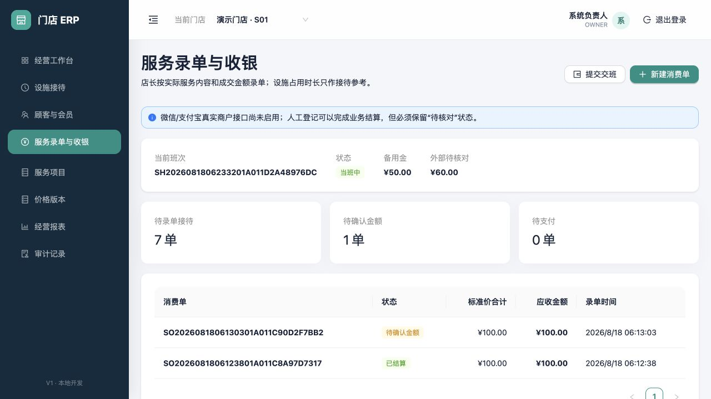
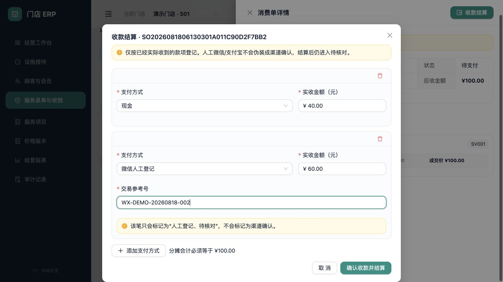
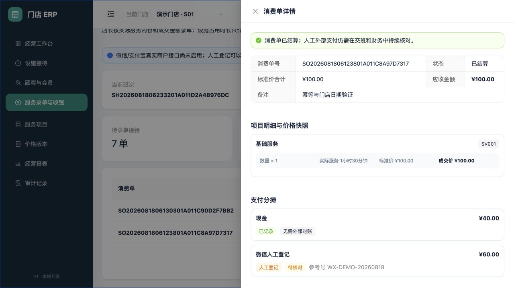
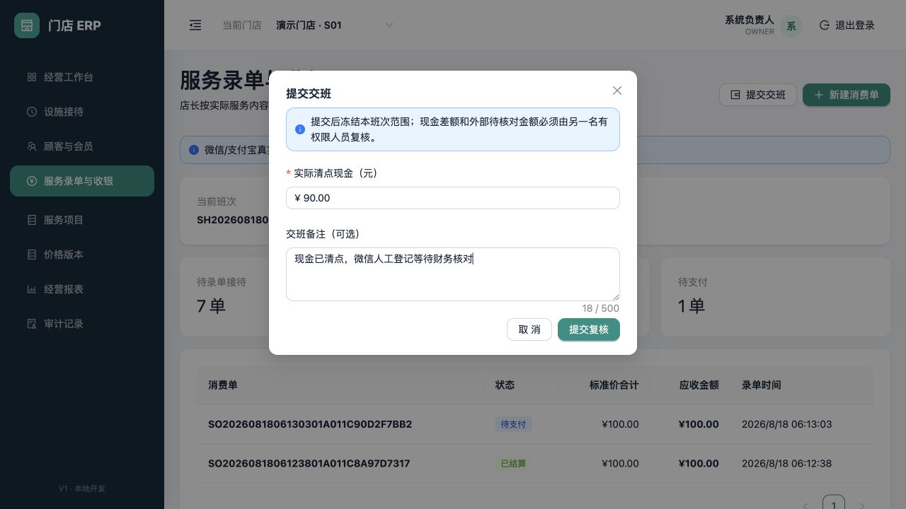
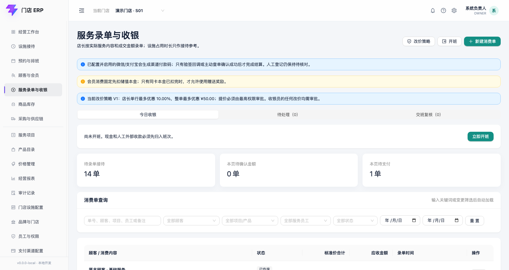
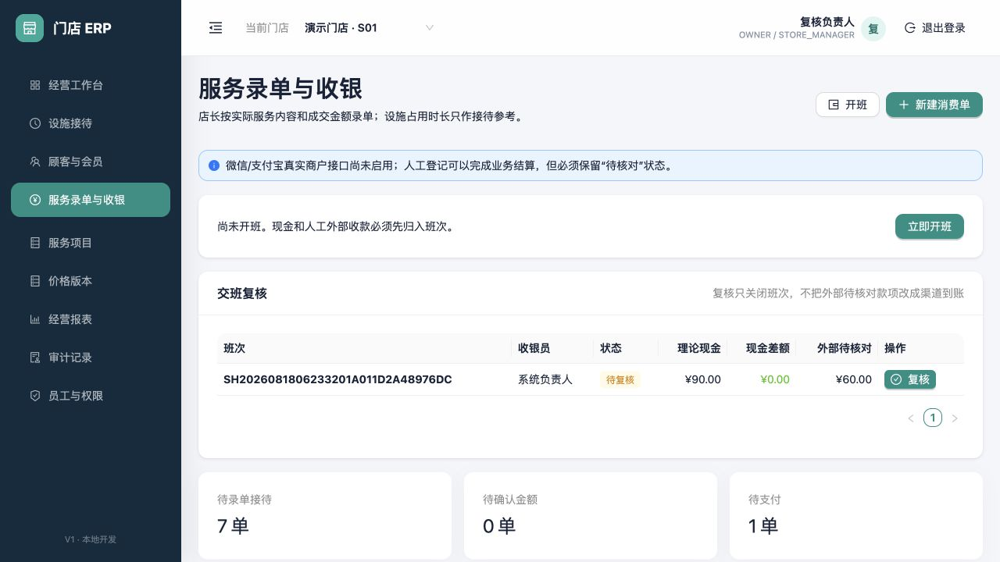
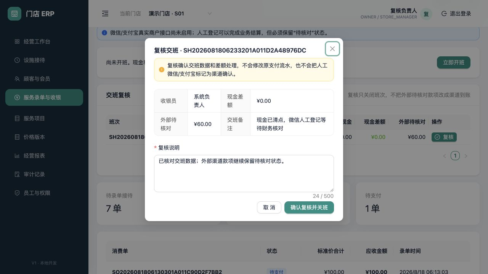

# 现金、人工外部收款与收银交班

适用版本：V1 支付与班次首个闭环

更新日期：2026-08-18

## 1. 业务边界

本模块在金额已经确认的消费单上完成支付分摊、现金记录、微信/支付宝人工登记、消费单结算和收银交班。

当前没有启用真实微信或支付宝商户接口。因此：

- 现金由收银员确认实收后记为“已记录”。
- 微信/支付宝由收银员依据实际收款记录人工登记，始终标记为“人工登记 + 待核对”。
- 人工登记可以按当前可逆策略完成业务结算，但绝不会写成“渠道已确认”。
- 会员本金/奖励金扣款已在 V2 扩展模块开放；真实渠道二维码、回调、查单和原路退款代码已具备，但当前门店没有启用真实商户凭据，渠道账单自动对账尚未开放。

## 2. 开班与当班概览



现金和人工外部收款必须归入当前账号在当前门店的唯一进行中班次。没有开班时，后端会拒绝结算，不依赖页面按钮是否可见。

点击“开班”并填写备用金。备用金用于计算交班时理论现金，不计入营业收入。

| 字段 | 是否必填 | 规则 |
|---|---|---|
| 开班备用金 | 必填 | 0–100,000,000 元；按分保存，不使用浮点金额 |

当班条显示班次号、状态、备用金和本班次外部待核对金额。班次号日期按门店时区生成。开班重复点击使用同一幂等请求号时只产生一个班次；同一账号在同一门店不能同时有两个进行中班次。

## 3. 组合支付



打开“待支付”消费单，点击“收款结算”。支付分摊合计必须精确等于消费单锁定的应收金额；后端重新读取消费单金额，不接受浏览器提交的总金额作为权威。

| 字段 | 是否必填 | 规则 |
|---|---|---|
| 支付方式 | 必填 | 当前启用现金、微信人工登记、支付宝人工登记；支付方式由独立配置表提供，不在消费单增加固定渠道金额列 |
| 实收金额 | 必填 | 每行大于 0；所有分摊合计必须等于应收金额 |
| 交易参考号 | 条件必填 | 微信/支付宝人工登记时必填，4–100 字；用于之后核对收款记录 |

同一支付方式在一张支付单中只能出现一次。结算按钮只应在已经实际收到对应款项后点击；顾客手机截图、口头说明或二维码页面不等于渠道到账证明。

结算在一个数据库事务中完成：

1. 校验消费单仍为待支付且版本未变化。
2. 校验支付方式有效、分摊平衡和班次仍在进行中。
3. 创建支付单和每一笔支付分摊。
4. 把消费单和接待记录推进为已结算/已完成。
5. 写入幂等结果和审计事件。

任一步失败会整体回滚。双击或网络重试不会产生第二张支付单。

## 4. 结算结果与对账状态



消费单“已结算”表示当前允许的业务支付来源已经平衡，不等于所有外部渠道已完成财务对账。详情分别展示两个状态轴：

| 支付来源 | 收款确认状态 | 对账状态 |
|---|---|---|
| 现金 | 已记录 | 无需外部渠道对账 |
| 微信/支付宝人工登记 | 人工登记 | 待核对 |
| 真实微信/支付宝（配置启用后） | 只有合法回调或主动查单才能渠道确认 | 等待渠道账单匹配 |
| 会员内部账户（V2 已开放） | 系统内部扣减成功 | 无需外部渠道对账 |

页面、交班和未来财务报表必须持续显示人工外部待核对金额，直到对账结果明确。不能通过修改消费单状态来掩盖差异。

## 5. 提交交班



服务端按本班次支付分摊计算：

```text
理论现金 = 开班备用金 + 本班次现金收款
现金差额 = 实际清点现金 - 理论现金
外部待核对 = 本班次人工微信/支付宝分摊合计
```

| 字段 | 是否必填 | 规则 |
|---|---|---|
| 实际清点现金 | 必填 | 0–100,000,000 元；必须依据真实清点结果填写 |
| 交班备注 | 选填 | 最多 500 字；建议说明现金清点或待核对事项 |

提交后班次范围被冻结，状态进入“待复核”。原收银员本人不能复核自己的班次；这项职责分离由服务端强制执行。

## 6. 待复核班次



待复核状态保留理论现金、实交现金、现金差额和外部待核对金额快照。复核规则：

- 无差额且没有外部待核对时，可由另一名门店店长或最高权限复核。
- 现金差额绝对值不超过 10 元时，可由未参与本班次的店长填写说明后复核。
- 现金差额超过 10 元，或存在任意外部待核对金额时，只允许最高权限账号处置。
- 存在差额或待核对金额时，复核说明必填。
- 复核队列展示收银员、理论现金、现金差额和外部待核对金额；收银员本人看到自己的班次时不能执行复核。



存在差额或外部待核对金额时，复核说明必填。点击“确认复核并关班”只记录复核结论并关闭班次，不会修改原支付流水，也不会把人工外部收款改成渠道到账。



## 7. 权限、审计与不可删除规则

- `OWNER`、门店店长和收银员可在授权门店开班和结算。
- 交班复核只允许 `OWNER` 或门店店长，并且复核人不能是本班次收银员。
- 开班、支付完成、消费单结算、提交交班和复核都记录请求号、操作者、服务器时间和状态变化。
- 已结算支付、支付分摊和交班快照不提供物理删除接口；错误只能通过后续退款、冲正或差异处置修复。
- 支付方式是可扩展配置数据。未来新增渠道不会给消费单表增加新的固定金额字段。

## 8. 待确认与未开放

以下内容仍需业务或商户资料确认：

- 人工外部收款是否允许在所有门店完成业务结算，或应按门店开关启用；当前按 `IMP-004` 可逆假设启用。
- 真实微信/支付宝接入主体、商户号范围、回调域名、密钥托管责任和退款审批阈值。
- 现金找零、签单欠款，以及真实短信服务商的发送和送达回执。
- 班次接续、交班退回修改和超过 24 小时未复核告警。
- 财务对人工外部交易执行匹配、差异、解决的页面和凭证要求。
- 已结算消费单的部分退款、全额退款和非原路退款流程。
