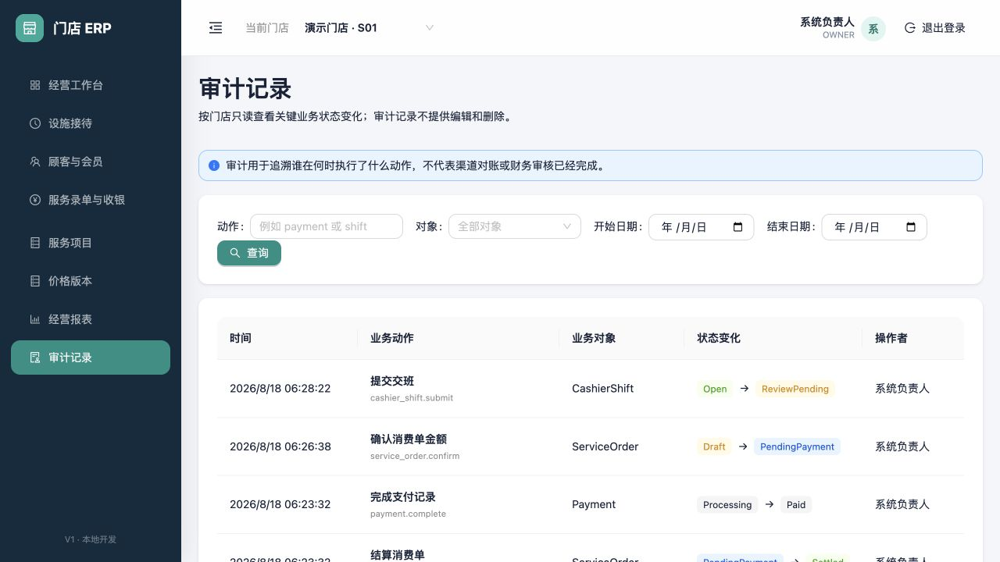

# 审计记录

适用版本：V1 审计查询首个闭环

更新日期：2026-08-18

## 1. 业务边界

审计记录用于回答“谁、在什么时间、对哪个业务对象、执行了什么动作、状态如何变化”。当前页面只读，不提供新增、编辑或删除。

审计不是支付对账、财务审核或业务审批本身。看到 `payment.complete` 只能证明 ERP 完成了支付记录处理；外部渠道是否到账仍以支付分摊的确认和对账状态为准。

## 2. 查询审计记录

页面只查询当前授权门店，默认按服务器时间倒序展示，每页 20 条。

| 筛选字段 | 是否必填 | 规则 |
|---|---|---|
| 动作 | 选填 | 最多 128 字，支持按动作编码片段查询，例如 `payment`、`shift` |
| 对象 | 选填 | 精确选择设施会话、顾客、会员卡、消费单、支付单或收银班次 |
| 开始日期 | 选填 | 按当前门店时区，包含所选日期 00:00 之后的记录 |
| 结束日期 | 选填 | 按当前门店时区，包含所选日期全天；开始日期不得晚于结束日期 |

列表展示：

- 服务器记录时间。
- 中文业务动作和稳定动作编码。
- 业务对象类型。
- 前后状态。
- 操作者显示名。

查询本身是只读动作，不会生成新的业务单、状态变化或审计记录。

## 3. 查看审计详情

点击列表行打开详情，可查看：

| 字段 | 含义 |
|---|---|
| 服务器时间 | 后端写入审计事件的 UTC 时间，页面按本地时区展示 |
| 动作 | 中文名称与稳定动作编码 |
| 操作者 | 事件记录的用户显示名；用户日后停用也不改变该事件身份引用 |
| 业务对象 | 对象类型和对象 UUID |
| 状态变化 | 动作前后状态；新建对象的前态显示“新建” |
| 原因/备注 | 改价、换设施、交班等动作提交的业务说明；没有时显示未填写 |
| 请求号 | 业务幂等命令号，用于识别重试是否属于同一命令 |
| 追踪号 | 服务请求追踪标识，用于定位应用日志 |

请求号和追踪号都不是支付凭证，不应向顾客解释为渠道交易号。

## 4. 权限和完整性

- 当前只有 `OWNER` 和门店店长可以进入审计查询。
- 服务端再次校验门店授权；不能通过修改 URL 查询其他门店。
- 单次查询最多返回 200 条，页面采用服务端分页，避免一次导出全部记录。
- 审计查询不会返回手机号明文、支付密钥、Cookie 或渠道原始报文。
- 当前业务写操作在同一数据库事务中写入审计；业务事务失败时不会留下“成功状态”的孤立审计。
- 页面没有审计编辑、覆盖或删除接口；业务错误通过作废、退款、冲正或新审计事件处理。

## 5. 待确认与未开放

- 审计在线保留年限、冷归档介质和合规删除要求尚未确认。
- 是否允许导出，以及导出权限、水印、字段脱敏和导出审计规则尚未确认；当前不提供导出。
- 登录失败、完整手机号查看、权限配置变化和真实支付回调的专用安全审计仍需随对应功能补齐。
- 事件动作编码的中文字典还会随业务模块增加；未知编码保留原值展示，不丢失事实。
