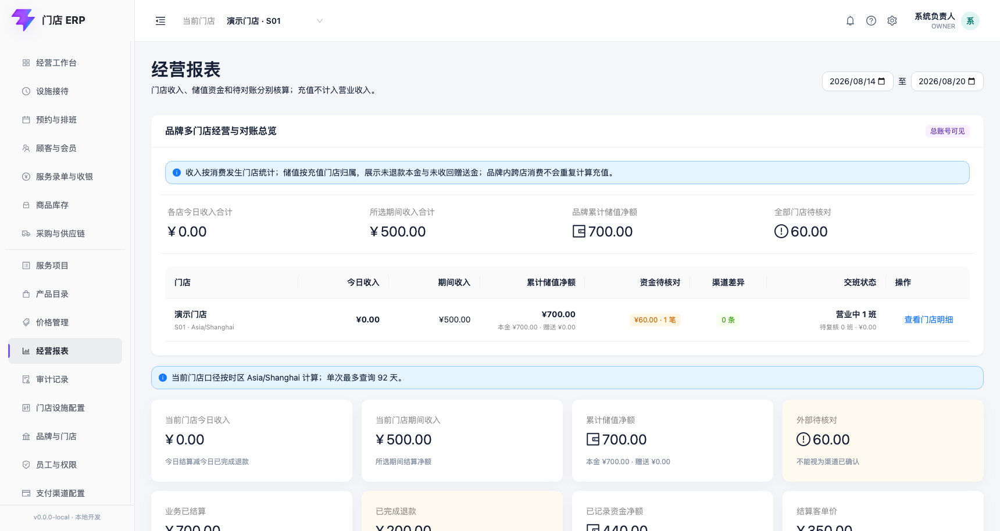
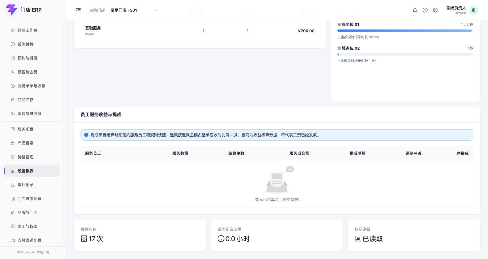

# 经营工作台与经营报表

适用版本：V1 经营可视化首个闭环

更新日期：2026-08-20

## 1. 业务边界

经营工作台和报表只汇总当前门店已经写入 ERP 的业务事实，不生成交易、不修改订单，也不把人工外部收款误标成渠道确认。

当前报表面向日常门店经营观察，不是会计利润表。费用、税费、跨店内部结算和渠道手续费尚未进入当前口径。

## 2. 今日经营工作台

登录后的首页显示当天实时数据：

| 指标 | 当前口径 |
|---|---|
| 今日接待 | 接待记录的到店时间落在门店当天的数量；不等于已消费顾客数 |
| 使用中设施 | 当前状态为使用中或已暂停的设施数量 |
| 今日已记录资金 | 当天已结算支付分摊中，排除人工外部待核对后的金额 |
| 外部待核对 | 当天人工登记微信/支付宝且对账状态仍为待核对的金额 |

首页快捷入口可以直接进入设施接待、服务录单与收银、经营报表。所有指标以服务端结果为准，刷新页面会重新读取，不在浏览器本地累加。

## 3. 当前门店收入与储值

报表默认查询当前门店最近 7 个自然日，起止日期均包含。日期边界按门店时区计算，单次最多查询 92 天。每日收入按天展示；“当前门店期间收入”是所选期间消费结算减消费退款。

| 指标 | 当前口径 |
|---|---|
| 业务已结算 | 状态为 `Paid` 的支付单金额；包含允许业务结算但仍待核对的人工外部收款 |
| 已记录资金 | 现金已记录、未来内部账户已确认或真实渠道已确认的分摊；当前不含人工外部待核对 |
| 外部待核对 | 对账状态为 `Pending` 的分摊金额 |
| 结算客单价 | 业务已结算金额 ÷ 已结算支付单数；没有结算单时为 0 |
| 累计储值本金 | 当前门店储值本金减已完成本金退款 |
| 累计储值赠送 | 当前门店赠送金额减退款时已收回赠送金额 |
| 累计储值净额 | 上述本金与赠送之和；按充值门店归属，不计入营业收入 |

这三个资金指标不能互相替换。例如截图中的业务已结算 100 元，由现金已记录 40 元和微信人工待核对 60 元组成。

## 4. 总账号多门店总览

`OWNER` 进入经营报表后，可在“品牌多门店经营与对账总览”同时查看所有启用门店：

- 各门店今日收入和所选期间收入。
- 按充值来源门店归属的累计储值本金、赠送和净额。
- 尚未核对的外部支付金额与笔数。
- 最新渠道账单对账仍未处置的差异数量。
- 营业中班次、待复核交班数量和交班待核对金额。

点击某行“查看门店明细”，会把该门店切换为当前门店，下方继续展示该店的每日走势、支付构成、服务排行、员工提成和设施记录；品牌总览本身不会因为切换而丢失。

普通店长不会收到该品牌总览接口的数据，只能通过当前门店报表查看授权门店。品牌间继续使用租户边界完全隔离。

会员可跨店使用权益，但统计不会重复：A 店充值记入 A 店储值；之后在 B 店扣卡消费，消费收入记入 B 店，扣卡本身不再次形成储值收入。

## 5. 每日走势和支付构成

每日走势按支付完成所在的门店自然日分组：

- 绿色：已记录资金。
- 黄色：人工外部待核对。
- 每日下方同时显示结算单数和接待次数。

支付构成按支付方式快照汇总金额和笔数。支付方式以后改名不会追改历史支付分摊；待核对金额在对应支付方式下持续显示。

## 6. 项目排行和设施记录时长

服务项目排行使用已结算消费单的项目快照：

- 结算单数：包含该项目的不同已结算消费单数。
- 数量：项目数量之和。
- 成交金额：项目成交单价 × 数量，不使用当前价目表重新计算历史。

设施区域展示选定日期范围内，每个设施的有效记录占用时长，以及它占全部设施记录时长的比例。系统会扣除暂停区间并按查询日期边界截断跨日会话。

当前**不把该比例称为设施利用率**。要计算营业时间利用率，还必须确认每个门店/设施的营业日历、停用、维护、清洁和可售容量口径。

## 7. 权限、性能与数据真实性

- 当前只有 `OWNER` 和门店店长可以查看经营报表；多门店汇总仅 `OWNER` 可用。
- 服务端校验门店授权；报表不能跨越未授权门店。
- 日期范围限制为 92 天，避免在门店操作台直接执行无边界大查询。
- 金额统一按“分”汇总，页面最后格式化为人民币，避免浮点累计误差。
- 报表读取支付、退款、储值单、渠道对账、交班、消费单、接待和设施会话等原始业务表；当前不维护第二套可手工编辑的报表数字。
- 截图中的数据是本地虚构验收数据，不是参考网站或真实门店经营数据。

## 8. 待确认与未开放

- “营业额”最终采用含税/不含税、优惠前/后、退款冲减日或原交易日口径尚未确认；当前使用“业务已结算”避免提前定名。
- 真实渠道确认后，渠道手续费是否从“已记录资金”中扣除，以及如何展示净额尚未确认。
- 设施营业时间、预约容量和维护时段未建模，因此尚无正式设施利用率。
- 跨店内部资金清算、同比/环比、目标值、产品毛利、会员复购和导出尚未开放。
- 报表快照、夜间汇总表和大数据量索引优化将在真实数据量压测后决定；当前查询直接来自规范化业务表。
