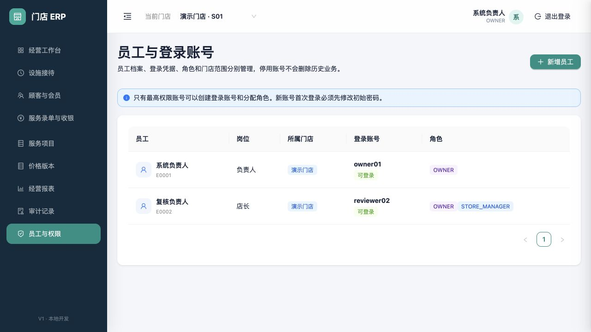
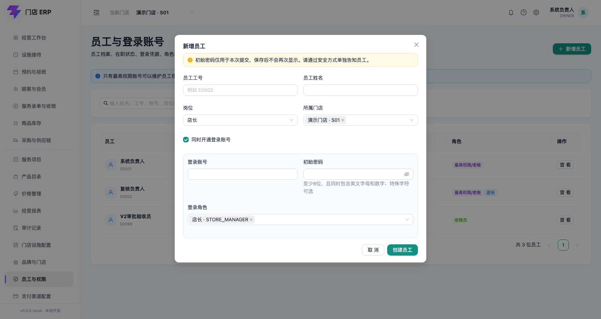
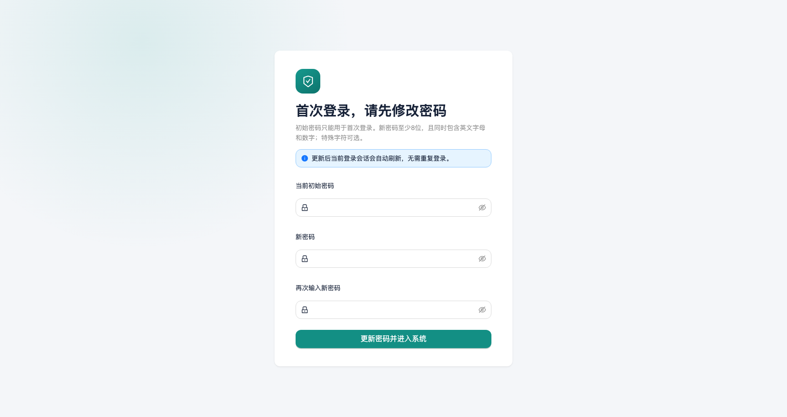

# 员工、登录账号与门店权限

适用版本：V1 员工与权限首个闭环

更新日期：2026-08-18

## 1. 业务边界

本模块由最高权限账号维护员工基础档案、登录账号、角色和可访问门店。员工档案与登录凭据分开保存：没有登录需求的员工也可以建档；停用登录账号不会删除员工或历史单据。

当前第一版支持新增员工、可选开通账号、分配多个角色和门店、首次登录强制改密、停用/启用账号。员工资料编辑、离职流程、临时授权、角色权限设计器、绩效和工资不在本闭环内。

## 2. 员工与账号列表

列表展示员工工号、姓名、岗位、所属门店、登录账号状态和角色。只有 `OWNER` 可以进入“员工与权限”页面；其他角色即使手工输入接口地址也会被服务端拒绝。

查询框支持姓名、工号、登录账号、岗位、门店名称或门店编码。输入停顿约 300 毫秒后列表自动刷新，无需点击查询按钮；继续输入时旧请求会被取消，清空后恢复全部员工。

点击某一行可查看详情，并对他人的登录账号执行停用或启用。系统限制：

- 当前登录用户不能变更自己的账号状态，避免把正在操作的会话锁死。
- 系统必须保留至少一个有效 `OWNER` 账号。
- 停用账号后无法新登录；员工档案、业务操作人和审计记录继续保留。
- 账号状态变化会更新安全标记，并记录操作者、门店、时间和前后状态。

## 3. 新增员工

| 字段 | 是否必填 | 规则 |
|---|---|---|
| 员工工号 | 必填 | 2–32 位；只允许字母、数字、下划线和短横线；租户内唯一 |
| 员工姓名 | 必填 | 2–100 字 |
| 岗位 | 必填 | 从负责人、店长、前台、收银员、服务员工和其他岗位中选择 |
| 所属门店 | 必填 | 至少一个，只能选择当前操作者有权管理的有效门店 |
| 同时开通登录账号 | 选填 | 未勾选时不能提交账号、密码或角色 |
| 登录账号 | 条件必填 | 开通登录时必填，4–100 位；租户内不可重复 |
| 初始密码 | 条件必填 | 至少 12 位，包含大小写字母、数字和特殊字符；后端只接收并哈希，不回显 |
| 登录角色 | 条件必填 | 开通登录时至少一个；可兼任多个角色 |

“创建员工”在同一数据库事务中写入员工、门店任职、可选登录账号、账号门店范围、角色和审计事件。任一步失败都不保留半成品。

## 4. 首次登录修改密码

管理员不能在保存后查看初始密码。新账号使用初始密码登录后只能进入修改密码页，不能访问其他业务页面。输入当前初始密码和两次一致的新密码后，系统使用 Argon2id 更新密码哈希、清除首次改密标记并刷新当前会话。

不要通过群聊、公开文档或截图传递初始密码；应通过与账号不同的受控渠道单独告知员工。

## 5. 角色与职责分离

第一版预置角色如下：

| 角色 | 主要用途 |
|---|---|
| `OWNER` | 最高权限、价格发布、账号管理、高风险交班复核和审计 |
| `STORE_MANAGER` | 指定门店经营、录单和授权范围内复核 |
| `FRONT_DESK` | 设施接待与现场操作 |
| `CASHIER` | 本人班次、收款和交班 |
| `TECHNICIAN` | 本人服务任务的受限查看和记录 |

交班复核使用实际登录用户身份判断，不能只看页面按钮。原收银员不能复核自己的班次；存在外部待核对金额或较大差额时必须由另一名 `OWNER` 处理。

## 6. 待开放

- 员工资料编辑、离职、跨门店任职生效期和员工编号自动规则。
- 角色权限设计器、字段脱敏权限、金额阈值和临时授权版本。
- 忘记密码/管理员重置密码、双因素认证和高风险动作二次认证。
- 绩效、奖罚、工资、服务员工分成和个人敏感资料。
