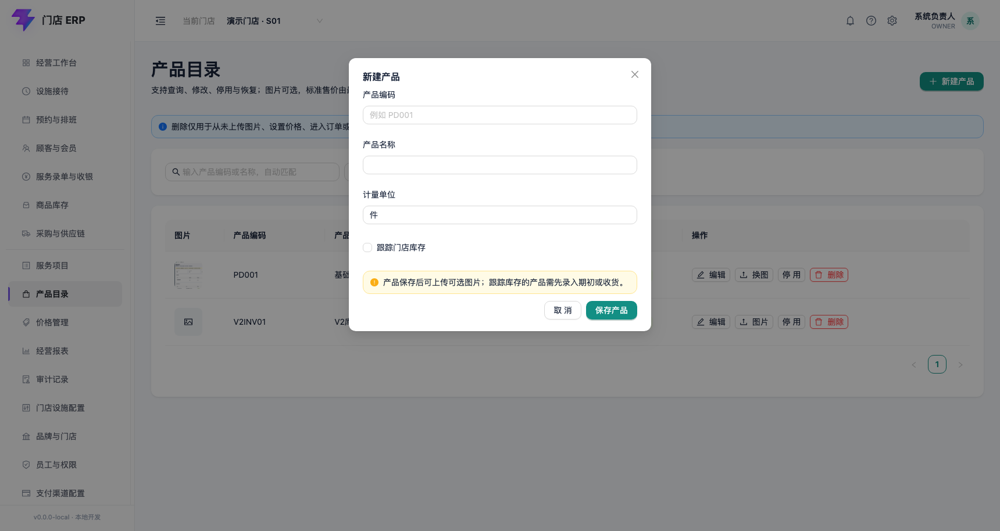
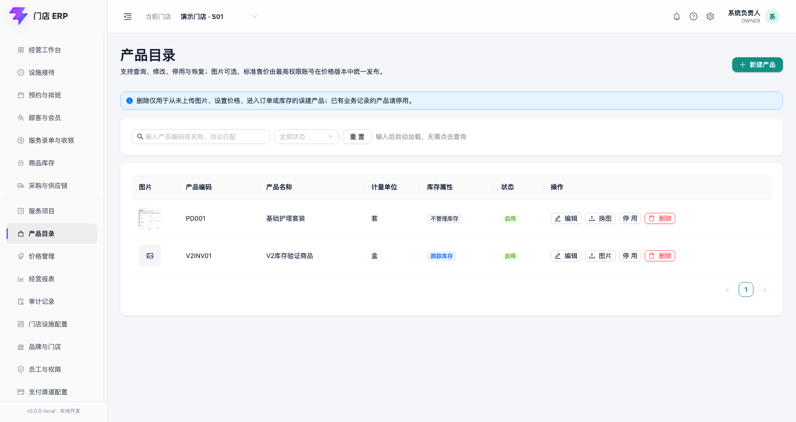
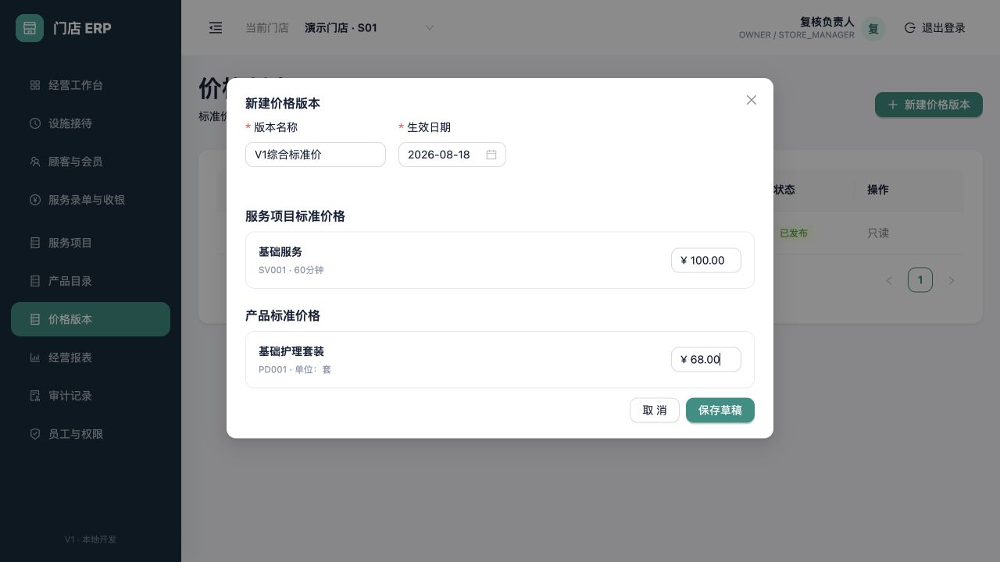
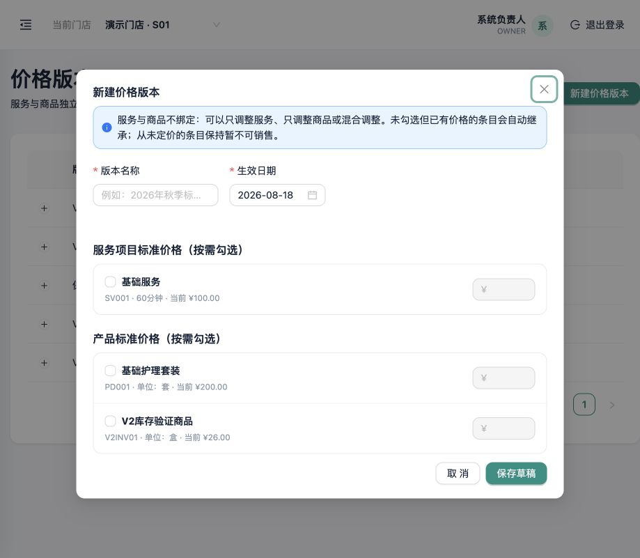
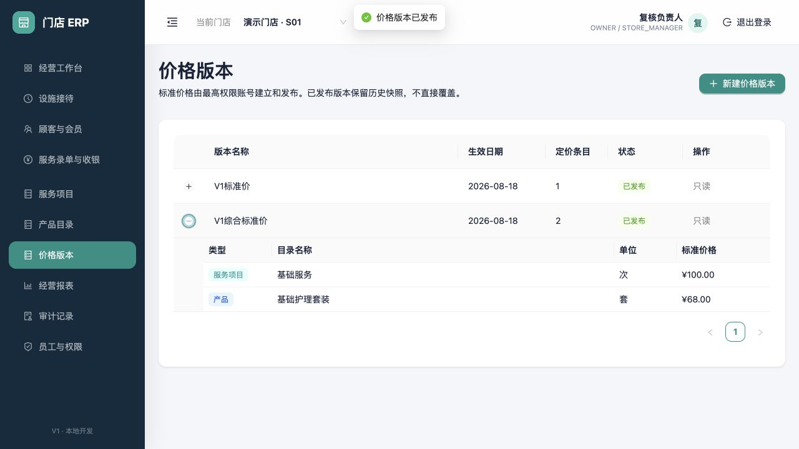

# 产品目录与版本化标准价

适用版本：V2 开发版

更新日期：2026-08-18

## 1. 功能边界

本模块维护产品编码、名称、计量单位、库存跟踪标记和版本化标准售价。最高权限账号负责建档和发布价格。服务项目与产品是互相独立的目录：系统不要求一个服务绑定一个产品，也不要求一个产品绑定一个服务。

V2 已支持消费单商品销售和门店整数库存；采购应付、调拨、盘点单、批次、效期、成本和多单位换算仍不在当前范围。库存操作见[商品销售与门店库存](15-product-sales-and-inventory.md)。

产品列表支持按编码或名称实时包含词匹配。输入停顿约 300 毫秒后自动刷新；启用/停用筛选选择后立即生效，清空关键词或点击重置恢复默认列表。

## 2. 新建产品

| 字段 | 是否必填 | 规则 |
|---|---|---|
| 产品编码 | 必填 | 最长 40 字，保存时转大写；同一租户内唯一 |
| 产品名称 | 必填 | 最长 120 字；不写死行业名称 |
| 计量单位 | 必填 | 最长 20 字，例如件、盒、套 |
| 跟踪库存 | 选填 | 勾选后，商品在消费单确认时预占、可信结算时出库；不勾选仍可销售但不形成库存流水 |

只有 `OWNER` 可以保存产品。重复编码由数据库唯一约束和服务端检查共同阻止；保存失败不会生成半条产品记录。

## 3. 产品目录

列表分别展示可选图片、编码、名称、单位、库存属性和状态。新产品默认启用；图片可在产品保存后单独上传或更换，不参与价格和库存计算，并会在收银端的商品选择列表中辅助辨认。已被价格版本或业务引用的产品不允许物理删除；停用和编辑动作尚未开放。图片规则详见[产品图片与顾客服务档案](16-product-images-and-service-records.md)。

## 4. 在价格版本中定价

服务和产品独立定价。创建新价格版本时，只勾选本次新增或调价的条目：可以只调整服务、只调整商品，也可以混合调整。勾选的条目必须填写非负标准价；未勾选但已有生效价格的条目自动继承到新版本完整快照，从未定价且未勾选的条目保持暂不可销售。

价格金额按整数分存储；服务价格与产品价格分别保存在独立明细中，不把二者做强制一一绑定，也不给消费单表增加“产品金额”固定列。

先“保存草稿”，核对后由 `OWNER` 点击“发布”。已发布版本只读；调整产品价格必须创建新版本，历史版本和未来单据价格快照不会被覆盖。

## 5. 与收银和库存的关系

- 消费单可以仅包含服务、仅包含商品或同时包含二者；至少需要一条明细，但不要求两种类型同时出现。
- 服务订单按门店日期选择已生效价格版本；同日多版本按最后发布时间选择。
- 商品行和服务行分别保存目录标识、名称、单位、标准价及成交价快照，历史单据不因后续目录或价格版本变化而重算。
- 跟踪库存的商品在消费单确认时预占、可信结算时出库；服务项目永远不产生库存流水。

## 6. 待开放

- 产品编辑、停用、条码、分类、品牌、规格、多单位和供应商资料。
- 更细的服务价/商品价分级审批，以及总部、区域、门店三级价格覆盖。
- 采购、盘点单、调拨、批次、效期、成本和库存估值报表。
