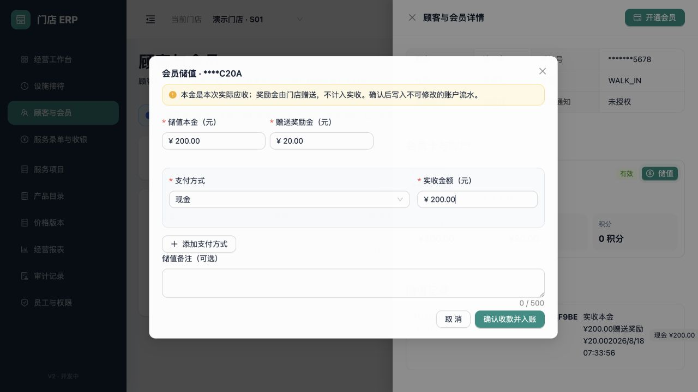

# 会员储值与资金分账

适用版本：V2 开发版（储值首个闭环）

更新日期：2026-08-18

## 1. 业务边界

会员储值是独立资金业务，不是消费收入。系统同时保存：

- 储值本金：顾客本次实际支付的金额，也是储值单应收金额。
- 奖励金：门店额外赠送的会员权益，不计入本次实收。
- 支付分摊：现金或人工微信、支付宝等本次真实收款记录。
- 账户流水：本金和奖励金分别写入各自账户，流水只新增，不允许修改或删除。

设施计时、消费单收费和会员储值继续保持相互独立。

## 2. 操作前提

1. 顾客已有有效会员卡，本金和奖励金账户均处于正常状态。
2. 操作账号拥有当前门店权限，角色为 `OWNER`、店长或收银员。
3. 操作账号已经开班；现金和人工外部收款必须归入自己的当前班次。
4. 只有 `OWNER` 可以填写大于 0 的赠送奖励金；店长和收银员只能办理无赠送储值。

## 3. 填写储值与支付分摊

从“顾客与会员”列表打开顾客详情，在有效会员卡右上角点击“储值”。

| 字段 | 必填 | 规则 |
|---|---|---|
| 储值本金 | 是 | 大于 0；以整数分发送到服务端 |
| 赠送奖励金 | 是 | 默认 0；只有最高权限账号可填写正数 |
| 支付方式 | 是 | 不能选择会员账户给自身充值；同一方式不可重复 |
| 实收金额 | 是 | 所有支付分摊合计必须等于储值本金，不包含奖励金 |
| 交易参考号 | 条件必填 | 人工微信/支付宝为 4–100 字 |
| 储值备注 | 否 | 最多 500 字 |

点击“确认收款并入账”后，储值单、支付单、支付分摊、本金/奖励金账户流水、余额投影、审计和幂等结果在同一个数据库事务内完成。任一环节失败时整体回滚。

## 4. 查看余额与储值记录

成功后详情立即显示：

- 本金、奖励金和积分三个独立余额。
- 储值单号、实收本金、赠送奖励、入账时间和支付方式。
- 人工微信/支付宝分摊继续显示“待核对”，不能由操作员手工改成渠道确认。

页面没有“直接改余额”或“删除流水”入口。需要退款时从储值记录按剩余可退本金发起申请；规则和审批步骤见[消费退款与会员储值退款](13-payment-refunds-and-topup-reversals.md)。

## 5. 账务与报表口径

- 经营报表的“业务已结算收入”只汇总消费单支付，不包含会员储值。
- 收银交班的现金和外部待核对金额包含本班次的消费收款与储值收款。
- 奖励金是会员负债增加，不属于现金实收。
- 支付单通过 `business_type + business_id` 关联消费或储值；新增业务类型不再要求增加固定支付列。

## 6. 储值部分退款与全额冲正

当前已开放现金储值的部分退款和累计全额冲正，且由 `OWNER` 批准。每次按累计退款本金比例向上取整收回对应赠送奖励；本金或应收回奖励余额不足时拒绝。系统只新增反向流水，不修改原充值流水。

## 7. 当前未开放

- 会员消费扣款已在[会员余额消费与手机号验证](12-member-balance-payments.md)中开放。
- 储值部分退款、按比例奖励回收和余额已使用后的复杂退卡。
- 奖励规则版本、活动审批和自动计算。
- 微信/支付宝真实下单、回调、查单和原路退款。
- 跨门店通用、转卡、账户合并和余额冻结。
