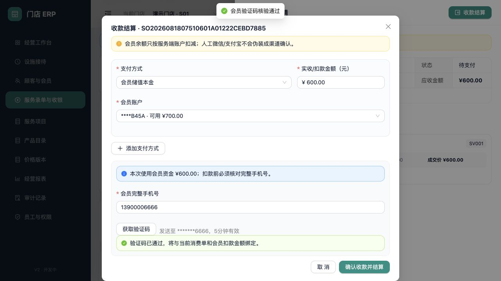
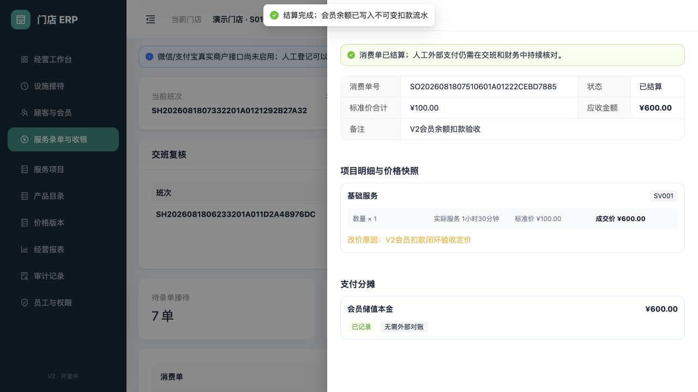

# 会员余额消费与手机号验证

适用版本：V2 开发版（会员扣款闭环）

更新日期：2026-08-18

## 1. 业务边界

会员储值本金和奖励金可以作为消费单的内部支付来源。扣款不依赖收银员手工修改余额，而是在服务端结算事务中同时完成：

- 校验消费单已关联当前门店的有效顾客。
- 校验完整手机号与顾客档案中的加密查询值一致。
- 校验支付方式、账户类型、账户归属和可用余额。
- 扣减余额并新增不可变借方流水。
- 创建支付单和支付分摊，结算消费单并写入审计。

设施使用时长和项目实际时长继续只作记录，不决定本次扣款金额。消费金额仍以店长确认后的消费单应收为准。

## 2. 选择会员支付方式

消费单必须先关联顾客并进入“待支付”。在“收款结算”中选择“会员储值本金”或“会员奖励金”，再选择对应会员卡下的同类型有效账户。

| 字段 | 必填 | 规则 |
|---|---|---|
| 支付方式 | 是 | 本金方式只能对应本金账户；奖励金方式只能对应奖励金账户 |
| 会员账户 | 条件必填 | 使用会员支付时必填；必须属于当前消费单顾客且状态有效 |
| 扣款金额 | 是 | 大于 0；所有支付分摊合计必须等于消费单应收 |
| 会员完整手机号 | 条件必填 | 任意会员账户扣款时必填；仅在当前输入框中用于核对，不写入支付单或审计 |

本金、奖励金和现金等来源可以组合分摊，但同一支付方式不能重复。同一张会员卡固定执行“先本金、后奖励”：只要本金仍有余额，就不能先扣奖励金；需要同时使用两类余额时，本次必须先把本金扣完，剩余应收才可从奖励金扣除。该规则由服务端校验，不能通过修改页面请求绕过。

## 3. 500 元验证码规则

会员账户扣款合计低于 500 元时，服务端只核对完整手机号。合计达到或超过 500 元时，还必须完成一次性验证码：

1. 验证码只绑定当前门店、顾客、消费单和会员扣款合计。
2. 有效期为 5 分钟，最多尝试 5 次；错误次数耗尽后锁定。
3. 再次获取会使该订单旧的活动中或已验证挑战失效。
4. 验证通过后仍不能挪给其他消费单或其他金额使用。
5. 成功结算时状态原子推进为 `Used`，不能再次使用。

当前 Development 环境使用受控测试发送适配器并回显虚构验证码，便于自动化和本地验收。非开发环境不会回显验证码；在真实短信服务商尚未配置前，服务端会拒绝发送，而不是以固定码或绕过验证继续结算。

## 4. 扣款结果

结算成功后，消费单显示“已结算”，会员分摊显示“已记录 + 无需外部对账”。数据库同时保留：

- 支付单业务来源为 `ServiceOrder`。
- 支付分摊关联实际扣款的会员账户。
- 账户余额投影按整数分减少。
- `ServiceOrder` 类型的不可变借方流水记录扣款前后余额和幂等请求号。
- 达到阈值时，验证码挑战状态为 `Used`。

余额不足、手机号不匹配、账户类型错误、验证码过期/重复使用、消费单版本变化或并发重复结算都会整体失败并回滚，不会只结算消费单而漏扣余额，也不会只扣余额而漏写支付单。

## 5. 当前未开放

- 真实短信服务商发送、送达回执和短信费用监控。
- 消费退款和储值整单冲正已开放，见[消费退款与会员储值整单冲正](13-payment-refunds-and-topup-reversals.md)；复杂退卡仍未开放。
- 奖励活动限制、冻结余额和跨门店通用。
- 微信/支付宝真实渠道与会员余额的组合支付、渠道账单自动对账；真实渠道单独支付及其原路退款代码见渠道配置和退款手册。
