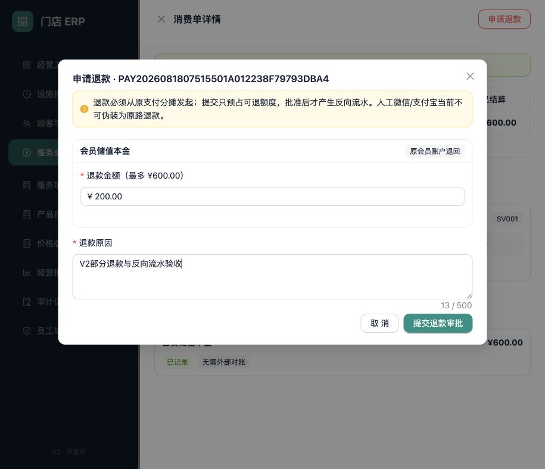
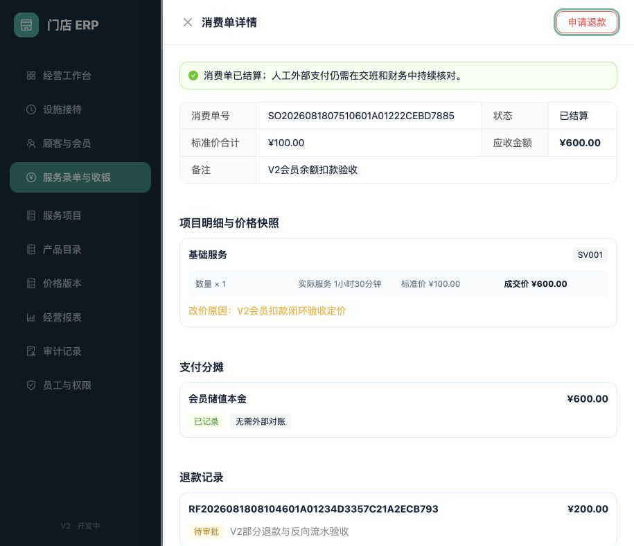

# 消费退款与会员储值退款

适用版本：V2 开发版（退款/冲正本地闭环）

更新日期：2026-08-18

## 1. 两类反向业务

系统保留原支付、原消费单、原储值单和原会员流水，不允许删除或覆盖；发现错误时新增退款单和反向流水：

- 消费退款：从已结算消费支付的原分摊发起，允许部分退款或累计全额退款。
- 储值退款：从原储值支付发起，允许部分或累计全额退款；实收本金按原支付分摊退回，同时按累计退款比例收回对应赠送奖励。

提交申请只预占可退额度，不会立即动现金或会员余额。只有 `OWNER` 批准后才执行反向流水；`OWNER` 和店长可提交申请。

## 2. 消费退款

在“服务录单与收银”打开已结算或部分退款的消费单，点击“申请退款”。

| 字段 | 必填 | 规则 |
|---|---|---|
| 原支付分摊 | 是 | 只能选择原支付中的现金或会员账户分摊 |
| 退款金额 | 是 | 大于 0；已完成和待审批金额之和不能超过原分摊 |
| 退款原因 | 是 | 2–500 字 |

现金退款在批准时归入审批人的当前班次，并校验可用现金；会员账户退款只退回原扣款账户。支付单和消费单分别推进为“部分退款”或“已退款”，原支付金额保持不变。

原支付分摊如果是已经由微信或支付宝可信结果确认的真实渠道支付，可以选择“原支付渠道退回”。最高权限批准后，退款单先进入“渠道处理中”，此时不会提前冲减支付单、消费单或经营报表。操作人员可以查询渠道结果；只有渠道确认退款成功后，本地退款单、支付累计退款和消费单累计退款才在同一事务中完成。渠道明确失败时保留原商户退款单号，最高权限可核对原因后安全重试，避免网络超时造成重复退款。

## 3. 储值部分退款与全额冲正

在“顾客与会员”的储值记录中点击“申请退款”，输入本次要退的本金。系统不允许把赠送奖励作为现金退还，也不允许退款后保留不成比例的赠送奖励：

1. 本次金额必须大于0，累计已完成和处理中退款不能超过原充值本金。
2. 目标累计收回奖励按 `向上取整(原赠送奖励 × 累计退款本金 ÷ 原充值本金)` 计算；本次只收回目标值与既有收回值的差额。
3. 本金账户必须至少包含本次退款本金，奖励账户必须至少包含本次应收回奖励。
4. 任一余额不足时，批准动作返回 `TOPUP_BALANCE_ALREADY_USED`，本次不产生反向流水。
5. 批准成功后，本金和奖励分别新增 `MemberTopupRefund` 借方流水；未退完时储值单和支付单标记“部分退款”，累计退完后标记“已退款”。

消费时固定先扣同卡储值本金，本金全部用完后才允许扣赠送奖励。这避免顾客先消费赠送金额、再退回完整本金而获得不应有的免费权益。

示例：顾客实付500元、赠送100元，先退本金200元时收回奖励40元，余额为本金300元、奖励60元。若此前已消费本金50元，则本金最多只剩450元；不能再退完整500元，但可以在余额允许范围内退还尚未消费的本金，并按累计比例收回奖励。

## 4. 最高权限审批

“服务录单与收银”的审批队列区分“消费退款”和“会员储值退款”。批准和拒绝均带版本号、幂等请求号和审计记录；并发审批只有一个请求可以成功。拒绝后释放预占额度，但保留申请和拒绝原因。

## 5. 当前边界

- 人工登记的微信/支付宝没有可信渠道订单，仍不能伪装为原路退款或冲正。
- 真实渠道原路退款当前仅支持消费支付的一条微信或支付宝渠道分摊，不能与现金或会员资金混合提交同一张退款单。
- 微信与支付宝退款已经接入提交、主动查询和固定商户退款单号重试；真实商户凭据尚未配置，因此当前证据不代表真实资金已经退回。
- 渠道日账单下载、自动对账和财务差异处置仍待后续闭环。
- 经营报表的退款与净收入只统计消费退款；储值退款属于会员负债和收银现金反向，不冲减消费收入。
- 储值部分退款和按比例收回奖励已经开放；跨多次充值追溯的复杂退卡作价、次卡退卡和非原路异常退款尚未开放。
