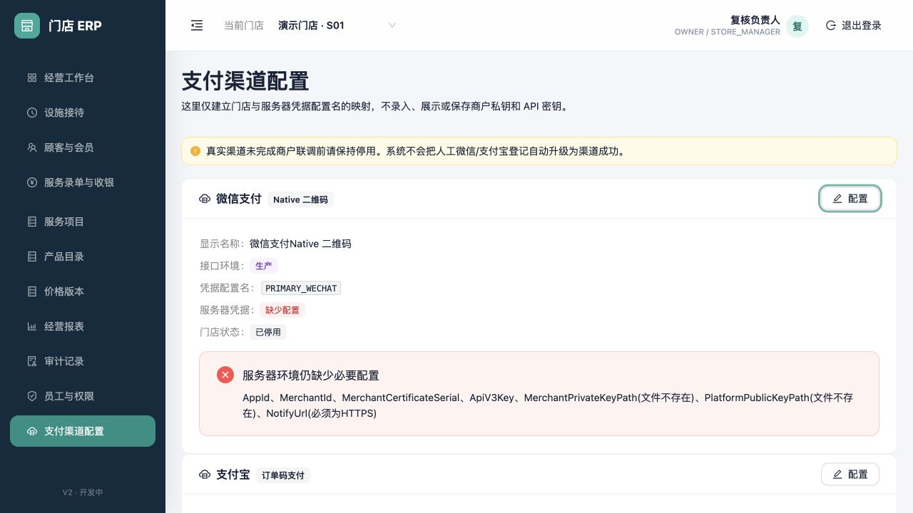

# 微信支付与支付宝渠道安全配置

状态：V2-04 安全配置底座已可运行；真实下单、回调、查单、退款和对账继续开发。

## 1. 当前可以做什么

最高权限账号可在“支付渠道配置”中为当前门店建立微信支付或支付宝的配置映射，并查看服务器凭据是否齐全。页面只保存一个凭据配置名，例如 `PRIMARY_WECHAT`，不接收也不显示以下敏感内容：

- 微信支付 APIv3 密钥、商户私钥；
- 支付宝应用私钥；
- 私钥正文、平台公钥正文或证书正文。

敏感材料只能通过服务器环境变量和访问受控的密钥文件提供。数据库不保存这些值，审计记录也只记录渠道、凭据配置名和启停状态。

## 2. 页面字段

| 字段 | 必填 | 规则 |
|---|---:|---|
| 收银台显示名称 | 是 | 1–80 字，只影响后续收银台展示 |
| 接口环境 | 是 | `Sandbox` 或 `Production`；切换环境不会复制密钥 |
| 服务器凭据配置名 | 是 | 3–40 位大写字母、数字或下划线，且以字母开头 |
| 门店启用 | 是 | 默认停用；启用前服务端重新检查所有必要配置 |

凭据配置名不能填写文件路径、相对路径或私钥内容，从而避免利用页面读取服务器文件。

## 3. 启用前检查

微信支付当前检查应用号、商户号、商户证书序列号、32 字符 APIv3 密钥、商户私钥文件、平台公钥文件和 HTTPS 回调地址。支付宝当前检查应用号、应用私钥文件、支付宝公钥文件、HTTPS 回调地址和 HTTPS 网关地址。

缺少任何一项时，可以保存“停用”配置用于准备环境，但服务端会以 `PAYMENT_CHANNEL_CREDENTIALS_INCOMPLETE` 拒绝启用。前端开关不是安全边界，直接调用接口也无法绕过。

“服务器凭据结构完整”只代表配置项和文件存在，不代表商户产品权限、证书有效期、网络连通性或真实收款已经验收。只有完成两家渠道的下单、通知验签、主动查单、关单、退款和对账测试后，才允许用于真实营业。

## 4. 数据库与状态记录

新增的前向迁移 `V202608180011` 建立三类记录：

- `payment_channel_configurations`：门店、渠道、环境和凭据配置名；
- `payment_channel_orders`：外部商户订单号、金额、二维码、渠道交易号及状态；
- `payment_channel_events`：仅保存已验签通知的渠道事件号和 SHA-256 摘要，不保存原始通知正文。

渠道订单禁止物理覆盖历史尝试；同一支付分摊同一时间只能有一个活动渠道订单。后续回调处理以渠道事件号唯一约束实现幂等。

## 5. 当前禁止事项

- 不得把真实私钥、APIv3 密钥或证书提交到 Git、数据库或页面表单。
- 不得因为配置项齐全就把人工微信/支付宝登记改成“渠道已确认”。
- 不得在真实适配器尚未完成前生成伪造支付成功或伪造退款成功。
- 当前配置页面不发起任何微信或支付宝网络请求，不会发生真实扣款。
