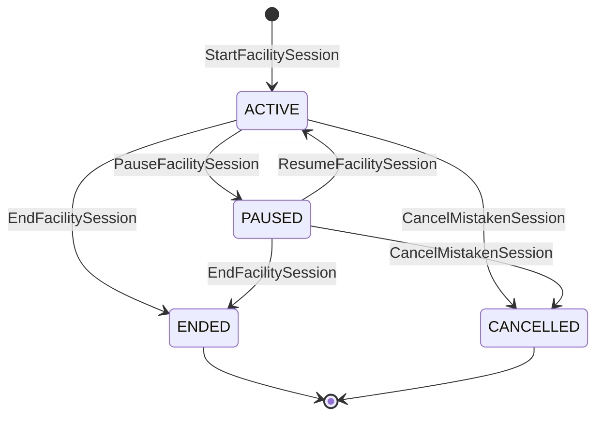
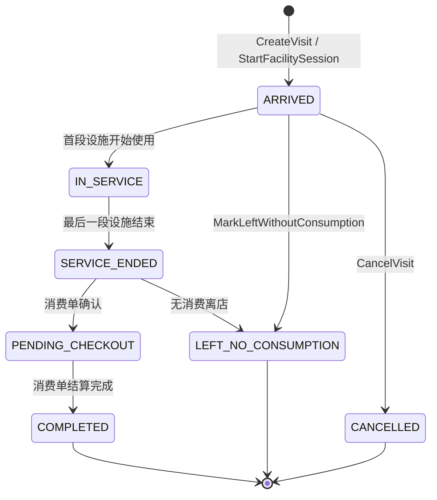
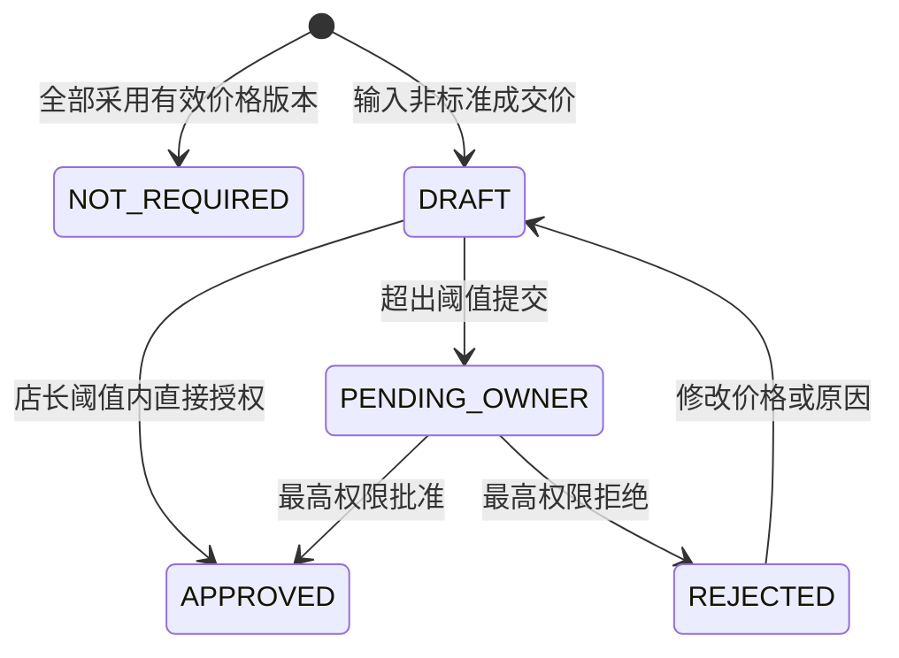
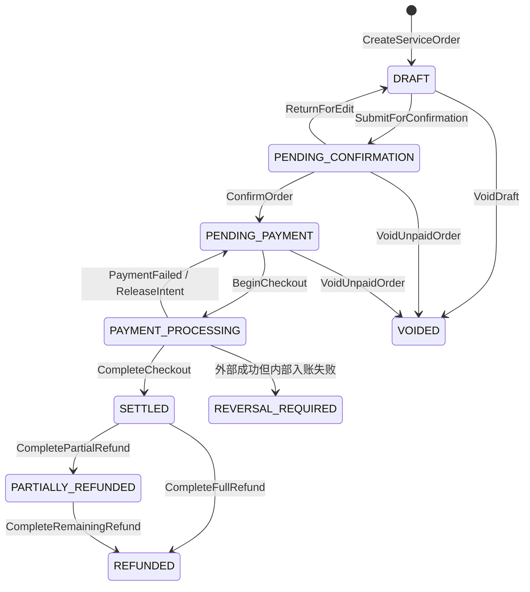
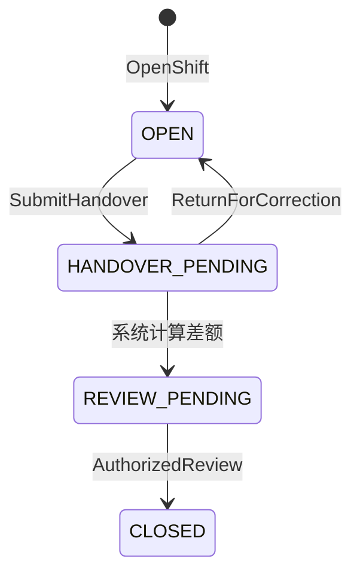

# V1 核心状态机与验收用例

版本：v1.0  
日期：2026-08-18  
适用范围：首个开发闭环——登录与门店授权、设施接待、服务录单、价格审批、会员权益、收银支付、退款、交班和审计

## 1. 文档目的

本文是首个开发闭环的状态与验收基线，解决三个问题：

1. 每个对象当前处于什么状态，什么角色可以执行什么动作。
2. 一次动作必须在同一事务中改变哪些数据，失败时如何恢复。
3. 产品、开发和测试使用同一组可执行验收案例判断功能是否完成。

本文中的状态码、命令名和错误码是 V1 的稳定契约。页面文案可以调整，但不得在页面、接口和数据库中各自发明另一套含义。

## 2. 建模原则

- 设施使用、顾客接待、消费单、支付、渠道核对、会员账户和收银班次是独立对象，不共享一个“大状态”。
- 点击、查看、搜索、刷新和打开抽屉都是只读动作，不得隐式创建接待、账单、占用记录或业务锁。
- 所有计时使用服务端时间；前端计时器只展示，不作为最终记录依据。
- 所有资金、会员权益、库存和退款动作都必须具备幂等键、事务边界和不可变流水。
- 状态迁移只能通过显式业务命令完成；禁止客户端直接提交目标状态。
- 已结算、已入账和已核销数据不得物理删除或原地改写，使用退款、冲正、调整单或补偿流水修复。
- 状态、权限、审批阈值和门店数据范围必须由服务端再次校验。
- 每次迁移记录操作者、角色、门店、发生时间、来源终端、原因、迁移前后状态和关联请求号。

## 3. 统一技术约定

### 3.1 命令请求

所有写命令至少携带：

| 字段 | 规则 |
|---|---|
| `command_id` | UUIDv7；一次用户意图全局唯一，用作幂等键 |
| `expected_version` | 客户端最后看到的聚合版本号，用于乐观并发控制 |
| `store_id` | 从当前授权上下文校验，不能仅信任客户端 |
| `operator_id` | 从登录令牌取得，不能由页面任意指定 |
| `occurred_at` | 服务端生成；客户端时间仅可作为诊断信息 |
| `reason` | 改价、作废、退款、手工核对、人工修时等动作必填 |

同一 `command_id`、同一请求摘要重复提交时，返回第一次执行结果且不重复写流水；同一 `command_id` 携带不同请求摘要时返回 `IDEMPOTENCY_CONFLICT`。

### 3.2 通用错误码

| 错误码 | 含义 | 页面处理 |
|---|---|---|
| `STATE_TRANSITION_NOT_ALLOWED` | 当前状态不允许该动作 | 刷新详情并提示当前状态 |
| `VERSION_CONFLICT` | 对象已被其他人更新 | 刷新数据，禁止覆盖 |
| `IDEMPOTENCY_CONFLICT` | 幂等键被不同请求复用 | 停止重试并记录技术告警 |
| `FORBIDDEN_ACTION` | 当前角色无动作权限 | 隐藏入口并由服务端拒绝绕过调用 |
| `FORBIDDEN_DATA_SCOPE` | 无目标门店或数据范围权限 | 不返回目标业务数据 |
| `VALIDATION_FAILED` | 必填、条件必填或金额关系不成立 | 定位到字段并保留未提交内容 |
| `FACILITY_NOT_AVAILABLE` | 设施已被占用、停用或维护 | 刷新设施看板并展示当前状态 |
| `PRICE_APPROVAL_REQUIRED` | 成交价超过操作者阈值 | 保存草稿并发起审批，不进入支付 |
| `MEMBER_VERIFICATION_REQUIRED` | 会员身份或验证码要求未满足 | 中止扣款，不锁定余额 |
| `INSUFFICIENT_MEMBER_BALANCE` | 会员可用余额不足 | 中止结算并刷新余额 |
| `PAYMENT_ALLOCATION_UNBALANCED` | 支付分摊与应付不平 | 禁止结算 |
| `SHIFT_NOT_OPEN` | 需要收银班次但当前未开班 | 引导开班或更换收银员 |
| `REVERSAL_REQUIRED` | 外部成功但内部入账未完整完成 | 锁定重复操作并进入人工处置队列 |

### 3.3 并发与数据库约束

- 同一门店同一设施最多一条 `ACTIVE` 或 `PAUSED` 的有效设施使用记录，使用数据库部分唯一索引兜底。
- 消费单、会员账户、收银班次使用 `version` 乐观锁；余额扣减还需在数据库事务中条件更新。
- `command_id` 在业务命令收件表中唯一；渠道支付单的商户订单号、渠道交易号分别建立唯一约束。
- 一次结算内的消费单、支付分摊、会员流水、现金班次流水、产品库存流水和业绩事件使用本地事务提交；对外通知采用事务发件箱。
- 外部支付调用不持有数据库长事务；先落支付意图，再调用渠道，最后以主动查询或回调确认结果。

## 4. 核心状态机

### 4.1 设施基础状态与可用状态

设施基础状态 `facility.lifecycle_status`：

| 状态 | 含义 | 可执行动作 |
|---|---|---|
| `ENABLED` | 正常启用 | 开始使用、进入维护、停用 |
| `MAINTENANCE` | 维护中 | 恢复启用、停用 |
| `DISABLED` | 已停用，不可接待 | 恢复启用 |

设施看板状态是投影，不由页面直接修改：

```text
若 lifecycle_status = MAINTENANCE       → MAINTENANCE
若 lifecycle_status = DISABLED          → DISABLED
若存在 ACTIVE 使用记录                  → IN_USE
若存在 PAUSED 使用记录                  → PAUSED
若存在未完成清洁任务                    → CLEANING_REQUIRED
若存在有效预约锁（V1 可关闭）           → RESERVED
否则                                    → AVAILABLE
```

`IN_USE`、`PAUSED` 和 `CLEANING_REQUIRED` 必须从真实记录推导，禁止在设施表上维护一份可能漂移的手工状态。

### 4.2 设施使用记录 Facility Session



| 当前状态 | 命令 | 目标状态 | 默认角色 | 同一事务内的结果 |
|---|---|---|---|---|
| 无记录 | `StartFacilitySession` | `ACTIVE` | 前台、店长 | 校验设施可用；创建接待或关联既有接待；写开始时间；看板投影变为使用中 |
| `ACTIVE` | `PauseFacilitySession` | `PAUSED` | 前台、店长 | 新增暂停区间，写服务端暂停时间 |
| `PAUSED` | `ResumeFacilitySession` | `ACTIVE` | 前台、店长 | 关闭当前暂停区间，写服务端继续时间 |
| `ACTIVE/PAUSED` | `EndFacilitySession` | `ENDED` | 前台、店长 | 关闭未完成暂停区间；写结束时间和时长；创建清洁任务或直接释放设施 |
| `ACTIVE/PAUSED` | `CancelMistakenSession` | `CANCELLED` | 店长 | 原因必填；不收费；保留完整记录和审计 |

换设施不是一个状态，而是原子命令 `SwitchFacility`：锁定旧、新设施；结束旧记录并标记 `end_reason=SWITCHED`；创建新 `ACTIVE` 记录；二者关联同一 `switch_group_id`。新设施不可用时整笔回滚，旧设施继续计时。

禁止事项：

- `ENDED/CANCELLED` 不得恢复；需要继续服务时创建新记录。
- 人工修正时间不得改变状态或覆盖原值，必须写修正记录及前后值。
- 设施时长不得自动生成价格、折扣或应收金额。

### 4.3 接待记录 Visit



- 顾客身份在 `ARRIVED`、`IN_SERVICE`、`SERVICE_ENDED` 时允许为空。
- 关联会员是 `LinkCustomer` 命令，不改变接待状态；在发生会员扣减前必须完成身份核验。
- 仍有有效设施使用记录时，不得进入 `SERVICE_ENDED`。
- `COMPLETED` 表示本次接待的主消费单已结算且没有阻塞性异常；不代表外部渠道已完成财务对账。
- `LEFT_NO_CONSUMPTION` 只能在应收为零、没有支付和会员权益流水时使用。

### 4.4 价格确认与审批 Price Decision

价格审批独立于消费单主状态：



V1 空库初始化阈值：店长必须同时满足“单行降幅不超过 10%”且“整单优惠行汇总不超过 50 元”才可直接授权；优惠金额不与其他行提价抵消。前台和收银员的直接授权阈值为 0，可提交改价草稿但不能在OWNER批准前确认金额。高于标准价的手工改价默认也提交最高权限审批，优先通过新增真实服务项目表达增项。

审批快照必须保存价格版本、标准单价、成交单价、数量、差额、比例、原因和发起人。价格版本后来变化，不得改变已审批快照。

### 4.5 消费单 Service Order



| 状态 | 可修改内容 | 关键进入条件 |
|---|---|---|
| `DRAFT` | 项目、产品、员工、时长、顾客、备注、成交价草稿 | 已建立单据，不要求顾客身份 |
| `PENDING_CONFIRMATION` | 原则上只允许退回草稿 | 必填项完成；金额可重算 |
| `PENDING_PAYMENT` | 仅支付分摊和允许的顾客核验信息 | 价格已通过审批；订单金额快照已冻结 |
| `PAYMENT_PROCESSING` | 禁止业务字段修改 | 已创建唯一结算意图；防止重复收款 |
| `SETTLED` | 只读 | 支付/权益分摊平衡且内部流水全部入账 |
| `PARTIALLY_REFUNDED/REFUNDED` | 只读 | 原单退款完成并写入反向流水 |
| `VOIDED` | 只读 | 未结算，原因和操作者已记录 |
| `REVERSAL_REQUIRED` | 只读、仅异常处置 | 可能已收款，禁止再次普通结算 |

金额恒等式：

```text
标准金额合计 - 优惠/改价差额 = 应收金额
有效支付分摊合计 + 新增签单欠款 = 应收金额
现金实收 - 现金找零 = 现金支付净额
退款累计金额 <= 原单可退金额
```

### 4.6 支付、支付分摊与渠道核对

支付结果、单个支付来源的确认方式、后续对账是三个状态轴。

**支付单 `payment.status`**

`DRAFT → PENDING → PROCESSING → PARTIALLY_PAID/PAID`，可进入 `CANCELLED`；退款后进入 `PARTIALLY_REFUNDED/REFUNDED`；外部成功但内部处理不完整时进入 `REVERSAL_REQUIRED`。

**支付分摊 `payment_allocation.confirmation_status`**

| 状态 | 适用场景 | 是否允许作为业务结算来源 |
|---|---|---|
| `INTERNAL_CONFIRMED` | 储值、奖励、次卡等已由本系统成功扣减 | 是 |
| `CASH_RECORDED` | 现金已由收银员确认收取并进入班次 | 是 |
| `MANUAL_PENDING_RECONCILIATION` | 人工登记微信/支付宝/其他外部收款 | 可按启用策略结算，但必须显著标记待核对 |
| `CHANNEL_CONFIRMED` | 真实接口回调或主动查询确认成功 | 是 |
| `FAILED` | 扣减或渠道支付失败 | 否 |
| `CANCELLED` | 未成功支付且已关闭 | 否 |

**对账 `reconciliation_status`**

| 状态 | 含义 |
|---|---|
| `NOT_REQUIRED` | 内部权益等无需外部渠道对账 |
| `PENDING` | 等待渠道账单、收款凭证或财务核验 |
| `MATCHED` | 金额、商户单号和渠道交易匹配 |
| `DIFFERENCE` | 金额、状态、门店或订单存在差异 |
| `RESOLVED` | 差异已经授权处置并闭环 |

人工登记外部支付绝不能写为 `CHANNEL_CONFIRMED`。当人工登记模式允许完成业务结算时，消费单可为 `SETTLED`，但支付分摊仍保持 `MANUAL_PENDING_RECONCILIATION + PENDING`，交班和财务看板必须持续显示待核对金额。

### 4.7 会员账户与储值

会员账户本身不保存可编辑余额；可用余额由不可变账户流水汇总或经校验的余额投影产生。

| 命令 | 前置条件 | 原子结果 |
|---|---|---|
| `TopUpMemberAccount` | 会员已核验；支付来源成功或允许人工待核对 | 新增充值业务单、支付分摊、本金入账流水、奖励入账流水 |
| `DeductMemberAccount` | 消费单待支付；余额充足；身份核验满足阈值 | 新增扣减流水并占用本次结算额度 |
| `ConsumeCountCard` | 次卡有效、适用项目匹配、余次充足 | 新增核销流水，禁止直接改剩余次数 |
| `ReverseMemberEntry` | 原业务失败或获批退款 | 新增方向相反的关联流水，不修改原流水 |

单笔“储值本金 + 奖励金”扣减达到 500 元时，要求核对完整手机号并验证一次性验证码。验证码只授权当前会员、当前订单和当前金额范围，短期有效且不可重复使用。

### 4.8 收银班次 Cashier Shift



- 现金收款、现金退款和人工外部支付登记要求操作者存在当前门店的唯一 `OPEN` 班次。
- 提交交班后冻结本班次业务范围，迟到的渠道通知进入独立对账调整，不静默改写已提交的实交金额。
- 现金差额绝对值不超过 10 元，可由未参与该班次交接的店长复核。
- 更大现金差额或任何外部渠道差异由最高权限账号处置。
- 交班提交后应在 24 小时内完成复核；超时形成待办和审计告警，不自动通过。

### 4.9 退款 Refund

退款单状态：

`DRAFT → PENDING_OWNER_APPROVAL → APPROVED → PROCESSING → COMPLETED`；可从待审批进入 `REJECTED`，执行失败进入 `FAILED` 或 `REVERSAL_REQUIRED`。

- 所有已结算退款必须从原消费单发起，退款金额、项目、支付来源和会员权益都不能超过原单剩余可退范围。
- V1 统一由最高权限账号批准；发起人与批准人均记录。
- 优先原路退回。不能原路退款时进入异常退款流程，记录新去向、原因和审批，不伪装为原路退款。
- 退款完成后新增支付反向流水、会员反向流水、必要的产品退货入库流水和业绩冲减事件；不修改原流水。
- 单个分摊失败时不得把整张退款单显示为成功；需要重试或人工处置。

## 5. 跨对象事务与完成语义

### 5.1 结束服务

`EndFacilitySession` 只结束计时并释放设施/进入待清洁，不要求消费单已经结算。它可以推动接待进入 `SERVICE_ENDED`，但不得自动生成收费金额。

### 5.2 完成结算

消费单进入 `SETTLED` 前必须同时满足：

1. 订单版本未冲突且仍为 `PAYMENT_PROCESSING`。
2. 价格审批为 `NOT_REQUIRED` 或 `APPROVED`。
3. 支付分摊恒等式成立。
4. 会员权益扣减成功且不存在负余额。
5. 现金和人工登记支付已归入有效班次。
6. 产品库存、员工业绩等 V1 同步流水成功，或已通过同一事务发件箱可靠登记。
7. 已写审计和结算结果，重复请求可返回同一结果。

真实渠道已经收款、但上述内部步骤失败时，不得回到普通 `PENDING_PAYMENT` 让店员再次收款；进入 `REVERSAL_REQUIRED` 并展示“请勿重复收费”。

### 5.3 作废与删除

- `DRAFT/PENDING_CONFIRMATION/PENDING_PAYMENT` 且无成功支付、会员扣减和库存流水时可以作废。
- 已存在成功资金或权益流水时，禁止作废，必须退款或冲正。
- 任何业务单据都不提供物理删除接口；测试数据清理只允许在隔离测试库通过受控脚本执行。

## 6. 验收测试数据基线

除案例另有说明外，使用以下空库初始化数据：

- 品牌 `B01`；门店 `S01`、`S02`。
- 设施 `F01`、`F02` 均在 `S01` 且可用；`F03` 在维护中。
- 角色账号：最高权限 `owner01`、店长 `manager01`、前台 `desk01`、收银员 `cashier01`、技师 `tech01`。
- 标准服务项目 `P01`：100 元；`P02`：200 元。价格版本 `PV1` 已发布。
- 会员 `M01`：储值本金 1,000 元、奖励金 200 元、完整手机号已登记。
- 会员 `M02`：储值本金 50 元、奖励金 0 元。
- `cashier01` 在 `S01` 存在有效开班记录；其他账号默认未开班。
- 时间由可控服务端时钟提供，测试不得依赖浏览器本地时间。

## 7. P0 验收用例

### 7.1 只读、设施与接待

**AC-FAC-001 查看设施不得写入**  
Given `F01` 可用且数据库中没有接待和设施使用记录；When 任意授权用户打开、刷新、关闭设施详情；Then 设施仍可用，接待、消费单、设施使用和审计动作记录均不新增。

**AC-FAC-002 正常开始使用**  
Given `F01` 可用且 `desk01` 有 `S01` 权限；When 执行 `StartFacilitySession`；Then 创建一条 `ACTIVE` 记录和一条 `ARRIVED/IN_SERVICE` 接待，开始时间取服务端，看板显示使用中，不创建收费明细。

**AC-FAC-003 重复开始幂等**  
Given AC-FAC-002 的请求第一次已成功；When 使用相同 `command_id` 和相同请求重复提交；Then 返回同一设施使用记录，不新增接待、记录或审计动作。

**AC-FAC-004 同设施并发占用**  
Given `F01` 可用；When 两个终端以不同命令同时开始使用；Then 仅一个成功，另一个返回 `FACILITY_NOT_AVAILABLE` 或 `VERSION_CONFLICT`，数据库始终只有一条有效记录。

**AC-FAC-005 暂停、刷新与继续**  
Given `F01` 已使用 20 分钟；When 暂停 10 分钟、刷新页面并继续 5 分钟；Then 实际使用时长为 25 分钟，暂停为 10 分钟，刷新不重置计时，所有边界使用服务端时间。

**AC-FAC-006 原子换设施**  
Given `F01` 使用中且 `F02` 可用；When 执行 `SwitchFacility`；Then 旧记录以 `SWITCHED` 结束，新记录为 `ACTIVE`，二者属于同一接待和换台组；若 `F02` 同时被占用，整笔失败且 `F01` 继续使用。

**AC-FAC-007 结束服务不自动收费**  
Given 接待仅有一条 `ACTIVE` 记录且消费单仍为草稿；When 结束服务；Then 记录进入 `ENDED`，设施待清洁或可用，接待进入 `SERVICE_ENDED`，消费单不自动结算且应收不由设施时长生成。

**AC-FAC-008 服务后关联会员**  
Given 接待已结束且顾客为空；When 店长通过核验后的手机号关联 `M01`；Then 接待关联会员但设施记录、计时和既有金额不变，并记录查看/关联审计。

**AC-FAC-009 门店隔离**  
Given `desk01` 只有 `S01` 权限；When 直接调用接口查看或操作 `S02` 设施；Then 返回 `FORBIDDEN_DATA_SCOPE`，响应不泄露设施名称、状态和顾客数据。

**AC-FAC-010 可识别待录单**
Given `F01` 开始时选填会员 `M01` 和预计项目 `P01`，8 秒后结束；When 店长打开待录单队列；Then 主信息显示顾客原名、预计项目、设施、到店时间和“占用8秒”，机器接待号仅作追溯；只有明确点击“带入预计服务”才生成可编辑草稿行，且不自动保存、确认金额或收款。

### 7.2 服务录单与价格

**AC-ORD-001 标准价确认**  
Given 店长给草稿单加入 `P01 × 1`；When 提交并确认；Then 标准金额和应收均为 100 元，价格审批为 `NOT_REQUIRED`，订单进入 `PENDING_PAYMENT`。

**AC-ORD-002 店长阈值内直接授权**
Given 标准总价 500 元，某行降幅 8%，各优惠行汇总 40 元且原因已填写；When `manager01` 保存并确认价格；Then 授权为 `DIRECT_AUTHORIZED`，保存完整价格与策略快照，订单可进入待支付。

**AC-ORD-003 任一阈值超限即升级**  
Given 单行降幅 9% 但各优惠行汇总 60 元，或单行降幅 12% 但优惠汇总 40 元；When 店长保存；Then 创建 `PENDING_APPROVAL` 审批，确认金额返回 `PRICE_APPROVAL_REQUIRED`，未经批准不得开始结算。

**AC-ORD-004 无改价权限角色被拒绝**  
Given 前台或收银员尝试把 `P01` 改为 99 元；When 绕过页面直接调用接口；Then 返回 `FORBIDDEN_ACTION`，订单和审批记录不改变。

**AC-ORD-005 审批快照不被新价格版本改写**  
Given 订单按 `PV1` 获批；When 最高权限发布 `PV2`；Then 既有订单仍引用 `PV1` 快照，新订单使用 `PV2`，历史金额不重算。

### 7.3 会员与结算

**AC-PAY-001 现金结算**  
Given 100 元订单待支付且 `cashier01` 已开班；When 录入现金实收 100 元并结算；Then 订单、支付进入已结算/已支付，分摊为 `CASH_RECORDED`，班次理论现金增加 100 元，重复提交不重复入账。

**AC-PAY-002 支付分摊不平衡**  
Given 应收 100 元且只分摊现金 90 元、未建立 10 元签单欠款；When 结算；Then 返回 `PAYMENT_ALLOCATION_UNBALANCED`，订单保持待支付且没有资金流水。

**AC-PAY-003 小额会员扣减**  
Given `M01` 已完成身份核验且订单为 100 元；When 使用储值本金支付；Then 原子新增 100 元扣减流水，余额变为 900 元，分摊为 `INTERNAL_CONFIRMED`，订单结算。

**AC-PAY-004 大额会员扣减需验证码**  
Given `M01` 的本金加奖励扣减合计为 500 元；When 未完成当前订单验证码即提交；Then 返回 `MEMBER_VERIFICATION_REQUIRED`，不锁余额、不写扣减流水；验证码成功后只允许当前订单在授权金额范围内执行一次。

**AC-PAY-005 余额不足**  
Given `M02` 可用余额 50 元且订单要扣 100 元；When 提交会员扣减；Then 返回 `INSUFFICIENT_MEMBER_BALANCE`，余额仍为 50 元，订单未结算。

**AC-PAY-006 会员余额并发扣减**  
Given `M01` 仅剩 100 元；When 两张 80 元订单同时扣减；Then 只能一张成功，另一张因余额或版本冲突失败，账户不得出现负数。

**AC-PAY-007 人工登记外部收款**  
Given 微信/支付宝真实接口未启用但人工登记策略已启用；When 收银员登记 100 元微信收款并完成结算；Then 订单可结算，分摊必须为 `MANUAL_PENDING_RECONCILIATION`，对账为 `PENDING`，交班待核对金额增加 100 元，界面不得显示“渠道已确认”。

**AC-PAY-008 未开班不得收银**  
Given 操作者在 `S01` 没有 `OPEN` 班次；When 录入现金或人工外部支付；Then 返回 `SHIFT_NOT_OPEN`，订单保持待支付。

**AC-PAY-009 双击结算不重复入账**  
Given 一个已平衡的结算请求；When 用户双击按钮、网络重试或两个页面重复发送相同 `command_id`；Then 只产生一张支付单、一组会员/现金流水和一个结算结果。

**AC-PAY-010 外部成功、内部失败**  
Given 真实渠道已确认收款，但内部会员/库存/业绩入账模拟失败；When 处理渠道结果；Then 支付或订单进入 `REVERSAL_REQUIRED`，页面显示“请勿重复收费”，不得回到普通待支付；恢复任务不会再次向渠道扣款。

**AC-PAY-011 权限撤销即时生效**  
Given 收银员打开了待支付页面；When 管理员撤销其收银权限后，原页面提交结算；Then 服务端返回 `FORBIDDEN_ACTION`，不得依赖旧页面按钮状态放行。

### 7.4 交班、作废与退款

**AC-SHF-001 正常交班**  
Given 班次理论现金 1,000 元且没有待核对差异；When 收银员提交实交 1,000 元，独立店长复核；Then 班次进入 `CLOSED`，金额、明细范围、双方身份和时间形成不可变快照。

**AC-SHF-002 小额现金差额**  
Given 理论现金 1,000 元、实交 995 元；When 未参与交班的 `manager01` 在 24 小时内填写原因并复核；Then 允许关班，保留 -5 元差额及审计。

**AC-SHF-003 大额或外部渠道差异升级**  
Given 现金差额 11 元，或存在任意微信/支付宝差异；When 店长尝试复核关闭；Then 返回 `FORBIDDEN_ACTION` 或保持 `REVIEW_PENDING`，只有最高权限可完成处置。

**AC-ORD-006 未支付订单作废**  
Given 订单待支付且没有成功资金、权益或库存流水；When 有权限人员填写原因作废；Then 订单进入 `VOIDED`，保留原数据和审计，不执行物理删除。

**AC-ORD-007 已结算订单禁止作废**  
Given 订单已结算；When 调用作废接口；Then 返回 `STATE_TRANSITION_NOT_ALLOWED`，引导从原单发起退款。

**AC-REF-001 原单全额退款**  
Given 已结算订单可退 100 元；When 发起退款、最高权限批准并执行原路退回；Then 退款为 `COMPLETED`，原单为 `REFUNDED`，新增反向支付及相关权益流水，原流水不变。

**AC-REF-002 超额或重复退款**  
Given 原单剩余可退 40 元；When 两个请求并发各退 40 元，或单次申请 50 元；Then 最多成功 40 元，其他请求失败，累计退款不得超过原单。

**AC-REF-003 非原路退款异常流程**  
Given 原支付来源不可原路退款；When 操作者选择现金或其他去向；Then 必须填写原因并经过最高权限批准，退款明确标记 `NON_ORIGINAL_ROUTE`，交班和审计单独展示。

## 8. P1 验收用例

**AC-FAC-010 清洁流程可配置**  
Given 门店启用待清洁；When 服务结束；Then 设施为 `CLEANING_REQUIRED`，完成清洁后才可用。Given 门店配置自动完成；When 服务结束；Then 设施直接可用，但仍保留结束记录。

**AC-FAC-011 通用设施名称与布局**  
Given 门店经营类型不同；When 最高权限配置“房间、床位、沙发、修脚位”等设施类型和看板布局；Then 页面按配置展示，不在代码或图片中写死行业名称，底层仍使用同一设施模型。

**AC-AUD-001 敏感信息展示审计**  
Given 手机号默认显示为 `138****1234`；When 操作人输入完整手机号查询；Then 服务端使用检索哈希精确匹配，结果仍只返回中间四位脱敏号码，任何列表接口均不返回手机号明文。

**AC-PAY-012 真实渠道异步确认**  
Given 渠道支付为处理中；When 回调与主动查询重复、乱序到达；Then 按渠道交易号和状态优先级幂等处理，成功不可被迟到的“处理中”覆盖，只生成一次业务入账。

**AC-SHF-004 交班后迟到渠道结果**  
Given 班次已提交交班；When 一笔属于该班次的渠道结果迟到；Then 不改写实交快照，生成该班次关联的对账调整项并进入复核待办。

## 9. 首个闭环通过标准

首个闭环进入业务验收前必须满足：

- 所有 P0 用例自动化通过；并发、幂等、余额和退款案例必须使用真实 PostgreSQL，不以纯内存替代。
- P1 中与当期启用功能有关的用例通过；未启用真实支付时 AC-PAY-012 可以保留为契约测试。
- API 集成测试证明服务端权限校验有效，不能只验证按钮隐藏。
- 每个状态迁移均能从审计日志还原操作者、前后状态、原因和请求号。
- 故障注入证明支付成功后内部失败不会造成重复收费或负余额。
- 产品、开发、测试对本文状态、错误码和用例编号完成一次联合评审；后续改动通过新版本和决策登记，不静默覆盖。

## 10. 需求追踪

- 页面与字段来源：[V1页面清单与字段级需求矩阵](v1-page-and-field-matrix.md)
- 角色、动作和阈值：[V1角色权限与审批阈值矩阵](v1-role-permission-and-approval-matrix.md)
- 领域对象与业务边界：[门店接待、设施计时与收银领域设计](domains/store-service-and-cashier.md)
- 支付接口与异常处理：[微信支付与支付宝支付开发设计](payment-integration-development-guide.md)
- 数据库约束与迁移：[数据库设计与变更治理规范](database-design-and-change-governance.md)
- 产品决策历史：[CRUD与版本更新决策登记册](product-decision-register.md)
