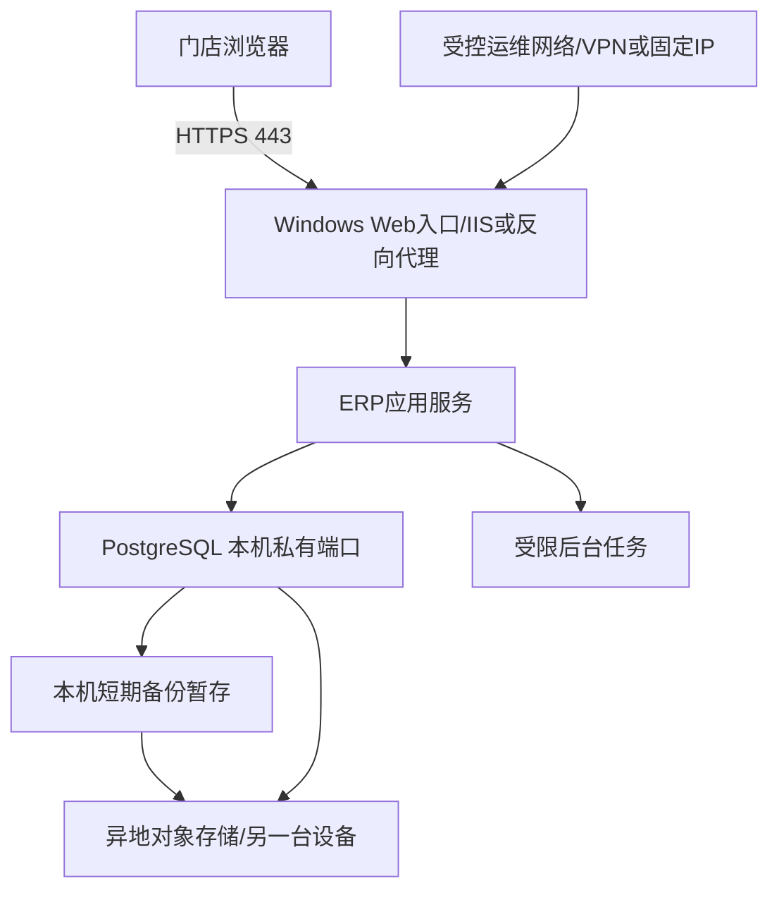

# Windows 单机部署与容量基线 v1

日期：2026-08-18  
服务器：Windows，2核CPU、4GB内存、70GB磁盘。  
定位：第一版开发验收和测试环境；不作为正式生产操作系统或长期部署架构的既定结论。

## 1. 单机边界

当前测试阶段允许应用和PostgreSQL部署在同一台服务器，但必须满足：

- 测试服务器不作为开发电脑使用；构建由CI完成，服务器只接收发布包和受控测试数据。
- 数据库、应用、后台任务和Windows系统分别设置资源上限与监控。
- 数据库不向公网暴露；公网只开放HTTPS业务入口。
- 备份必须传出当前服务器，不能把本机备份当作灾难恢复。
- 门店数、并发、数据库规模或报表负载超过阈值时优先拆分数据库。

## 2. 当前测试部署结构



数据库端口只监听本机或私有网卡。远程桌面只允许固定管理IP、VPN或云厂商堡垒机访问。

## 3. 资源预算

### 3.1 磁盘预算

70GB测试服务器建议预算：

| 用途 | 预算上限/保留 |
|---|---:|
| Windows、补丁和系统组件 | 约20GB，按实际监控 |
| 应用、运行时和发布包 | 5GB |
| PostgreSQL数据与索引 | 初始20GB软上限 |
| 应用日志与数据库日志 | 5GB |
| 临时文件、迁移和导出缓存 | 3GB |
| 本机备份暂存 | 2GB，仅作短期缓冲；大备份直接传输异地 |
| 必须保留的自由空间 | 不低于15GB |

告警阈值：

- 磁盘使用率达到60%：容量预警并检查增长来源。
- 达到75%：暂停非必要导出、历史报表生成和大批量迁移。
- 达到85%：进入严重告警，禁止普通发布和大数据任务。
- 自由空间低于10GB：立即处理；不得等待数据库或WAL写满。

附件、导出文件和长期备份不能无限保存在系统盘；大附件后续迁移到对象存储。

### 3.2 内存与连接

4GB内存只适合轻量负载。初始控制目标：

- Windows及安全组件预留约1.5GB。
- PostgreSQL目标使用约1.0—1.3GB，具体通过压测调整。
- 应用服务目标使用约1.0—1.3GB。
- 保留运行缓冲，避免系统持续换页。
- 应用数据库连接池初始控制在10—20个连接，后台任务使用独立小连接池。
- 禁止为每个请求创建独立数据库连接。

以上数字是启动配置，不是性能承诺；正式值必须通过实际业务数据和并发测试确定。

### 3.3 CPU与后台任务

- 大报表、历史回填、备份压缩、批量短信和导出任务限制并发。
- 同一时间只运行一个高CPU或高I/O后台任务。
- 数据迁移和索引构建安排在低峰窗口。
- CPU持续高于80%、内存持续高于85%或磁盘延迟持续恶化时触发扩容评估。

## 4. 目录与权限

建议使用独立目录并限制NTFS权限：

```text
D:\erp\app\current
D:\erp\app\releases
D:\erp\logs\app
D:\erp\data\attachments
D:\erp\data\data-protection-keys
D:\erp\backup\staging
D:\postgresql\data
D:\postgresql\logs
```

如果服务器只有C盘，也保持同样的逻辑目录隔离。应用服务账号只能读写附件目录和 Data Protection 密钥目录，不能读取数据库数据目录、备份密钥或其他服务密钥；PostgreSQL服务账号不能修改应用发布目录。附件和密钥目录必须位于 `releases` 之外，A/B 两个站点使用同一受控目录。

生产/验收环境至少配置：

```text
FileStorage__RootPath=D:\erp\data\attachments
DataProtection__KeyRingPath=D:\erp\data\data-protection-keys
```

Data Protection 密钥用于解密顾客手机号和上传图片。丢失密钥会导致历史敏感数据及附件无法读取；密钥备份必须加密、限制访问并与附件备份保持一致的恢复点。

## 5. 网络安全

- 公网只开放TCP 443；HTTP 80仅用于跳转HTTPS时开放。
- PostgreSQL端口禁止公网访问。
- RDP不对任意公网IP开放，启用网络级身份验证、强密码和登录失败限制。
- 管理员账号不用于运行应用和数据库服务。
- HTTPS证书自动续期并设置到期告警。
- Windows、防病毒、数据库和运行时补丁进入受控维护窗口。
- 服务器时间保持同步；数据库时间按UTC记录。

## 6. 应用发布目录

应用采用版本目录和可切换指针：

```text
releases\2026.08.18.1
releases\2026.08.25.1
current -> releases\2026.08.25.1
```

每个发布包包含：

- 应用版本号和提交标识。
- 支持的最小/最大数据库schema版本。
- 迁移清单和校验值。
- 配置模板，不包含正式密钥。
- 冒烟测试和健康检查。
- 程序回退说明。

数据库迁移成功并通过检查后再切换应用版本。程序回退只切换应用发布目录，不自动执行数据库降级。

## 7. 备份任务

第一版执行：

- 每日低峰期：`pg_dump` 自定义格式逻辑备份。
- 每周：基础备份。
- 持续：WAL归档到服务器之外的受控存储。
- 归档切换和传输策略必须经过演练，满足15分钟RPO目标，同时监控额外WAL量和 `pg_wal` 积压。
- 发布前：数据库备份或云盘快照，并记录备份编号。
- 每日：检查备份大小、校验值、上传结果和WAL归档积压。
- 每日：增量备份加密附件目录；Data Protection 密钥变化后立即生成受控加密备份。
- 每月：恢复到隔离数据库并运行金额、余额、库存和schema校验。
- 每月：联合恢复数据库、附件和密钥目录，并抽查产品图片及服务档案图片可解密、摘要一致且权限仍有效。

本机 `backup\staging` 只用于小文件和短期上传缓冲；较大的逻辑备份和基础备份应直接流式传输或生成后立即传出。异地校验成功后按策略清理，防止占满70GB磁盘。

## 8. 监控与告警

至少监控：

- CPU、内存、磁盘使用率和磁盘延迟。
- 应用可用性、请求错误率和响应时间。
- PostgreSQL连接数、慢查询、锁等待、长事务和数据库大小。
- WAL归档失败、积压量、备份失败和恢复校验失败。
- 后台任务队列、失败次数和重试积压。
- 收银支付失败、会员扣减失败、库存写入失败和交班差额异常。

严重告警必须发送到服务器之外的通知渠道，避免服务器离线后告警也无法送出。

## 9. 扩容触发条件

满足任一条件时进入拆分或扩容评估：

- 正式门店和并发增长后，CPU或内存连续7天在营业高峰接近阈值。
- PostgreSQL数据与索引接近20GB软上限。
- 系统盘使用率超过70%且增长趋势不可通过清理控制。
- 备份、报表或迁移频繁影响收银响应。
- RTO/RPO无法在当前单机上通过恢复演练。
- 需要高可用、只读报表副本或多应用实例。

优先扩容顺序：

1. 将备份、附件和导出迁移到对象存储。
2. 将PostgreSQL迁移到独立服务器或托管数据库。
3. 增加应用实例并使用反向代理负载均衡。
4. 增加只读分析副本或独立报表数据层。

## 10. 测试环境启用前检查

- [ ] Windows Server版本与.NET 10、IIS Hosting Bundle及PostgreSQL 18兼容。
- [ ] HTTPS、Windows防火墙和RDP访问范围完成配置。
- [ ] 数据库端口未暴露公网。
- [ ] 应用、迁移、备份和只读账号完成最小授权。
- [ ] 自动备份已上传异地且成功恢复过。
- [ ] 附件目录与 Data Protection 密钥目录位于发布目录之外，NTFS权限、联合备份和解密抽查通过。
- [ ] 磁盘、WAL、备份和应用健康告警可用。
- [ ] 应用发布与程序回退演练完成。
- [ ] 数据库扩展—迁移—收缩演练完成。
- [ ] 收银、会员、库存和交班关键流程通过并发与失败测试。
- [ ] 正式密钥不在代码库、发布包和普通日志中。
